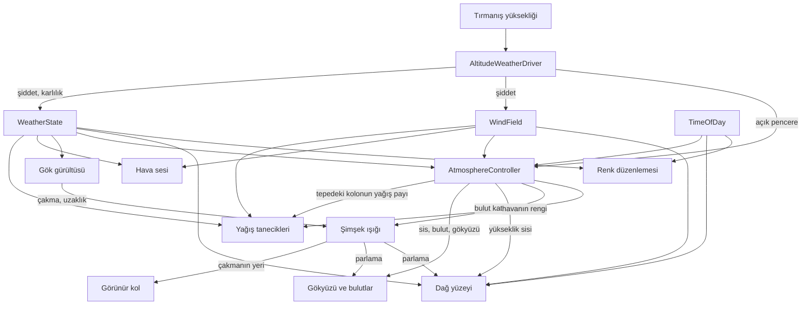

# Sistemler

## Bulutlar (`Assets/VolumetricClouds/`, `Assets/Scripts/Clouds/`)

`UnityVolumetricCloudsURP` (MIT) üzerine kurulu; yoğunluk, şekil ve aydınlatma zinciri
Nubis/HZD makalesine göre düzeltildi. Portun makaleyle farkları ve ölçümleri
`CLOUDS_REBUILD.md`'de, kuralların gerekçeleri `RATIONALE.md` → Bulutlar.

**Bulut ne okur**

| kaynak | ne | nereye |
|---|---|---|
| `AtmosphereController.Coverage` | küresel kapsamanın TEK eşlemesi | `cloudCoverage` |
| `AltitudeWeatherDriver.CloudMass` **veya** `AtmosphereController.Coverage` — hangisi büyükse | örtünün optik kalınlığı | `densityMultiplier` |
| `WindField.FreeAirSpeed` + `PrevailingDirection` | serbest hava rüzgârı, **arazi maruziyeti uygulanmadan** | `globalSpeed` (km/h), `globalOrientation` |
| `TimeOfDay` | **dolaylı** — yönlü ışığın yönü/rengi/şiddeti | `GetMainLight()` |
| `HeightFog.hlsl → FogPath` | kamera ile bulut arasındaki sis | birleştirme geçişi |

Çeviriyi `CloudWeatherDriver` yapıyor; tek yön, bulut geri yazmıyor.

**Buluttan ne okunur** — hepsi `CloudLayerProbe` üzerinden, o da aynı Volume ayarlarını ve
aynı hava haritasını okuyor:

| tüketici | ne |
|---|---|
| `AltitudeWeatherDriver.CloudColumnTop` | sütunun tepesi; üstünde yağış yok |
| `ClimbHud` | katman kotları ve kapsama |
| `PrecipitationRenderer` | sütunun kapsaması — yağış bulutun altında yağar |
| `LightningFlash` | çakma kotu, çakma sütununun tepesinden |
| `_CloudBottom` / `_CloudTop` globalleri | `LightningBolt.shader` çakmayı bulut kabuğuyla kesiştiriyor |

Yer bulut gölgesi bunlardan geçmez: bulut sistemi gölgeyi **ana ışığın cookie dokusuna**
yazar, `MountainSurface.shader` `_LIGHT_COOKIES` ile okur — gölge göğü çizen yoğunluk
alanının ta kendisinden türer.

Sis bağı birleştirme geçişinde, bulutun **kendi derinlik dokusuyla** (bkz. **Volumetrik
sis**, "her katman kendi mesafesiyle bir kez").

**Kurallar**
- Kapsama optik kalınlığa da girer; ikisinden **büyüğü** alınır, toplanmaz.
- Yoğunluk **kameradan bağımsızdır**.
- Yoğunluk `WeatherState.Precipitation`'dan **sürülmez** (döngü kurar).
- Kapsamanın eşlemesi **tek yerde**, `AtmosphereController`'da.
- Katman **mutlak kotta** (`localClouds` açık).
- Rüzgârda **maruziyet uygulanmaz**.

**Açık:** bulut rengi ufuk altı gök renginden besleniyor ve sıcağa çalıyor; düzeltmesi
ertelenen atmosfer işinde (`DECISIONS.md`).

Atmosferin **şu an nasıl çalıştığı**: ne neyden beslenir, ne neyi etkiler.

**Bu dosya sayı ve gerekçe tutmaz.** Eşikler, katsayılar ve renkler kodda ve ayar
asset'lerinde; bir kuralın **neden** öyle olduğu, ne ölçüldüğü ve ne denendiği
`RATIONALE.md`'de. Burada yalnız **ilişkiler ve kurallar** var.

| soru | dosya |
|---|---|
| Ne neyi okur, kural ne? | burası |
| Kural neden böyle? | `RATIONALE.md` |
| Hangi belirti, sebebi neydi? | `SYMPTOMS.md` |
| Hangi karar ertelendi, tetikleyicisi ne? | `DECISIONS.md` |

---

## 1. Kaynaklar

Her şey üç yerden doğar. Bunların dışında hiçbir sistem kendi zamanlayıcısını, kendi
rastgeleliğini veya kendi hava kavramını kurmaz.

| Kaynak | Ne üretir | Neye bakar |
|---|---|---|
| `AltitudeWeatherDriver` | Yağış şiddeti, karlılık, rüzgâr şiddeti | Tırmanışın ulaştığı yükseklik |
| `TerrainWindShelter` | Rüzgârın arazi maruziyeti | Oyuncunun altındaki arazinin biçimi |
| `TemperatureField` | Sıcaklık, hissedilen sıcaklık, donma seviyesi | Kot, saat, yağış, rüzgâr |
| `TimeOfDay` | Saat, güneş yönü, gündüz katsayısı, ışığın rengi | Kendi saati |
| `WindField` | Rüzgâr vektörü, sürekli şiddet, anlık esinti | Sürücünün verdiği şiddet + kendi gürültüsü |

`WeatherState` bir kaynak değil, taşıyıcı: sürücünün yazdığı iki değeri (şiddet, karlılık)
tutar ve değiştiğinde olay yayar.

**Rüzgâr iki sayıdır** — sürekli şiddet ve anlık esinti — ve ayrı yayımlanır. Yavaş tepki
vermesi gereken sistemler sürekliyi, esintiyi duyması veya görmesi gerekenler toplamı okur;
hangisinin hangisi olduğu §4'te. **Yükseklik "ulaşılan seviye"dir**, anlık Y değil: yukarı
anında takip eder, aşağı bir ölü bant ve gecikmeyle iner. Gerekçeler `RATIONALE.md`.

---

## 2. Akış

Akış tek yönlü. Hiçbir tüketici kaynağa geri yazmaz; iki tüketici birbirini okumaz.
Bu yüzden çelişki ancak aynı kaynağı farklı yorumlamaktan doğabilir — nitekim öyle de
oldu (bkz. §6).

---

## 3. Kuşaklar

Yükseklik arttıkça hava sertleşir. Kuşak sınırları `AltitudeWeatherDriver`'da tanımlı;
başka hiçbir yerde tekrarlanmaz — yüzey de tanecikler de oradan okur.

Sınırlar mutlak metre değil **dağın yüksekliğine oran**. Oran yalnız **referansı** verir;
yağmur/kar sınırının kendisi sabit değildir — donma seviyesi soğuk cephede iner, öğle
ısınmasında çıkar, `TimeOfDay` ve şiddet birlikte sürer. **Kalıcı kar çizgisi bu hareketli
sınırı okumaz, referansı okur.** Aradaki sulu kar kuşağı dar tutulur: geçiş bir bant değil
bir sınır gibi okunmalı.

| Kuşak | Hava | Ses | Yüzey |
|---|---|---|---|
| Açılış | Çok hafif yağmur, neredeyse rüzgârsız | Dingin yağmur ve rüzgâr | Çıplak kaya, ıslanır |
| Yağmur | Kademeli sertleşir, kar yok | Sağanak katmanı açılır, uzak gök gürültüsü | Islak kaya |
| Geçiş | Yağmur çekilir, kar yerleşir | Yağmur sesi hızla kısılır | Taze kar birikmeye başlar |
| Prosedürel | Bazen tipi, bazen sakin kar | Yalnızca rüzgâr | Kalıcı kar çizgisinin üstü |
| Zirve | Dalgalanma kapanır, sürekli fırtına | Tam güç rüzgâr | Sürekli örtü |

**Kurallar**
- Şiddet, yükseklik tabanının üstüne binen iki Perlin katmanının çarpımı. Üçüncü ve çok
  yavaş bir gürültü nadiren **açık pencere** açar; pencerenin **derinliği de değişkendir**.
- Zirve kuşağında genlik daralır ama **sıfırlanmaz**.
- **Açık pencere dalgalanmanın parçası değildir**, ayrı hesaplanır ve zirvede de çalışır —
  orada yalnız eşiği yükselir. Şiddeti düşürdüğü için görüş de o anda açılır.
- **Bulut kütlesi yağışı gecikmeyle izler**; kapsama ve bulut tabanı `CloudMass`'ten sürülür.
  Sonuç kendiliğinden çıkar: kısa pencereler gökyüzünü açmadan geçer, uzun olanlar açar.
- **Bulut tepesinin üstünde yağış yoktur** ve bu kesme bulut sisteminden **itilir**
  (`CloudLayerProbe` → `CloudColumnTop`); sürücü çekmez.
- **Ani geçiş yoktur:** şiddet **ve karlılık** hedeflerine aynı zaman sabitiyle kayar.

Gerekçeler: `RATIONALE.md` → Kuşaklar ve hava dalgalanması.

---

## 4. Sistem sistem girdiler

### Yağış tanecikleri (`PrecipitationRenderer`, `Precipitation.shader`)

**Okur:** şiddet (yoğunluk ve damla boyutu dağılımı), **tepedeki bulut kolonunun yağış payı**
(`AtmosphereController.LocalRain`), karlılık (damla/tane oranı), rüzgâr vektörü (savrulma
**ve girdap alanının sürüklenmesi**), rüzgârın **esintili** şiddeti (girdap genliği, tanenin
dönme hızı), **havanın rengi** (`_HeightFogColor`).
**Okumaz:** günün saatini — tanecikler kendi rengini ışıktan almıyor, gece ve gündüz aynı
görünüyorlar. **Bilinen eksik.**

- **Yağış gökten tek parça düşmez, kaynağı tepedeki buluttur.** `CloudLayerProbe` hava
  haritasını oyuncunun konumunda CPU'dan okur; kapsama × kabarıklık (tip) yağış payını
  verir, yayvan ince katman yağdırmaz. Kolonun tepesinin üstünde pay sıfırlanır. Pay
  ~2.5 s'lik sabitle yumuşatılır.
- **Türbülans yamalıdır:** genlik, rüzgârla akan alçak frekanslı bir zarfla yerel çarpılır;
  damla da tane de aynı zarfı okur. Kar tanesinin ayrıca taneye özel çırpıntısı vardır
  (1–3 Hz); damla çırpmaz.
- **Tane kendi rengini seçmez** — havanın rengini çarpanla parlatır.
- **Tanenin biçimi kristal değil kümelenmedir.**
- **Kar tanesi esintiyi anında yer** (~0.1 s); damla gevşeme süresiyle uyar (terminal hız/g).
  Dönme ve girdap **esintiye** bağlanır, sürekli şiddete değil.
- **Damla ve tane ayrı popülasyondur**; karlılık oranı belirler. Sulu kar ikisinin bir arada
  bulunmasıdır.
- **Damla boyutu hem düşme hızını hem rüzgâra direncini belirler**; dağılım şiddetle kayar.

### Yağış perdesi (`SpectralPrecipitationFeature`, `SpectralPrecipitation.shader`)

**ŞU AN KAPALI** (renderer'da pasif). Gerekçe ve tetikleyici `DECISIONS.md`'de.

Taneler arasını dolduran ekran uzayı dokusu `[Langer 2004]`. Doku editörde pişiyor
(`SpectralPrecipitationBaker` → `Assets/Settings/SpectralPrecipitation.asset`), çalışma
zamanı yalnız örnekliyor.

**Okur:** yağış şiddeti × yerel bulut payı (yoğunluk), karlılık (taban ağırlık), yağışın
**dünya hızı** (akış ekseni), kameranın hareketi (genleşme odağı), sahne derinliği
(yalnız yakın nesne koruması), **savrulan karın rengi** (`SpindriftColor`).
**Okumaz:** görüş mesafesini — perde sisin yerini tutmuyor, sis kendi işini yapıyor.
Gökyüzü rengini de okumaz.

- **Opaklık eğrisi tek ve pişiricide.** Ortalama 0.5'e taşınıyor, σ küçültülüyor,
  aykırılar kırpılıyor, sonra **karesi alınıyor** (`§5.6`). Ölçülen sonuç: ortalama 0.289,
  σ 0.204. Shader'da ikinci bir eğri veya ağırlık **yok** — bir dönem üç eğri üst üste
  binmişti ve çıktının makaleyle ilgisi kalmamıştı.
- **Bileşim `Blend SrcAlpha OneMinusSrcAlpha`** — makalenin Denklem 7'si birebir
  (`I = I_snow·α + (1−α)·I_bg`).
- **Sahne derinliğine göre kapı yok.** Dispersiyon bağıntısı derinliği ZATEN taşıyor:
  farklı uzamsal frekanslar farklı hızda akıyor çünkü farklı derinlikteki taneleri
  temsil ediyorlar. Derinlik yalnız çok yakın cismin önüne geçmemek için okunuyor.
- **Perde kendi rengini seçmez ve gökyüzünden de boyanmaz** — `SpindriftColor`, havada
  asılı tanenin rengi. Aynı ayrım savrulan karda da geçerli.
- **Kar ve yağmur AYRI desen, farkı tek sayı: `C`.** Tek doku, iki kanal (`R` kar,
  `G` yağmur), karlılık harmanlıyor. Bant ikisinde de aynı (`M/32..M/4`, üç oktav).
- **Yağmurun izi yüksek `C`'den çıkıyor** (`§7`, Ventana). `ω_t = C·ωx/ω` ve zamansal
  Nyquist kesmesi `|ω_t| > T/2` olanı sıfırlıyor; C büyürse yalnız hareket eksenine DİK
  modlar kalıyor, yani hareket yönünde uzun dalga boyları → o yönde uzamış izler.
  Kar 6, yağmur 60. Ölçüldü: yağmurun varyansı karın %16'sı, kare farkı 57.4'e karşı 34.2.
- **Tek akış yönü, ekran geneli.** Yön, yağışın dünya hızıyla kameranın hareketinin
  bileşkesinin görüntü düzlemine düşen payı. Doku dikişsiz döşeniyor (opaklık fonksiyonu
  `(x,y)`'de toroidal), piksel başına **tek örnek**.
- **Genleşme odağı ve döşeme başına θ YOK.** Sökülme gerekçesi `RATIONALE.md`'de: yöntem
  θ'nın zamanla değişmesine uygun değil ve makale de değiştirmiyor (`§7.2`).

### Hava sesi (`WeatherAudio`, `AudioBand`)

**Okur:** şiddet, karlılık, rüzgârın sürekli şiddeti **ve** esintisi.

Dört band (hafif yağmur, sağanak, dingin rüzgâr, fırtına rüzgârı), eşit-güç geçişiyle
karışır; ayrık "hafif/şiddetli" durumu yoktur.

- **Hangi sesin çaldığını sürekli şiddet, ne kadar yükseldiğini esinti belirler.** Band
  geçişi esintiye bağlanmaz.
- **Rüzgâr sesi asimetrik yumuşatılır** — esinti hızlı gelir, yavaş çekilir. Sertleştikçe
  alçak geçiren filtre açılır ve perde yükselir.
- **Her band varyasyonlar arasında çapraz geçiş yapar**, band susmasını beklemez.
- **Seviyesi eşiğin altına inen kaynak duraklatılır** — sıfır sesle çalmak klibi çözmeye
  devam eder.

### Gök gürültüsü (`ThunderPlayer`)

**Okur:** şiddet (sıklık ve yakınlık), karlılık (kesilme).

- Belirli bir şiddetin altında hiç çalmaz. Karlılık yükseldikçe seyrelir ama **tamamen
  susmaz** — tipide şimşek nadirdir, yok değildir.
- Çakma anında `Struck` olayı yayılır ve **uzaklığı metre olarak** taşır. **Mesafenin tek
  sahibi burasıdır:** hem sesin gecikmesi (`mesafe / 340`) hem çakmanın dünyadaki yeri
  ondan türer.
- **Ses o anda çalmaz** — yakında saniyenin altı, uzakta yirmi saniyeye kadar bekler.

### Şimşek ışığı (`LightningFlash`)

**Okur:** `ThunderPlayer.Struck` ve taşıdığı uzaklık, `CloudLayerProbe`'dan bulut katmanının
tabanı ve tavanı, oyuncunun konumu.
**Okumaz:** yağış, rüzgâr, günün saati — çakmanın koşulları tetikleyen tarafta zaten
değerlendirildi.

- Uzaklığı bir dünya noktasına çevirir: yön rastgele, yükseklik bulut katmanının **alt
  çeyreği**.
- **Işık yönlü kalır** ve şiddeti mesafenin karesiyle söner.
- Kendi rastgeleliği yalnız çakmanın **yönü** ve **biçimi** (1–3 geri vuruş); **anı** ve
  **uzaklığı** değil.
- **Gökyüzü ve bulut aynı `_LightningFlash` / `_LightningPosition` değerlerini okur.**
  Bulutun parlaması bindirme geçişinde, tam çözünürlükte, her kare uygulanır.
- **Yükseklik sisi de aynı değeri okur** — çakma anında sisin kendisi içeriden parlar.
- **Parlama çakmanın bulunduğu yerde toplanır, bir yönde değil:** ışın bulut katmanıyla
  kesiştirilir ve bulunan noktanın çakmaya uzaklığına göre söner.
- **Ortam ışığına dokunmaz** — onu gökyüzü paketi pişiriyor.

### Görünür kol (`LightningBolt`)

**Okur:** `LightningFlash.Placed` ve taşıdığı çakma noktası, arazinin yüksekliği.
**Okumaz:** hava, uzaklık aralıkları, zamanlama — nerede çakıldığına karar vermez.

- **Yalnız yakın çakmalarda çizilir**; kolun görünmesi mesafe hakkında bilgi taşıyor.
- Kanalın nerede biteceğini yamacın kendisi belirler. Değme noktasındaki ışık **nokta**
  ışıktır.
- **Kol bir AĞAÇ** (Reed & Wyvill 1994): dallar ana koldan ortalama **16°** sapar, açı
  normal dağılır, dallanma özyinelemelidir. Her kuşakta kalınlık ×0.5, olasılık ×0.8,
  uzunluk ×0.5, kıvrımlılık ×1.3 — dal ebeveyninden daha kıvrımlıdır. Çizgiler havuzdan
  gelir, bütçe tavanı `boltMaxLines`.

### Şimşek saçılma tablosu (`LightningLutBaker`)

Dobashi 2001 §4'ün lookup table'ı: `Assets/Settings/LightningScatterLut.asset`,
128×128 RGBAFloat, T = 1.5 km. Asset yoksa yükleme anında kendiliğinden pişer.

**Statik.** Sahne, hava ve çakma konumu değişse de değişmez — makalenin bütün numarası
bu (Denklem 4: kaynağın şiddeti integralin dışında kalıyor).

**Berrak hava için pişiyor**, yerel sis için değil: tablo üniform yoğunluk varsayıyor,
bizim sisimiz üniform değil. Yerel sis kendi yolundan geçmeye devam eder, çift sayım yok.

**Referans yapılandırmada 1.0 verecek şekilde normalize** (800 m, 30° sapma) — bugünkü
parlaklık o noktada korunuyor, değişen yalnız mesafe/açı sönümü.

**Eksenler işaretli karekök**, makaledeki doğrusal değil: T 9 km'ye çıkmak zorundaydı
(çakma 8 km'ye gidiyor, kaynak tablonun dışında kalırsa parlama sıfır olur) ve doğrusal
eksende 128 hücre 18 km'ye yayılınca hücre 140 m'ye çıkıyordu. Parlamanın tamamı ilk
birkaç yüz metrede; karekök eksende hücre merkezde ~1 m. **Shader ters eşlemeyi birebir
uygulamak zorunda.**

**DÖRT TÜKETİCİ, TEK KAYNAK DİZİSİ:** `HeightFog.hlsl → FogPath` (arazi ve cisimler),
`SkyFog.shader` (gök pikselleri), `Sky.shader` (yedek gök materyali) ve bulut ışın
yürüyüşü. İlk üçü `LightningScatter()` çağırıyor; bulut kendi yürüyüşünün içinde aynı
`_LightningSources` dizisini okuyor.

**KANAL BOYUNCA SEKİZ NOKTA KAYNAK**, tek nokta değil: boşalma noktasından yamaca kadar
eşit aralıkla, uç arazi örneklenerek. Tek kaynakta parlama küre gibi duruyordu. Enerji
kaynaklara bölünüyor, yani sayı değişince toplam parlaklık değişmiyor.

**ARAZİ TIKAMASI VAR.** Yüzeyin arkasında kalan integral parçası çıkarılıyor:
`görünen = I(u_eye,v) − I(u_eye−L,v)·e^(−κL)`. Makale bunu yapmıyor; dağın altında da
hâle çıkıyor ve dağ saydam okunuyordu.

**Bulut parlamasının düşüşü `R²/(r²+R²)`** — uzakta 1/r² (Denklem 9), r=0'da ıraksamıyor,
R'de yarıya iniyor. Eski `pow(1−d/R,12)` sezgiseldi. Optik derinlik τ hâlâ yaklaşık:
makalenin küp-ekran çözümü metaball'a özgü, yerel yoğunluk vekil alınıyor.

**Terim ÇARPILMAZ, EKLENİR.** Eskiden üçünde de `_LightningFlash.rgb * 0.6` sisin
opaklığıyla ağırlıklanıyordu — berrak havada parlama sıfırdı. Saçılan şey her zaman var
olan hava; yerel sis ayrı ortam, kendi yolundan geçiyor, çift sayım yok.

**Bilinçli sınır: arazi tıkaması yok.** Kaynağın önündeki yamaç parlamayı kesmiyor.
Makale de kesmiyor (§4.5 doğrudan toplam).

### Volumetrik sis (`VolumetricFogFeature`, `VolumetricFog.compute`, `VolumetricFogShared.hlsl`)

**Okur:** yoğunluk modelini (`AtmosphereController` sürer), URP ana ışığını, ortam probe'unu,
bulut gölgesini (ana ışık cookie'si).
**Okumaz:** gökyüzü paketinin hava perspektifini — o homojen atmosferin sahibi, bu sistem
yalnız YEREL ortamı taşır.

Wronski 2014 froxel hacmi: kamera frustum'una hizalı 3B ızgara, x/y ekran koordinatı, z
üstel derinlik (`z(s) = near·(far/near)^s`). 160×90×64, RGBA16F, 0.5 → 1000 m. İki compute
kernel: yoğunluk+aydınlatma, sonra Beer-Lambert birikimi.

- **TEK YOĞUNLUK MODELİ, İKİ DEĞERLENDİRİCİ.** `VolumetricFogShared.hlsl` bütün katmanları
  taşır; hacim içinde compute, ötesinde `HeightFog.hlsl`'in analitik kuyruğu aynı
  fonksiyonları çağırır. Model tek yerde durmasa hacmin sınırında sisin yapısı değişirdi.
- Kompozisyon Beer-Lambert gereği: `sonuç = kuyruk × T_hacim + saçılım_hacim`. Geçiş yapı
  gereği sürekli, ayrıca blend penceresi yok.
- **Savrulan kar TEK KAYNAKTAN:** `HeightFog.hlsl → SpindriftPath`, kameradan okunur ve
  dikey profil **kapalı biçimde** integre edilir.
- **Alanlar sinüs TOPLAMIDIR, çarpımı değil** — yönleri paralel olmayan, dalga boyları
  oransız beş bileşen. Sinüs seçildi çünkü CPU ile GPU birebir aynı sonucu veriyor ve
  `AtmosphereController` aynı alanı CPU'da örneklemek zorunda; **formül değişirse ikisi
  birlikte değişir.**
- **HER KATMAN KENDİ MESAFESİYLE BİR KEZ SİSLENİR.** Arazi kendi shader'ında
  (`ApplyHeightFog`), hacimsel bulut birleştirme geçişinde (`FogPath` + bulutun kendi
  derinlik dokusu), gökyüzü `SkyFog.shader`'da (sonsuz yol). Sıra: gök sisi
  `AfterRenderingSkybox + 2`, bulutlar `BeforeRenderingTransparents`.
- `FogPath` geçirgenlik ile in-scattering'i **ayrı** döndürür; `ApplyHeightFog` ikisini
  `renk × T + saçılım` diye birleştirir — yol renkte doğrusal olduğu için ayrıştırma
  yaklaştırma değil.
- **Ortamın SEVİYESİ sis renginden, YÖNÜ SH'den.**
- **Bulut gölgesi ana ışık cookie'sinden**; üçüncü bir yol açılmadı.
- **KOMUT TAMPONU GLOBALLERİ COMPUTE'A ULAŞMAZ.** `Shader.SetGlobalX` ulaşır; URP'nin
  `cmd.SetGlobal...` ile yazdıkları (`_MainLightColor`, `_MainLightPosition`, cookie
  matrisi) **ulaşmaz ve sessizce sıfır okunur**. Ana ışık, cookie matrisi ve ortam SH'si
  C#'tan açıkça geçirilir; dokular kernel'e elle bağlanır.

Gerekçeler: `RATIONALE.md` → Yağış, ses ve şimşek · Volumetrik sis.

---

### Sis ve hava sinyalleri (`AtmosphereController`)

Sis, görüş mesafesi, hava sinyalleri. **Gökyüzü, ortam ışığı ve yansıma burada değil**
(bkz. **Gökyüzü ve atmosfer**); hacimsel bulutlar ayrı sistem (bkz. **Bulutlar**).
Buradaki `coverage` bulutların da okuduğu tek eşlemedir.

**Okur:** şiddet, karlılık, rüzgârın **sürekli** şiddeti ve yönü, günün saati, ve
sürücüden üç sinyal — **açık pencere**, **kuru kapsama**, **bulut kütlesi**.
**Okumaz:** esintiyi, kuşak kotlarını, yüksekliği, ilerlemeyi.

Görüş mesafesi tek değerden türer: yağış tipi, rüzgârın savurması (yalnız yağışta anlamlı),
bulut kuşağının içinde olup olmama.

**Bulut gölgesi ana ışığın cookie dokusundan yere düşer** ve arazi gölgesiyle **çarpılır**:
ikisi ayrı olay ama ikisi de yalnız doğrudan güneşi keser, dolaylıya dokunmaz.

#### Sis katmanları

- **Sis üç katmanın TOPLAMIDIR**, her biri kendi yarı yüksekliğiyle: sınır tabakası
  (yağışla derinleşir, inversiyonda biter), vadi sis denizi (çok sığ, gece ürünü), serbest
  troposfer (yayvan, yağıştan bağımsız). **Toplanır, çarpılmaz.**
- **Şafak denizi ayrı katmandır** ve ayrı kanaldan gider
  (`_FogSeaDensity`/`_FogSeaFalloff` ile `_HeightFogDensity`/`_HeightFogFalloff`);
  `FogDensityAt` mutlak yoğunlukları toplar. Vadi sisi gece birikir, şafakta en kalın,
  güneşle dağılır — **akşam geri gelmez**.
- **Katmanın derinliği yağıştan sürülür.** Görüş, inversiyon tavanı ve katman derinliği
  üçü de yağış şiddetinden türer; çelişemezler.
- **Görüşün fiziksel tavanı vardır.**
- **Sis üniform değildir:** rüzgârla sürüklenen alçak frekanslı bank alanıyla yerel
  çarpılır. Aynı alan iki yerden okunur — GPU deseni çizer (`FogBankAt`), CPU kamera
  konumunda örnekler (`BankField`); **formül değişirse ikisi birlikte değişir.**
- **Bulut tabanı sabit değil:** sakin havada iner, yağış ve rüzgâr yükseltir; dakikalar
  ölçeğinde yer değiştirir.

#### Sürüklenen kar (dördüncü katman)

Rüzgâr eşiği aşınca gevşek kar havalanıp yüzeye yapışık sığ perde oluşturur.

- **İki koşul birden:** rüzgâr eşiği (CPU, tek dünya durumu) ve **yerde taze kar** (shader
  kot profilinden).
- **Yükseklik yerden ölçülür**; arazi yüksekliği `SurfaceMapBaker` pişirmesinden.
- **Ataklarla gelir:** kaldırma payı **hamleli** hızdan (`Strength × (1 + Gust)`) ve eşiğin
  üstünde **küple** ölçeklenir.
- **KRETTEN fışkırır, yamacın tamamından değil** — rüzgâr yönünde ileri/geri iki arazi
  örneği; ikisi de alçaksa sırttayız. Kret üzerinde kaldırma güçlenir ve katman kalınlaşır.
- **Rüzgâr altına kuyruk bırakır.**
- **Dikey profil kuvvet yasası**, üstel değil.
- **Sürüklenme kaynağını TÜKETİR.** Yalnız örtü süpürülür, kalınlık deposu değil.
  Süpürülen kar kot ekseninde yok olur; rüzgâr altına yığılma yüzeyde birikim ağırlığıyla
  zaten var, ikinci kez modellenmez.
- **KAR SIFIRIN ALTINDA ERİMEZ.** Erime sıcaklıktan sürülür, karlılık oranından değil;
  sıfırın altında tek kayıp çok yavaş **süblimasyon**.
- Kaldırma payı atmosferden **global yayınlanır** (`_SpindriftLift`); yüzey ve yağış
  tanecikleri aynı globali okur.
- Ayrı tanecik sistemi **değil**: sıfır ek çizim, güneş rengi sisin okuduğu yerden.
- **Rengi ile parlaklığı ayrı kurulur** — ton 1'e normalize, seviyeye fiziksel tavan
  (perde kardır), ölçüsü **güneşin yüksekliği**.
- Akış alanı **bilerek kaba**; ince yapı yakın tanecik katmanının işi.

#### Hava haritası ve bulut biçimi

**Bulut dağılımının tek kaynağı pişirilmiş 2B hava haritasıdır.** Matematiği
`CloudWeatherMapGenerator`'da; iki tüketici: `CloudWeatherMapBaker` (editör) ve F1 panelinin
canlı "yeniden pişir" düğmesi (`AtmosphereController.SetWeatherMap`). Kanallar:
**R kapsama, G tip, B taban kayması, A tavan.**

- **Harita türetilmiş veridir ve kendini tazeler.** İmza ayar alanları **ve**
  `CloudWeatherMapGenerator.Version`'dan kurulur; tazeleme editör yüklenirken
  (`[InitializeOnLoadMethod]`), sahne kurulumunda değil. Pişirme asset'in **üstüne** yazar.
- Harita gürültüden türetilmez, fiziksel kurallarla kurulur: organizasyon alanı göğü
  boş/seyrek/yoğun ayırır, çekirdekler üstel yarıçap dağılımıyla serpilir ve örtüşenler
  birleşir. **Çekirdekler eliptiktir**; tip ve taban kayması çekirdek başına sabittir,
  opaklığı TİP taşır.
- **Süreksiz fonksiyon sürekli alana uygulanamaz** (ayrı "kimlik" hash'i bu yüzden söküldü).
- **Hava kolonsaldır:** kapsama, tip, tavan ve taban kayması kolon boyunca tek değer;
  dikey yapıyı yalnız zarf ve şekil gürültüsü kurar.
- **Tavanı yalnız kolon-sabit alanlar sürebilir.** Kolon-sabit okumalar y'lerini sabitler
  (`colWarp` y = 87.3 + evrim, `colBump` y = 310.7). Tavanın meşru kaynağı pişmiş A
  kanalıdır. **Fırtına tekdüze doldurur, kolon seçmez** (`DECISIONS.md`).
- **Zarf şekil alanını çarpmaz, kapsamayı kısar.** Saçak kapısı zayıf kapsama kuyruğunu
  keser; saçak ezmesi zayıf kapsamada tavanı basıklaştırır. Kapsama–gök bağı alt-doğrusal.
- **İğne/bıçak biçimli bulut matematiksel olarak üretilemez.** İki garanti pişirmede:
  tavan alanı tip×gelişim **bileşimi** olarak bütün hâlinde bulanıklaştırılır (dünya eğimi
  ~45°'yi aşamaz) ve kubbe geometrisi yüksekliği kenara uzaklıkla büyütür. Kanıt
  `weather_bake_sim.py`.
- **Bulut alanı rijit ötelenmez:** harita rüzgârın %72'siyle, şekil alanı tam hızla akar;
  evrim üç eksende kayar, aşındırma kendi zamanında (~3×) kaynar.
- Fırtına dolgusu 0.42'den itibaren boşlukları doldurur; **tabanı tavan kanalından
  varyanslıdır.** Kapalı örtüde döşeme tekrarına iki önlem var ve **yetmiyor** — asıl
  kırıcı 48 km periyotlu kaydırma (bkz. §5, "Döşeme kırıcı").

#### Işık ve örnekleme

- **Kapsama eşiği belirler; yoğunluğu ayrıca çarpmaz.** Kenar sönümünü sert kapsama kapısı
  ve uzun kuyruklu kuvvet eğrisi yapar.
- **Işık sondası 5 koni örneği + 1 uzak örnek**, adımlar üstel büyür (`menzil/(2ⁿ−1)`).
  Koni çekirdeği sürgü aralığının tamamını ayrı yönle karşılar.
- **Sonda bulutun ön yüzünde tam örnekler** (alfa 0.3'e kadar erozyon da okunur) ve
  örneğin **kameraya uzaklığını** taşır. Koninin uzak örneği bilinçle ucuz ve mesafesiz.
- **Kare başına piksellerin 1/9'u hesaplanır**; geçiş **harmansız**, blok deseni yalnız
  kompozit çadır filtresiyle örtülür (`DECISIONS.md`, 1/16).
- **Boş bölge sıçraması tam adım katları hâlinde** yapılır, faz korunur.
- **Mercek sapması kapsamayı çarpar**, şekil alanına toplamsal binmez.
- Integrasyon yamuk kuralıyla; **ışık kapısı dar tutulur**; **jitter yerel koordinat +
  sin'siz hash**.
- **Dilim değişmezi:** yoğunluk ≤ 0.30/adım. **Peçe rengi süzer, alfayı değil.**
- **Yağış karartması ikinci çarpan değil**, karartmanın derinliği.
- **Yağmur soğurması yereldir** — ölçü kolonun kendi kalınlığı, ek doku okuması yok.
- **Bulut ortamı IŞINIM değil RADYANS ister** (dönüşüm π).
- **Gezegen yarıçapı gerçek değeriyle durur**; bulutun ufuk kenarını **sönüm** saklar,
  geometri değil. Şimşek shader'ı aynı küreyi kestiği için aynı globali okur.
- **Sanat yönü haritayı ezebilir, ama pişirmede.** Pişmiş harita adı boyanan dosyanın
  **içerik** hash'ini taşır.

#### Renk ve gökyüzü bağları

- **Bulut ve sis rengi aynı kaynaktan gelir.**
- **Batış kızıllığı buluta ışık olarak EKLENİR**, sonucu çarpan ton değil. Renk
  `TimeOfDay`'in süzülmüş güneşi, pencere `HorizonFactor`. Güneş/ay kadranları sınırlı yol
  sönümü alır.
- **Şafağın rengi üç gök örneğinden** (güneşe doğru, karşı ufuk, zenit), azimut sönümü tek
  yerde. Yalnız güneşin tam azimutundaki **altın uç** açık yazılı sabittir ve bilinçli
  abartmadır.
- **Kazanç tektir** (`Atmosphere.SceneGain`).
- **Gökyüzünün rengi tek ve çok saçılmanın toplamıdır** (Hillaire 2020). Kazançlar zenit
  radyansına göre eşitlenir; tabloya dokunulduğunda ikisi birlikte ayarlanır.
- **Sis renginin SEVİYESİ gökten, TONU sabitten.** Zincir tek yönlü: gök →
  `SkyAmbientBaker` → probe → sis rengi → froxel hacmi. Katsayı **üç renge birden**
  uygulanır.
- **Hava ve gökyüzü tek fonksiyondur** (`HeightFog.hlsl → AirColor`). Gökyüzü kendini
  `SkyFogAmount` ile sisler. **İnen ışının integrali ayrıdır.**
- Yıldız, kadranlar ve şimşek lekesi havanın arkasındaki cisimlerdir. Bulut bindirmesi
  geçirgenliğini arazi sisiyle aynı integralden alır ama **bank çarpanını yalnız kameranın
  yerelinden** okur.
- **Yüksek katman aynı fonksiyona karışır**; ufuk sınırı kesme değil **sönme**.
- **Güneş diski sisin optik derinliğiyle söner, hâlesi kalmaz.**
- **Sönüm bütçesi Koschmieder'dir (3.9).**
- **Arazide sönüm kanal başınadır:** berrak havada Rayleigh, kapandıkça Mie; geçişi
  görüşten CPU türetir.
- **Test kilitleri bileşeni kapatmaz** — kilit sürücünün kendi hedefini dışarıdan verir.

Gerekçeler: `RATIONALE.md` → Sis, görüş ve hava sinyalleri.

### Işığın rengi (`TimeOfDay`)

Şafak/batış rengini üretir ve **dört yeri birden** besler: dağ yüzeyi, bulutlar, sis,
gökyüzü kadranı.

- **Alpenglow'un alt sınırı Dünya'nın gölgesinin o andaki yüksekliğidir** (`h ≈ R·θ²/2`,
  θ güneşin ufuk altı açısı), sabit bir irtifa bandı değil. Tanınabilir yapan şey gölge
  çizgisinin yamaçta **yukarı yürümesi**.
- **Güneş battıktan sonra aydınlatan kaynak noktasal değil**, kızıla boyanmış bütün
  gökyüzü. Yönlü sönüm (`alpenglowFacing`) ve güneş yönlü arazi gölgesi yalnız **doğrudan
  fazda** çalışır; artçı fazda yerlerini **maruziyete** bırakır.
- **Şafak kızıllığı seçilmez, hesaplanır** — alçak açıdan gelen ışık atmosferde uzun yol
  kat eder, mavi saçılıp tükenir. En parlak kanal **bire oturtulur**.
- **Hava kütlesi ufuk altında sabitlenir**, daha erken kesilmez.
- **Alacakaranlık üç parçanın toplamıdır ve üçü de aynı kaynaktan beslenir:** gök paleti
  (`AirColor`; altın ucu açık yazılır), bulut alt ışığı, ve **altın saat kademesi**
  (`LookSettings.goldenHour`, `HorizonFactor` sürer — fırtınada devreye girmez).
- **Palet sayıları simülasyonla doğrulanır** (`dusk_palette_sim.py`); göz test aracı değil.

Renk sırası turuncu → pembe → mor ilerler; moru veren Rayleigh değil ozonun Chappuis
soğurmasıdır — **renk ilerlemesi henüz yapılmadı**.

Gerekçeler: `RATIONALE.md` → Işığın rengi.

### Rota ve arazi şekli (`MountainRoute`, `RoutePainter`, `RouteTerrainShaper`)

**Okur:** elle çizilmiş rota verisi (otobüs yolu, doğuş, dört hat, kamplar, market) ve
üretilmiş yükseklik haritası.
**Yazar:** yükseklik haritasını — arazi üretildikten **hemen sonra**, yüzey haritaları
pişmeden önce.

- Konumlar **normalize XZ (0–1)** olarak saklanır, yükseklik saklanmaz: arazi yeniden
  üretilince işaretler yeni zemine kendiliğinden oturur.
- Boyuna eğim sınırı **tavandır**, ortalama değil (otobüs %10, bisiklet %12); uygun
  parçalara dokunulmaz.
- Kazı 1:1, dolgu 1:1.5; sabit geçiş genişliği yok, pay kot farkından türer.
- **Rota imzaya girer** — hat değişince arazi baştan üretilip yeniden şekillenir. Tesviye
  şekillenmiş arazinin üstüne ikinci kez uygulanamaz.
- Yolun **görünürlüğü** buradan gelmez (`DECISIONS.md`, doku işi).

### Dağ yüzeyi (`TerrainSurface`, `MountainSurface.hlsl`)

**Okur:** karlılık ve şiddet (taze kar, ıslaklık), **hâkim** rüzgâr yönü ve anlık şiddeti,
öğle güneşi (liken), kar kuşağı kotları (hava sürücüsünden).
**Okumaz:** anlık rüzgâr yönünü — birikinti ekseni hâkim yönden kurulur.

#### Örtü, kalınlık, birikinti

- **Kapsama ile kalınlık ayrı iki sorudur** ve farklı yerlerde zirve yapar. Kayanın
  kabartısını gömen **kalınlıktır**. `TerrainSurface` iki depo tutar; örtü yağışla hızlı
  kapanır, kalınlık arkadan gelir, erirken ters sıra. Kalıcı çizginin üstünde kalınlık
  havadan bağımsız tamdır.
- **İki ayrı kalınlık kanalı.** `depth` kabartıyı besler (sastrugi, pütür, mikro doku) ve
  birikinti onu şekillendirir; `burial` "altındaki taş görünüyor mu" sorusunun cevabıdır ve
  birikinti ona **karışmaz** — gömülme doyar.
- Birikintinin **ısırığı** örtü maskesine eşikten ÖNCE girer: kar bol olduğu yerde delmez,
  yalnız inceltir.
- **Birikinti alanı** (`SnowDrift.hlsl`) derinliğin YATAY şeklini verir; rüzgâr eksenine
  hizalı yığınlar üretir. **Konkavlık okumaz.**
- **ARAZİ AĞIRLIĞI TEK KAYNAK.** Arazi rüzgârın **hızını** değiştirir, hız da birikimi;
  süpürülme ve dolma ayrı iki terim değil. Liston & Sturm (SnowTran-3D):

      W = clamp(1 + 0.5·Ωs + 0.5·Ωc, 0.5, 1.5),   birikim ∝ 1/W  ∈ [0.67, 2.0]

  `Ωs` hâkim rüzgâr yönündeki eğim, `Ωc` eğrilik.
- `W` bir **rüzgâr hızı** çarpanıdır: `TerrainWindShelter` oyuncunun hissettiği rüzgârı da
  bu haritadan okur.
- Ağırlık **pişer** (`SurfaceMapBaker.BakeDriftWeight` → `MountainSnowDrift`), çünkü hâkim
  rüzgâr yönü sabit bir ayar. Gölgelendirme (`cover`, `pile`), geometri (`SnowMacroDepth`)
  ve çarpışma (`SnowSurface`) **üçü de bu tek dokuyu** okur.
- Eğrilik çekirdeği **dairesel** (Gauss ağırlıklı disk, σ = yarıçap/2).

#### Kar yüzeyi

- Gömülen taş dokusunun yerine karın kendi dokusu gelir; üstüne desimetre ölçeğinde
  **pütür** yalnız karlı piksellerde biner.
- **Sastrugi:** kabartının rüzgâr yönündeki bileşeni kısılır, yanal bileşeni güçlendirilir.
  Tarama gücü paylaşılan gürültüyle yamalanır ve **maruziyetle** kapılanır. Maruziyet
  **birikim ağırlığından** gelir, gökyüzü açıklığından değil. **Yeni gürültü örneği
  alınmaz.**
- **Tazelik ayrı bir sinyaldir:** taze toz mat, pütürsüz, parıltılı ve sastrugiyi örter;
  yıllanmış névé camsı ve oyulmuş. Taze pay yerleşmişliği geri çeker.
- **Kar parlaması** yalnız doğrudan güneşte (arazi gölgesi kapılar), yalnız yakında ve
  **tazeliğe** bağlı. Rengi anlık güneşin süzülmüş rengi.
- **Kar gece matlaşır.** Kaynak `_SurfaceDawnDir.y`; ayrı zamanlayıcı yok.
- **Alpenglow ayrı bir ışık değil**, kızıllaşmış güneşin kendisi — ve **arazi gölgesine
  tabidir** (aynı ufuk haritası). Rengi `TimeOfDay`'in süzülmüş güneşi, penceresi
  `HorizonFactor`.

#### Geometri, çarpışma ve katmanlar

`SnowDisplacement.hlsl` alanı makro derinliğe (0.2–3 m) çevirip yüzeyi fiilen kaldırır,
`SnowTessellation.hlsl` yakın ve karlı yamaları böler.

- **Dört geçiş de** (ForwardLit, ShadowCaster, DepthOnly, DepthNormals) aynı yer
  değiştirmeyi uygular.
- Yer değiştirme yalnız **dünya konumunun** fonksiyonudur ve sönümü bölünmenin **içinde**
  biter — ikisi de LOD çatlağını engelleyen kurallar.
- Çarpışma aynı hesabın CPU ikizinden (`SnowSurface`, `SnowDriftField`); ayak o kota oturur
  (`FirstPersonController.SettleOnSnow`). CPU ikizi **mesafe sönümü uygulamaz** — sönüm
  kameraya bağlı, çarpışma kamerayı bilmez (`COOP.md`, `DECISIONS.md`).

Katmanların **nerede** olduğu gürültüyle değil dağın kendi biçimiyle belirlenir; veriler
`SurfaceMapBaker` tarafından heightmap'ten çıkarılır:

| Katman | Kaynak |
|---|---|
| Çakıl | Akış birikimi — dik yüzler malzeme verir, oluklar toplar |
| Liken | Konkavlık + gökyüzü maruziyeti + öğle güneşi + rakım sınırı |
| Oksit | Jeolojik bant maskesi — demir damarları katmanları izler |
| Kar | Eğim + birikim ağırlığı (rüzgâraltı/içbükey) + hava + rakım |
| Islaklık | Yağış; hızlı ıslanır, yavaş kurur |

- Liken **öğle** güneşine bakar, anlığa değil.
- **Kar iki parçadır.** *Kalıcı kar çizgisi* sürücünün kar kuşağından **türetilir**
  (`SnowFloor + permanentSnowRise`), ayrı sabit tutulmaz; yükseltme payı çizginin
  **yumuşatma bandından büyük** olmalı. *Taze kar* **kot ekseninde** tutulur: dağ 128 banda
  bölünür, her bant kendi kotundaki yağışla dolar ve kendi sıcaklığıyla erir. Profil yüzeye
  128×1 doku olarak verilir.
- **Hava kaynaklı değerler GLOBAL yazılır, materyale değil** (`_SnowfallFloor`,
  `_SnowfallCeiling`, `_PermanentSnowLine`, `_SnowProfile`). **Kural:** bir değer çalışma
  anında paylaşılan bir kaynaktan geliyorsa materyalin ayarı değildir, globaldir.

Gerekçeler: `RATIONALE.md` → Dağ yüzeyi.

### Gökyüzü ve atmosfer (`PhysicallyBasedSkyURP` paketi, `SkyWeatherDriver`)

**Okur:** ana ışığın yönü ve rengi (`TimeOfDay` sürüyor), yağış şiddeti (`WeatherState`).
**Okumaz:** `AtmosphereController`'ın renk zincirini — gökyüzü kendi fiziğinden çiziliyor.

`Packages/com.jiaozi158.unity-physically-based-sky-urp` — HDRP Physically Based Sky'ın URP
portu (MIT). Rayleigh, Mie ve ozon soğurmasını LUT'lardan hesaplıyor; aynı LUT'lar üç yeri
besliyor: gökyüzü, hava perspektifi, ambient probe.

Üç override tek profilde (bulutlarla aynı profil — bulut portu gezegeni oradan okuyor):
`VisualEnvironment` (tip Fiziksel, uzay DÜNYA, ambient DİNAMİK) · `PhysicallyBasedSky`
(EarthAdvanced, atmosferik saçılım AÇIK) · `Fog` KAPALI (`DECISIONS.md`).

**Bulut bağı.** `URP_PBSKY` tanımlıyken bulut portu gezegen merkezi/yarıçapı, ambient probe
ve hava perspektifini gökyüzünden alır. Gök yansıması bulut materyalini de alıyor.

**Kurallar**
- **SOĞURMANIN TEK SAHİBİ PAKET.** Yönlü ışığa HAM güneş yazılır; `TimeOfDay`'in kendi
  süzmesi (`Tint`, `BeamLevel`, `LowSunFade`) ışığa uygulanmaz.
- Işıktaki tek kısıcı geometrik: **güneşin bandı +3° → −12°, ayınki ±3°**; asimetri
  bilinçli, çünkü paket göğü ışığın yönünden ve şiddetinden hesaplıyor.
- `Atmosphere` modeli **silinmedi** — ışığa değil başka tüketicilere bakıyor: sis rengi,
  bulut tonu, arazi şafak rengi, pozlama uyumu.
- **GÜNEŞ VE AY AYRI IŞIK, AY İKİNCİ GÖK CİSMİ.** `TimeOfDay` ikisini ayrı sürer; güneş
  bandı **+3° → −18°** (gökyüzünü o sürüyor), ay **±3°**.
- **Ay gölge düşürmez** — paketin `GetMainLight`'ı gölgesiz cismi ana ışık saymayıp
  `RenderSettings.sun`'a düşüyor.
- Paket ayı **ikinci gök cismi** olarak çizer; evre ve dünya parıltısı kendi hesabından.
- **AY GÖKYÜZÜNÜ DE AYDINLATIR** — LUT'lar `_CelestialBodyCount` üzerinden iki cismi de
  topluyor.
- **Bulutlar ayı YALNIZ ortam ışığından alır** (ayda gümüş kenar yok).
- **Ortam probe'u GERÇEK gökyüzünden pişer** (`SkyAmbientBaker`, `DynamicGI`); paketin
  analitik probe'u devre dışı. Pişirme kısık, ve **sıçramada iki kez** yapılır.
- **Ortam kipi `Skybox` olmak zorunda**; kipi sahne kurulumu yazar.
- **Ortam ışığı ve yansımayı paket pişirir.** `AtmosphereController` `RenderSettings`'e
  yazmaz — iki yazar olduğunda sonuç kare içindeki yazma sırasına kalıyordu.
- **YILDIZLAR PROSEDÜREL** (`StarField.hlsl`): yön küp yüzü ızgarasına bölünür (yüz başına
  128, hücre 0.70°), hücre hash'inden konum/kadir/renk. Yarıçap ekran-uzayı türevinden.
  Sintilasyon hava kütlesinden (kendi zamanlayıcısı yok), gündüz solması güneş
  yüksekliğinden ve **kadire göre ayrı**. `(1 − skyOpacity)` gündüzü kapatmaz.
  Gök kutbu ekseni güneşin yayıyla **aynı** (`TimeOfDay.CelestialPole`).
- **Ayın tonu değişirse eski ışımaya ölçeklenir** — renk değişirken parlaklık değişmemeli,
  yoksa `SurfaceLightLevel` üzerinden pozlama da kayar.
- **Hava bağı tek çeviri:** yağış şiddeti → `aerosolDensity`. Güneşin yönü ve rengi buradan
  **geçmez**.

Gerekçeler: `RATIONALE.md` → Gökyüzü ve gök cisimleri.

### Bisiklet (`BikeController`, `BikeSurface`)

**Okur:** yalnız sisi (`ApplyHeightFog`). Davranış tarafında hava, rüzgâr, sıcaklık ve kar
sistemleriyle **bağı yok** ve bu bilinçli — bisiklet başka bir projeye taşınabilsin diye
tek bağımlılığı kendi ayar asset'i.

Sis istisnası taşınabilirliği bozmuyor ve zorunlu: ekrana çizilen her şey aynı havanın
içinde. Bisiklet Unity'nin kendi sisini çağırıyordu (`ComputeFogFactor` / `MixFog`), ama
sahnede `m_Fog: 0` — çağrı ölüydü, bisiklet hiç sis yemiyordu ve fırtınada dağ beyazlarken
tek başına net duruyordu. Unity sisi zaten yükseklikten bağımsız olduğu için projede hiç
kullanılmıyor; ikinci bir sis kaynağı tutmak atmosfer kuralının yasakladığı şey.

Hız fizikten çıkıyor, tablodan değil: `P = v·(Crr·m·g + m·g·sin θ + ½·ρ·CdA·v²)`. Zemin
eğimi ışının döndürdüğü yüzey normalinden okunuyor, arazi sistemine sorulmuyor.

Görsel üç ayrı bileşende ve hiçbiri fiziği bilmiyor: `BikeWheels` yol hızından dönüş
(`ω = v/r`), `BikeSteeringVisual` yatma açısından gidon sapması, gölgelendirici yüzey.
Model olmadan da fizik çalışıyor.

**Yüzey desenin kaynağı nesne uzayı**, dünya değil: bisiklet hareket ediyor ve dünya
uzayında örneklenseydi boya yüzeyin üstünde kayardı. Aşınma yine de dünya yukarısını
okuyor — toz üstte birikir, kir altta toplanır, sebebi yerçekimi.

Malzeme üç yerden geliyor: parça→yüzey tablosu (kaba atama), mesh bölgeleri (tek mesh'te
gelen tutamak/kablo/pedal), köşe rengi maskesi (elle boyanan sınırlar). Sonuncusu
diğerlerinin üstüne yazıyor.

### Renk düzenlemesi (`LookController`)

**Okur:** şiddet ve karlılık (fırtına ağırlığı), gündüz katsayısı, `TimeOfDay`'in
`SurfaceLightLevel`i, ortam probe'unun zenit parlaklığı. Post-process profilini sürer,
ayrı bir hava kavramı kurmaz.

- **Pozlama uyumu gökyüzünü OKUR, sürmez.** `adaptShare` × sahnenin ışık seviyesi kadar
  açılır, `exposureCap`te kırpılır. Gece kırpma etkin — gece parlaklığı `MoonIntensity`den
  ayarlanır, buradan telafi aranmaz.
- **Pozlama karanlık ucu kaldırmak için kullanılmaz.** Karanlık ucun aleti gece profilinin
  `contrast` değeridir.
- **Bloom eşiği bulut faz karışımına bağlı.** Faz karışımına bir daha dokunulursa **eşik
  yeniden bakılır**.

Gerekçeler: `RATIONALE.md` → Renk düzenlemesi.

---

### Arazi iskeleti (`DivideTree`)

**Okur:** hiçbir şey — pişmiş içerik; `Tools/terrain/` bir kez üretir, çıktı repoda durur,
çalışma zamanı yalnız yükler.
**Yazar:** hiçbir şey. Bir veri asset'i; tüketicileri L1 (yükseklik haritası), L2
(işaretler) ve içerik yerleştirmesi.

- Zirve ile key saddle arasında **bijektif** eşleme var, yani yapı grafik değil **ağaç**:
  boyun sayısı = zirve sayısı − 1. İçe aktarma bunu denetler.
- **KİMLİK = DİZİ İNDEKSİ.** İçerik dünya koordinatı değil `(düğüm kimliği, yerel ofset,
  oturma kuralı)` tutar; kimlik kararlılığı bozulursa yerleştirme emeğinin tamamı gider.
- **Yükseklik bu grafikten türer** — zirvesiz bölgede yükseklik bilgisi de yoktur ve arazi
  tabana çöker. Bir bölgenin belli kotta durması isteniyorsa oraya zirve konur
  (`DECISIONS.md` → "L0 uygulandı").
- Aynı tohum → aynı grafik → aynı kimlikler; co-op'ta senkronlanacak bir şey yok.

### Kar sınırı (`BuildSnowCoverage`)

**Okur:** kot, `WeatherDriver`'ın kar kuşağı, pişmiş konkavlık ve birikinti ağırlığı,
`_GroundNormals` (bakı için **kaba mip**).

**Bilinçli kural: her terim kendi ölçeğinden okunur.**
- **Bakı yamaç yüzü ölçeğinden** (mip 4, ~234 m) — mevsimlik ışınım bir yüzün toplamıdır.
- **Kırılma gürültüsü arazi ölçeğinde** (125 m taban, 4 oktav) — gerçek kar sınırının
  düzensizliği oluk ve sırt ölçeğindedir.
- **Kayma bandın yarısını geçemez.** Üç terim de mutlak metre.

Örtü ile kalınlık **ayrı kanal**: albedo iki santim karda doyar, kalınlık arkadan gelir.
Eşik bu yüzden alçak (0.03); üst eşik (0.45) geçişin genişliğini verir.

### Arazi ışığı (`MountainSurface.shader`)

**Okur:** `TimeOfDay` (güneş yönü ve şiddeti), ortam probu (`SkyAmbientBaker` → `DynamicGI`),
`SurfaceMapBaker`'ın ufuk ve normal haritaları.

Araziye ulaşan güneşi **üç yol** kesiyor ve üçü de aynı kanaldan gidiyor:

| yol | kaynak | menzil |
|---|---|---|
| ufuk haritası | `SurfaceMapBaker.BakeHorizon`, 1024², 16 yön | tüm arazi |
| gölge haritası | URP cascade | 60 m |
| bulut cookie'si | `VolumetricClouds`, 1024², opaklık 1 | 12 km |

**Bilinçli kural: her harita yalnız kendi sorusunu cevaplar.**
- **Ufuk haritası "sırtın arkasında mıyım" der, "yamaçta mıyım" demez** — noktanın kendi
  eğimi pişirirken çıkarılır, yoksa gölge iki kez uygulanır.
- **Işıklandırma normali yer değiştirmeyi bilir.** İleri geçiş de DepthNormals geçişi de
  `SnowDisplacedNormal` kullanır.
- **Güneş hava kütlesiyle söner.** `sun.intensity` `BeamTransmittance`'ın **en parlak
  kanalını** taşır — `Tint()` rengi aynı kanala göre normalize ettiği için
  `CurrentSunColor × intensity` gerçek huzmeye eşit kalır.
- **Kardan yansıyan güneş ortama eklenir.** Görüş faktörü ders kitabı: eğimli yüzey göğü
  `(1+cosβ)/2` oranında görür, kalanı zemindir; düz zeminde sıfır.
- **Yansımaya gölge çarpanı uygulanmaz** — ışık çevreden geliyor ve çevre, bu nokta
  gölgedeyken de güneş alıyor olabilir.

### Prosedürel yüzey tohumu (`_PatternSeed`)

**Okur:** `TerrainMaterialSettings.patternSeed`.
**Yazar:** iki hash kökü — `MountainHash` (kaya bandı, oksit, liken, tanecik, kırılma) ve
`SnowDriftHash` (birikinti şekli, yani gerçek geometri).

- **Tohum çağrı yerlerine değil hash köküne uygulanır** — yeni bir prosedürel katman
  eklendiğinde kaydırmayı unutmak böylece mümkün değil.
- **Dağ baştan üretilirse tohum da artırılır.** Geometri yenilenip tohum sabit kalırsa aynı
  koordinatta aynı desen ve aynı birikinti sırtı çıkar (bir kez yaşandı, `SYMPTOMS.md`).
- Aynı tohum → aynı yüzey; co-op'ta senkronlanacak bir şey yok.

### Arazi yüzeyi (`MountainHeightmap.png` → `HeightmapImporter`)

**Okur:** `DivideTree` (L0 grafiği). Başka hiçbir şeyi okumaz.
**Yazar:** `TerrainData.heights`, ve ardından `SurfaceMapBaker.Invalidate()` — sürüm
damgası arazinin İÇERİĞİNİ bilmediği için bayatlığı kendiliğinden fark etmez.

Zincir: L0 grafiği → üçgenleştirme (`divideTreeToMesh`) → 4097² raster → multifraktal
gürültü + kısıtlı erozyon → 16 bit PNG. Şekillendirme burada değil, C# tarafında
(`TerrainShaper`, `Dağ Şekli` penceresi).

- **Gürültünün oktav sayısı Nyquist'le sınırlı.** En kısa dalga boyu iki hücrenin altına
  inemez; sınır `detail.multifractal` içinde, çağrı yerinde değil.
- **Yalıtım halkası bilinçli bir kural.** Maskede etekten (8.4 km) arazi kenarına kadar her
  yönde ova zorlanır. İki sonucu da istenen: dağ hiçbir kenarda kesilmiyor, ve dağın
  **360° çevresinde yürünebilir kuşak** var (8.4 → 15 km).
- **Halkanın dış sönümü kareye göre** (Chebyshev), yarıçapa göre değil — arazi kare, köşe
  21.2 km'de ve yarıçap sönümü orada silsileyi geri getirirdi.
- **Üretim üç şeyi denetler ve geçmezse durur:** geri okuma hatası (< 0.1 m), her kenarın
  en yüksek kotu (< 1200 m), zirvenin spawn'dan görünürlüğü. Üçü de bir kez sessizce
  bozuldu (`SYMPTOMS.md`).

Gerekçeler: `RATIONALE.md` → Arazi.

---

## 5. Bilinçli kurallar

Bunlar hata değil, karar. Yanlışlıkla "düzeltilmemeli". Her birinin gerekçesi
`RATIONALE.md` → Bilinçli kuralların gerekçeleri.

**Zaman ve hava**
- **"Gündüz"ün iki ayrı ölçüsü var ve bilerek farklılar.** `DayFactor` "ortalık ne kadar
  gündüz" (gökyüzü rengi, sis rengi, renk düzenlemesi okur); `sunOverMoon` "ışığın kaynağı
  güneş mi ay mı" ve yalnız `TimeOfDay` içinde kalır. Biri diğerine uydurulmaz.
- **Aşağı inmek havayı geri sarmaz.**
- **Bulut kütlesinin üstünde yağış olmaz.** Ölçü katmanın nominal tavanı değil,
  **kütlesinin bittiği kot**.
- **Bulut kapsamasının alt sınırını yalnız açık pencere delebilir** — test kilidi dahil
  her yol o tabana tabi.
- **Kapsama şiddetten daha hızlı yükselir**, ama bu zamanda önceleme değil eğrinin
  dikleşmesi.
- **Taze karı biriktiren yağışın ŞİDDETİDİR, varlığı değil.**
- **Kar erimez denecek kadar yavaş erir**; kalıcı çizginin üstünde erime kavramı yoktur.
- **Esintiyi herkes okumaz.** Yeni sistem rüzgâra bağlanırken hangisini okuduğu seçilir:
  anında tepki veriyorsa sürekli + esinti, ağır ve yavaşsa yalnız sürekli. Varsayılan yok.
- **Tanecik yoğunluğu şiddetin doğrusal karşılığı değildir.**
- **Kar sesi yoktur.** Karlı havada duyulan rüzgârdır; tanelerin giysiye çarpma sesi
  bilinen eksik.

**Işık ve gölge**
- **Arazinin güneş gölgesi gölge haritasından gelmez**, pişirilmiş **ufuk haritasından**
  gelir (on altı pusula yönü, her nokta için ufku kapatan açı). Araziden gölge alması
  gereken nesneler geldiğinde ya ufuk haritasını okumalı ya gölge haritası **yalnız
  nesneler için** açılmalı.
- **Bulut ve arazi aynı havayı paylaşır** — bulutların atmosfere karışma mesafesi de
  yükseklik sisinin rakım profilini kullanır.

**Bulut geometrisi**
- **Bulutun BOYU tipinden gelir, metre cinsinden.** Ayrı bir tavan kanalı yoktur.
- **Zarf şekil alanını ÇARPAR** (HZD s.35). Sönüm bandı gürültünün özellik boyunun
  **altında** kalmalı — dalga boyu kuralı.
- **Kolon-sabit bir alan yüksekliği süremez**; genişliği ve yoğunluğu sürebilir.
- **Hava perspektifi bulutun uzaklığından ölçülür**, ışının nerede durduğundan değil.
- **Görüş sınırında bulut şeklini de kaybeder**, yalnız rengini değil.
- **Bulut örnekleme kafesi ekranda tektir.** Adım boyu piksele göre değişen hiçbir şeyden
  türetilmez; derinlik yürüyüşün nerede duracağını belirler, nasıl örnekleneceğini değil.
- **Yoğunluk alanı ve gölge sondası, görüş ışınının ne kadar kapandığına bakamaz.** Ne
  `CloudDensity` ne `CloudLightTransmittance` `transmittance` üzerinden dallanır.
  Ucuzlatma yalnız **ışından bağımsız** ölçütlerle: mesafe (`_DetailDistance`), LOD, iki
  kademeli yürüyüşün kendi kademesi (`cheap`, ve orada `cheap ≥ full` garantisi şart).
- **Döşeme kırıcı görüş menzilinden uzun periyotlu olmak zorunda.** İkinci örneklem, 3B
  büküm ve kolon warp'ı kendileri de kafestir; tekrarı gizlemez, süslerler. Hava
  haritasının kendi periyodu ayrı bir sınır — görüş menzili onu aşarsa bulutların
  **yerleşimi** tekrar eder ve bunu büküm çözmez, harita büyür.

---

## 6. Çelişki kontrolü

Yeni bir özellik eklerken ya da bir değeri değiştirirken bakılacak liste. Her maddesi
gerçekten yaşandı.

- [ ] Rüzgâr uğularken yağış aynı yöne savruluyor mu? *(Kar sola süzülürken yağmur dik iniyordu.)*
- [ ] Ekranda kar varken kulakta yağmur var mı? *(Ses doğrusal, tanecikler dördüncü kuvvetle kısılıyordu.)*
- [ ] Fırtınada gökyüzü ve sis birlikte kapanıyor mu? *(Bulut perspektifi sabitti, dağ sise gömülürken bulutlar berrak kalıyordu.)*
- [ ] Şafak rengi dağa, buluta, sise ve gökyüzüne aynı anda ulaşıyor mu? *(Her biri kendi sabit rengini kullanıyordu.)*
- [ ] Yeni özellik kendi zamanlayıcısını mı kuruyor? *(Kurmamalı; mevcut duruma bağlanmalı.)*
- [ ] Aynı rüzgârı iki sistem farklı şiddette mi görüyor? *(Esinti tavanı aşınca normalize değer kırpılıyor, hız kırpılmıyordu.)*
- [ ] Görsel bir ölçü, hesaplanan bir sınırdan mı geliyor yoksa bir döngünün nerede durduğundan mı? *(İkincisi içeriğe göre basamaklanır ve ekrana desen olarak çıkar.)*
- [ ] İki bilinçli kural birbirini yutuyor mu? *(Sürücü "bulutlar aralanır" diyordu, atmosferin kapsama tabanı o anın hiç gelmemesini sağlıyordu.)*
- [ ] Kodda okuduğun varsayılan, sahnede geçerli olan değer mi? *(Serileştirilmiş alanın sahnedeki kopyası kazanır; kuşak sınırları ve kapsama eşikleri iki kez bu yüzden yanlış teşhis edildi.)*
- [ ] Bir yükseklik eşiği ikinci bir yerde tekrar tanımlanıyor mu? *(Kar kuşağı yalnızca hava sürücüsünde durmalı.)*
- [ ] Oyuncunun konumundan gelen bir değer bütün dünyaya uygulanıyor mu? *(Karlılık oyuncunun kotundan geliyordu; zirvedeyken etek de karlı görünüyordu.)*
- [ ] Gece ve gündüz aynı görünüyor mu? *(Tanecikler hâlâ öyle.)*

---

## Bakım

İki sistem arasında yeni bir bağ kurulduğunda, bir bağ koptuğunda veya bilinçli bir kural
eklendiğinde bu dosya aynı adımda güncellenir. Sayı değişiklikleri buraya yazılmaz.
