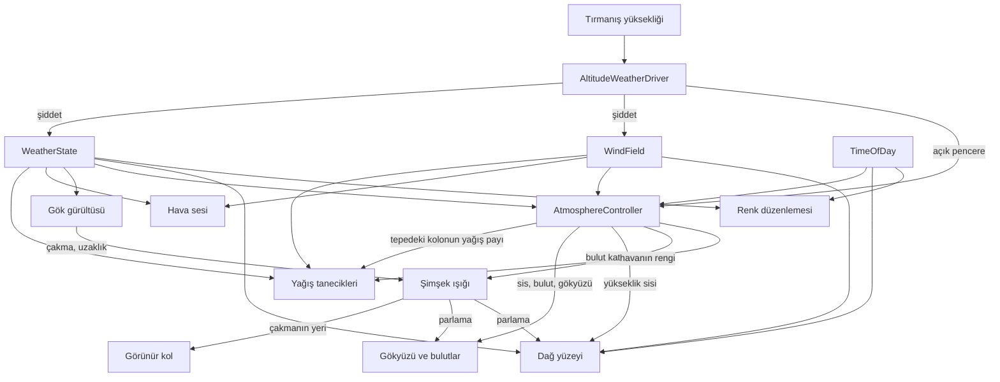

# Sistemler

## Bulutlar (`Assets/VolumetricClouds/`, `Assets/Scripts/Clouds/`)

`UnityVolumetricCloudsURP` (MIT) üzerine kurulu; yoğunluk, şekil ve aydınlatma zinciri
Nubis/HZD makalesine göre düzeltildi. Portun makaleyle farkları ve ölçümleri
`CLOUDS_REBUILD.md`'de, kuralların gerekçeleri `RATIONALE.md` → Bulutlar.

**Bulut ne okur**

| kaynak | ne | nereye |
|---|---|---|
| `AtmosphereController.Coverage` | küresel kapsamanın TEK eşlemesi | `cloudCoverage` |
| `AltitudeWeatherDriver.CloudMass` **veya** `AtmosphereController.Coverage` — hangisi büyükse | örtünün optik kalınlığı | `densityMultiplier` |
| `WindField.FreeAirSpeed` + `PrevailingDirection` | serbest hava rüzgârı, **arazi maruziyeti uygulanmadan** | `globalSpeed` (km/h), `globalOrientation` |
| `TimeOfDay` | **dolaylı** — yönlü ışığın yönü/rengi/şiddeti | `GetMainLight()` |
| `HeightFog.hlsl → FogPath` | kamera ile bulut arasındaki sis | birleştirme geçişi |

Çeviriyi `CloudWeatherDriver` yapıyor; tek yön, bulut geri yazmıyor.

**Buluttan ne okunur** — hepsi `CloudLayerProbe` üzerinden, o da aynı Volume ayarlarını ve
aynı hava haritasını okuyor:

| tüketici | ne |
|---|---|
| `AltitudeWeatherDriver.CloudColumnTop` | sütunun tepesi; üstünde yağış yok |
| `ClimbHud` | katman kotları ve kapsama |
| `PrecipitationRenderer` | sütunun kapsaması — yağış bulutun altında yağar |
| `LightningFlash` | çakma kotu, çakma sütununun tepesinden |
| `_CloudBottom` / `_CloudTop` globalleri | `LightningBolt.shader` çakmayı bulut kabuğuyla kesiştiriyor |

Yer bulut gölgesi bunlardan geçmez: bulut sistemi gölgeyi **ana ışığın cookie dokusuna**
yazar, `MountainSurface.shader` `_LIGHT_COOKIES` ile okur — gölge göğü çizen yoğunluk
alanının ta kendisinden türer.

Sis bağı birleştirme geçişinde, bulutun **kendi derinlik dokusuyla** (bkz. **Volumetrik
sis**, "her katman kendi mesafesiyle bir kez").

**Kurallar**
- Kapsama optik kalınlığa da girer; ikisinden **büyüğü** alınır, toplanmaz.
- Yoğunluk **kameradan bağımsızdır**.
- Yoğunluk `WeatherState.Precipitation`'dan **sürülmez** (döngü kurar).
- Kapsamanın eşlemesi **tek yerde**, `AtmosphereController`'da.
- Katman **mutlak kotta** (`localClouds` açık).
- Rüzgârda **maruziyet uygulanmaz**.

**Açık:** bulut rengi ufuk altı gök renginden besleniyor ve sıcağa çalıyor; düzeltmesi
ertelenen atmosfer işinde (`DECISIONS.md`).

Atmosferin **şu an nasıl çalıştığı**: ne neyden beslenir, ne neyi etkiler.

**Bu dosya sayı ve gerekçe tutmaz.** Eşikler, katsayılar ve renkler kodda ve ayar
asset'lerinde; bir kuralın **neden** öyle olduğu, ne ölçüldüğü ve ne denendiği
`RATIONALE.md`'de. Burada yalnız **ilişkiler ve kurallar** var.

| soru | dosya |
|---|---|
| Ne neyi okur, kural ne? | burası |
| Kural neden böyle? | `RATIONALE.md` |
| Hangi belirti, sebebi neydi? | `SYMPTOMS.md` |
| Hangi karar ertelendi, tetikleyicisi ne? | `DECISIONS.md` |

---

## 1. Kaynaklar

Her şey üç yerden doğar. Bunların dışında hiçbir sistem kendi zamanlayıcısını, kendi
rastgeleliğini veya kendi hava kavramını kurmaz.

| Kaynak | Ne üretir | Neye bakar |
|---|---|---|
| `AltitudeWeatherDriver` | Yağış şiddeti, rüzgâr şiddeti | Tırmanışın ulaştığı yükseklik |
| `TerrainWindShelter` | Rüzgârın arazi maruziyeti | Oyuncunun altındaki arazinin biçimi |
| `TemperatureField` | Sıcaklık, hissedilen sıcaklık, donma seviyesi | Kot, saat, yağış, rüzgâr |
| `TimeOfDay` | Saat, güneş yönü, gündüz katsayısı, ışığın rengi | Kendi saati |
| `WindField` | Rüzgâr vektörü, sürekli şiddet, anlık esinti | Sürücünün verdiği şiddet + kendi gürültüsü |

`WeatherState` bir kaynak değil, taşıyıcı: sürücünün yazdığı değeri (şiddet)
tutar ve değiştiğinde olay yayar.

**Rüzgâr iki sayıdır** — sürekli şiddet ve anlık esinti — ve ayrı yayımlanır. Yavaş tepki
vermesi gereken sistemler sürekliyi, esintiyi duyması veya görmesi gerekenler toplamı okur;
hangisinin hangisi olduğu §4'te. **Yükseklik "ulaşılan seviye"dir**, anlık Y değil: yukarı
anında takip eder, aşağı bir ölü bant ve gecikmeyle iner. Gerekçeler `RATIONALE.md`.

---

## 2. Akış



Akış tek yönlü. Hiçbir tüketici kaynağa geri yazmaz; iki tüketici birbirini okumaz.
Bu yüzden çelişki ancak aynı kaynağı farklı yorumlamaktan doğabilir — nitekim öyle de
oldu (bkz. §6).

---

## 3. Kuşaklar

Yükseklik arttıkça hava sertleşir. Kuşak sınırları `AltitudeWeatherDriver`'da tanımlı;
başka hiçbir yerde tekrarlanmaz — yüzey de tanecikler de oradan okur.

Sınırlar mutlak metre değil **dağın yüksekliğine oran**. Oran yalnız **referansı** verir;
sınırı okumaz, referansı okur.** Aradaki sulu kar kuşağı dar tutulur: geçiş bir bant değil
bir sınır gibi okunmalı.

| Kuşak | Hava | Ses | Yüzey |
|---|---|---|---|
| Açılış | Çok hafif yağmur, neredeyse rüzgârsız | Dingin yağmur ve rüzgâr | Çıplak kaya, ıslanır |
| Yağmur | Kademeli sertleşir, kar yok | Sağanak katmanı açılır, uzak gök gürültüsü | Islak kaya |
| Geçiş | Yağmur çekilir, kar yerleşir | Yağmur sesi hızla kısılır | Taze kar birikmeye başlar |
| Zirve | Dalgalanma kapanır, sürekli fırtına | Tam güç rüzgâr | Sürekli örtü |

**Kurallar**
- Şiddet, yükseklik tabanının üstüne binen iki Perlin katmanının çarpımı. Üçüncü ve çok
  yavaş bir gürültü nadiren **açık pencere** açar; pencerenin **derinliği de değişkendir**.
- Zirve kuşağında genlik daralır ama **sıfırlanmaz**.
- **Açık pencere dalgalanmanın parçası değildir**, ayrı hesaplanır ve zirvede de çalışır —
  orada yalnız eşiği yükselir. Şiddeti düşürdüğü için görüş de o anda açılır.
- **Bulut kütlesi yağışı gecikmeyle izler**; kapsama ve bulut tabanı `CloudMass`'ten sürülür.
  Sonuç kendiliğinden çıkar: kısa pencereler gökyüzünü açmadan geçer, uzun olanlar açar.
- **Bulut tepesinin üstünde yağış yoktur** ve bu kesme bulut sisteminden **itilir**
  (`CloudLayerProbe` → `CloudColumnTop`); sürücü çekmez.

Gerekçeler: `RATIONALE.md` → Kuşaklar ve hava dalgalanması.

---

## 4. Sistem sistem girdiler

### Yağış tanecikleri (`PrecipitationRenderer`, `Precipitation.shader`)

**Okur:** şiddet (yoğunluk ve damla boyutu dağılımı), **tepedeki bulut kolonunun yağış payı**
**ve girdap alanının sürüklenmesi**), rüzgârın **esintili** şiddeti (girdap genliği, tanenin
dönme hızı), **arazi yüzeyini** (`TerrainHeightAt` — rüzgârın sınır tabakası), **günün
saatini** (`TimeOfDay.CurrentSunColor × SunIntensity`, izin yönlü terimi) ve **göğün o
yöndeki rengini** (`AirColor`, izin ambient terimi).
**Okumaz:** hiçbir ışık kaynağını güneşten başka. Şimşek, fener ve lamba iz görünümüne
girmiyor — Garg-Nayar'ın hale maskesi (`1/d²`) sonlu mesafedeki kaynağın işi ve şu an
sahnede öyle bir kaynak yok. Şimşek eklendiğinde gerekecek (`DECISIONS.md`).

- **İzin rengi iki terimden gelir:** güneşin radyansı (yönlü, veritabanının `point`
  dokusu) + göğün radyansı (izotrop, `ambient` dokusu). İkisi ayrı örneklenip toplanır.
  Gök terimi ALÇAK GÜNEŞTE tonundan arındırılır — `AirColor` tek bir bakış yönünün
  rengini taşır ve şafakta damlaları maviye boyuyordu.

- **Yağış gökten tek parça düşmez, kaynağı tepedeki buluttur.** `CloudLayerProbe` hava
  haritasını oyuncunun konumunda CPU'dan okur; kapsama × kabarıklık (tip) yağış payını
  verir, yayvan ince katman yağdırmaz. Kolonun tepesinin üstünde pay sıfırlanır. Pay
  ~2.5 s'lik sabitle yumuşatılır.
- **Türbülans yamalıdır:** genlik, rüzgârla akan alçak frekanslı bir zarfla yerel çarpılır;
  (1–3 Hz); damla çırpmaz.
- **Tane kendi rengini seçmez** — havanın rengini çarpanla parlatır.
- **Tanenin biçimi kristal değil kümelenmedir.**
  Dönme ve girdap **esintiye** bağlanır, sürekli şiddete değil.
  bulunmasıdır.
- **Damla boyutu hem düşme hızını hem rüzgâra direncini belirler**; dağılım şiddetle kayar.
- **Tanecikler İKİ İÇ İÇE KUTUDA yaşar** (48 m ve 12 m), ikisi de kamerada merkezli,
  ikisi de kendi kutusuna sarar. Kameranın etrafında sarma periyodik bir döşemedir ve
  periyodik döşeme yoğunluk gradyanı taşıyamaz — "yakında sık" tek kutuyla kurulamaz.
  İç kutunun kapsadığı yerde yoğunluklar TOPLANIR.
- **Temsil payı konumdan türer, kutudan değil:** `N(r) = 1000 / yoğunluk(r)`. Aynı
  noktadaki iki tanecik hangi kutudan geldiğine bakılmaksızın aynı sayıda gerçek damlayı
  temsil etmek zorunda, yoksa aynı yerde iki farklı opaklık çıkar. İç kutunun payı kendi
  sönüm eğrisiyle girer; ayrışsalardı sınırda opaklık sıçrardı.
- **Yağış rüzgârın SINIR TABAKASINI okur** — yani `TerrainHeightAt`'ı, arazi yüzeyini.
  Rüzgâr yerde sıfıra iner, yükseldikçe logaritmik açılır; damla da tane de kendi kotunun
  payını yer. CPU yalnız SERBEST AKIŞ kaymasını integre eder; kotun getirdiği yavaşlama
  shader'da, tanecik başına, **kapalı biçimli sınırlı bir gecikme** olarak eklenir. Kar da
  aynı yasayı okur — yalnız damla düzeltilseydi aynı rüzgârda damla yavaşlar, tane
  yavaşlamazdı.
- **Tanecik girdabın her kıvrımını yemez: ATALET SÜZGECİ var.** Sürüklenme denklemi birinci
  mertebeden, yani tanecik alçak geçiren bir süzgeç: gevşeme süresi `τ = v_t/g`, `ω`
  frekanslı zorlamaya `1/√(1+(ωτ)²)` ile cevap verir. Frekans taneciğin alanın içinden
  GEÇME hızından doğar (`ω ≈ k·|V| + ω_zaman`), o yüzden girdap oktavı başına ayrı hesaplanır.
  **Yağmurla karı ayıran şey budur** — kar aynı alanda damladan altı kat fazla sapar. Eskiden
  fark elle konmuş bir katsayıyla taklit ediliyordu; o telafi terimi silindi.
- **Girdap ölçeği de kotla değişir.** Yüzey tabakasında girdap boyu `ℓ ≈ κz` ile büyür,
  yere yakın büyük girdap sığmaz. Alanın dalga boyu sabit olduğu için ölçek değil ENERJİ
  PAYI kaydırılır: kaba oktav sığdığı kadarını tutar, kalanı ince oktava geçer. Toplam hız
  değişintisi korunur. Bandı kesmek denendi ve elendi — kesilen enerjinin nereye gittiği
  yazılmadan hiçbir bant kapatılmaz (`RATIONALE.md`).
- **İzin boyu, saydamlığı ve yönü tek bir hızdan türer: bileşke hız** (sınıftan gelen yatay
  rüzgâr sürüklenmesi + damlanın kendi terminal hızı). Üçü ayrı hız okuyamaz — boy uzayıp
  saydamlık sabit kalırsa enerji yoktan var olur. Dolayısıyla **iz geometrisi rüzgârı
  okur**: rüzgâr sertleştikçe izler hem uzar hem yatar hem soluklaşır.
- **Yön sekiz sınıfa kilitli değildir.** Rüzgâr sürüklenmesi CPU'da sınıf başına integre
  edilir (konum ayrık kalmak zorunda), ama izin yönü damlanın kendi yarıçapından gelen
  dikey bileşenle kurulur ve üstüne **girdap alanının kendi türevinden** çıkan damla başına
  sapma binder. Sapma uydurulmaz: çizilen konumun tam türevi alınır.

### Hava sesi (`WeatherAudio`, `AudioBand`)

**Okur:** şiddet, rüzgârın sürekli şiddeti **ve** esintisi.

Dört band (hafif yağmur, sağanak, dingin rüzgâr, fırtına rüzgârı), eşit-güç geçişiyle
karışır; ayrık "hafif/şiddetli" durumu yoktur.

- **Hangi sesin çaldığını sürekli şiddet, ne kadar yükseldiğini esinti belirler.** Band
  geçişi esintiye bağlanmaz.
- **Rüzgâr sesi asimetrik yumuşatılır** — esinti hızlı gelir, yavaş çekilir. Sertleştikçe
  alçak geçiren filtre açılır ve perde yükselir.
- **Her band varyasyonlar arasında çapraz geçiş yapar**, band susmasını beklemez.
- **Seviyesi eşiğin altına inen kaynak duraklatılır** — sıfır sesle çalmak klibi çözmeye
  devam eder.

### Gök gürültüsü (`ThunderPlayer`)

**Okur:** şiddet (sıklık ve yakınlık).

  susmaz** — tipide şimşek nadirdir, yok değildir.
- Çakma anında `Struck` olayı yayılır ve **uzaklığı metre olarak** taşır. **Mesafenin tek
  sahibi burasıdır:** hem sesin gecikmesi (`mesafe / 340`) hem çakmanın dünyadaki yeri
  ondan türer.
- **Ses o anda çalmaz** — yakında saniyenin altı, uzakta yirmi saniyeye kadar bekler.

### Şimşek ışığı (`LightningFlash`)

**Okur:** `ThunderPlayer.Struck` ve taşıdığı uzaklık, `CloudLayerProbe`'dan bulut katmanının
tabanı ve tavanı, oyuncunun konumu.
**Okumaz:** yağış, rüzgâr, günün saati — çakmanın koşulları tetikleyen tarafta zaten
değerlendirildi.

- Uzaklığı bir dünya noktasına çevirir: yön rastgele, yükseklik bulut katmanının **alt
  çeyreği**.
- **Işık yönlü kalır** ve şiddeti mesafenin karesiyle söner.
- Kendi rastgeleliği yalnız çakmanın **yönü** ve **biçimi** (1–3 geri vuruş); **anı** ve
  **uzaklığı** değil.
- **Gökyüzü ve bulut aynı `_LightningFlash` / `_LightningPosition` değerlerini okur.**
  Bulutun parlaması bindirme geçişinde, tam çözünürlükte, her kare uygulanır.
- **Yükseklik sisi de aynı değeri okur** — çakma anında sisin kendisi içeriden parlar.
- **Parlama çakmanın bulunduğu yerde toplanır, bir yönde değil:** ışın bulut katmanıyla
  kesiştirilir ve bulunan noktanın çakmaya uzaklığına göre söner.
- **Ortam ışığına dokunmaz** — onu gökyüzü paketi pişiriyor.

### Görünür kol (`LightningBolt`)

**Okur:** `LightningFlash.Placed` ve taşıdığı çakma noktası, arazinin yüksekliği.
**Okumaz:** hava, uzaklık aralıkları, zamanlama — nerede çakıldığına karar vermez.

- **Yalnız yakın çakmalarda çizilir**; kolun görünmesi mesafe hakkında bilgi taşıyor.
- Kanalın nerede biteceğini yamacın kendisi belirler. Değme noktasındaki ışık **nokta**
  ışıktır.
- **Kol bir AĞAÇ** (Reed & Wyvill 1994): dallar ana koldan ortalama **16°** sapar, açı
  normal dağılır, dallanma özyinelemelidir. Her kuşakta kalınlık ×0.5, olasılık ×0.8,
  uzunluk ×0.5, kıvrımlılık ×1.3 — dal ebeveyninden daha kıvrımlıdır. Çizgiler havuzdan
  gelir, bütçe tavanı `boltMaxLines`.

### Şimşek saçılma tablosu (`LightningLutBaker`)

Dobashi 2001 §4'ün lookup table'ı: `Assets/Settings/LightningScatterLut.asset`,
128×128 RGBAFloat, T = 1.5 km. Asset yoksa yükleme anında kendiliğinden pişer.

**Statik.** Sahne, hava ve çakma konumu değişse de değişmez — makalenin bütün numarası
bu (Denklem 4: kaynağın şiddeti integralin dışında kalıyor).

**Berrak hava için pişiyor**, yerel sis için değil: tablo üniform yoğunluk varsayıyor,
bizim sisimiz üniform değil. Yerel sis kendi yolundan geçmeye devam eder, çift sayım yok.

**Referans yapılandırmada 1.0 verecek şekilde normalize** (800 m, 30° sapma) — bugünkü
parlaklık o noktada korunuyor, değişen yalnız mesafe/açı sönümü.

**Eksenler işaretli karekök**, makaledeki doğrusal değil: T 9 km'ye çıkmak zorundaydı
(çakma 8 km'ye gidiyor, kaynak tablonun dışında kalırsa parlama sıfır olur) ve doğrusal
eksende 128 hücre 18 km'ye yayılınca hücre 140 m'ye çıkıyordu. Parlamanın tamamı ilk
birkaç yüz metrede; karekök eksende hücre merkezde ~1 m. **Shader ters eşlemeyi birebir
uygulamak zorunda.**

**DÖRT TÜKETİCİ, TEK KAYNAK DİZİSİ:** `HeightFog.hlsl → FogPath` (arazi ve cisimler),
`SkyFog.shader` (gök pikselleri), `Sky.shader` (yedek gök materyali) ve bulut ışın
yürüyüşü. İlk üçü `LightningScatter()` çağırıyor; bulut kendi yürüyüşünün içinde aynı
`_LightningSources` dizisini okuyor.

**KANAL BOYUNCA SEKİZ NOKTA KAYNAK**, tek nokta değil: boşalma noktasından yamaca kadar
eşit aralıkla, uç arazi örneklenerek. Tek kaynakta parlama küre gibi duruyordu. Enerji
kaynaklara bölünüyor, yani sayı değişince toplam parlaklık değişmiyor.

**ARAZİ TIKAMASI VAR.** Yüzeyin arkasında kalan integral parçası çıkarılıyor:
`görünen = I(u_eye,v) − I(u_eye−L,v)·e^(−κL)`. Makale bunu yapmıyor; dağın altında da
hâle çıkıyor ve dağ saydam okunuyordu.

**Bulut parlamasının düşüşü `R²/(r²+R²)`** — uzakta 1/r² (Denklem 9), r=0'da ıraksamıyor,
R'de yarıya iniyor. Eski `pow(1−d/R,12)` sezgiseldi. Optik derinlik τ hâlâ yaklaşık:
makalenin küp-ekran çözümü metaball'a özgü, yerel yoğunluk vekil alınıyor.

**Terim ÇARPILMAZ, EKLENİR.** Eskiden üçünde de `_LightningFlash.rgb * 0.6` sisin
opaklığıyla ağırlıklanıyordu — berrak havada parlama sıfırdı. Saçılan şey her zaman var
olan hava; yerel sis ayrı ortam, kendi yolundan geçiyor, çift sayım yok.

**Bilinçli sınır: arazi tıkaması yok.** Kaynağın önündeki yamaç parlamayı kesmiyor.
Makale de kesmiyor (§4.5 doğrudan toplam).

### Volumetrik sis (`VolumetricFogFeature`, `VolumetricFog.compute`, `VolumetricFogShared.hlsl`)

**Okur:** yoğunluk modelini (`AtmosphereController` sürer), URP ana ışığını, ortam probe'unu,
bulut gölgesini (ana ışık cookie'si).
**Okumaz:** gökyüzü paketinin hava perspektifini — o homojen atmosferin sahibi, bu sistem
yalnız YEREL ortamı taşır.

Wronski 2014 froxel hacmi: kamera frustum'una hizalı 3B ızgara, x/y ekran koordinatı, z
üstel derinlik (`z(s) = near·(far/near)^s`). 160×90×64, RGBA16F, 0.5 → 1000 m. İki compute
kernel: yoğunluk+aydınlatma, sonra Beer-Lambert birikimi.

- **TEK YOĞUNLUK MODELİ, İKİ DEĞERLENDİRİCİ.** `VolumetricFogShared.hlsl` bütün katmanları
  taşır; hacim içinde compute, ötesinde `HeightFog.hlsl`'in analitik kuyruğu aynı
  fonksiyonları çağırır. Model tek yerde durmasa hacmin sınırında sisin yapısı değişirdi.
- Kompozisyon Beer-Lambert gereği: `sonuç = kuyruk × T_hacim + saçılım_hacim`. Geçiş yapı
  gereği sürekli, ayrıca blend penceresi yok.
  dikey profil **kapalı biçimde** integre edilir.
- **Alanlar sinüs TOPLAMIDIR, çarpımı değil** — yönleri paralel olmayan, dalga boyları
  oransız beş bileşen. Sinüs seçildi çünkü CPU ile GPU birebir aynı sonucu veriyor ve
  `AtmosphereController` aynı alanı CPU'da örneklemek zorunda; **formül değişirse ikisi
  birlikte değişir.**
- **HER KATMAN KENDİ MESAFESİYLE BİR KEZ SİSLENİR.** Arazi kendi shader'ında
  (`ApplyHeightFog`), hacimsel bulut birleştirme geçişinde (`FogPath` + bulutun kendi
  derinlik dokusu), gökyüzü `SkyFog.shader`'da (sonsuz yol). Sıra: gök sisi
  `AfterRenderingSkybox + 2`, bulutlar `BeforeRenderingTransparents`.
- `FogPath` geçirgenlik ile in-scattering'i **ayrı** döndürür; `ApplyHeightFog` ikisini
  `renk × T + saçılım` diye birleştirir — yol renkte doğrusal olduğu için ayrıştırma
  yaklaştırma değil.
- **Ortamın SEVİYESİ sis renginden, YÖNÜ SH'den.**
- **Bulut gölgesi ana ışık cookie'sinden**; üçüncü bir yol açılmadı.
- **KOMUT TAMPONU GLOBALLERİ COMPUTE'A ULAŞMAZ.** `Shader.SetGlobalX` ulaşır; URP'nin
  `cmd.SetGlobal...` ile yazdıkları (`_MainLightColor`, `_MainLightPosition`, cookie
  matrisi) **ulaşmaz ve sessizce sıfır okunur**. Ana ışık, cookie matrisi ve ortam SH'si
  C#'tan açıkça geçirilir; dokular kernel'e elle bağlanır.

Gerekçeler: `RATIONALE.md` → Yağış, ses ve şimşek · Volumetrik sis.

---

### Sis ve hava sinyalleri (`AtmosphereController`)

Sis, görüş mesafesi, hava sinyalleri. **Gökyüzü, ortam ışığı ve yansıma burada değil**
(bkz. **Gökyüzü ve atmosfer**); hacimsel bulutlar ayrı sistem (bkz. **Bulutlar**).
Buradaki `coverage` bulutların da okuduğu tek eşlemedir.

**Okur:** şiddet, rüzgârın **sürekli** şiddeti ve yönü, günün saati, ve
sürücüden üç sinyal — **açık pencere**, **kuru kapsama**, **bulut kütlesi**.
**Okumaz:** esintiyi, kuşak kotlarını, yüksekliği, ilerlemeyi.

Görüş mesafesi tek değerden türer: yağış tipi, rüzgârın savurması (yalnız yağışta anlamlı),
bulut kuşağının içinde olup olmama.

**Bulut gölgesi ana ışığın cookie dokusundan yere düşer** ve arazi gölgesiyle **çarpılır**:
ikisi ayrı olay ama ikisi de yalnız doğrudan güneşi keser, dolaylıya dokunmaz.

#### Sis katmanları

- **Sis üç katmanın TOPLAMIDIR**, her biri kendi yarı yüksekliğiyle: sınır tabakası
  (yağışla derinleşir, inversiyonda biter), vadi sis denizi (çok sığ, gece ürünü), serbest
  troposfer (yayvan, yağıştan bağımsız). **Toplanır, çarpılmaz.**
- **Şafak denizi ayrı katmandır** ve ayrı kanaldan gider
  (`_FogSeaDensity`/`_FogSeaFalloff` ile `_HeightFogDensity`/`_HeightFogFalloff`);
  `FogDensityAt` mutlak yoğunlukları toplar. Vadi sisi gece birikir, şafakta en kalın,
  güneşle dağılır — **akşam geri gelmez**.
- **Katmanın derinliği yağıştan sürülür.** Görüş, inversiyon tavanı ve katman derinliği
  üçü de yağış şiddetinden türer; çelişemezler.
- **Görüşün fiziksel tavanı vardır.**
- **Sis üniform değildir:** rüzgârla sürüklenen alçak frekanslı bank alanıyla yerel
  çarpılır. Aynı alan iki yerden okunur — GPU deseni çizer (`FogBankAt`), CPU kamera
  konumunda örnekler (`BankField`); **formül değişirse ikisi birlikte değişir.**
- **Bulut tabanı sabit değil:** sakin havada iner, yağış ve rüzgâr yükseltir; dakikalar
  ölçeğinde yer değiştirir.

#### Hava haritası ve bulut biçimi

**Bulut dağılımının tek kaynağı pişirilmiş 2B hava haritasıdır.** Matematiği
`CloudWeatherMapGenerator`'da; iki tüketici: `CloudWeatherMapBaker` (editör) ve F1 panelinin
canlı "yeniden pişir" düğmesi (`AtmosphereController.SetWeatherMap`). Kanallar:
**R kapsama, G tip, B taban kayması, A tavan.**

- **Harita türetilmiş veridir ve kendini tazeler.** İmza ayar alanları **ve**
  `CloudWeatherMapGenerator.Version`'dan kurulur; tazeleme editör yüklenirken
  (`[InitializeOnLoadMethod]`), sahne kurulumunda değil. Pişirme asset'in **üstüne** yazar.
- Harita gürültüden türetilmez, fiziksel kurallarla kurulur: organizasyon alanı göğü
  boş/seyrek/yoğun ayırır, çekirdekler üstel yarıçap dağılımıyla serpilir ve örtüşenler
  birleşir. **Çekirdekler eliptiktir**; tip ve taban kayması çekirdek başına sabittir,
  opaklığı TİP taşır.
- **Süreksiz fonksiyon sürekli alana uygulanamaz** (ayrı "kimlik" hash'i bu yüzden söküldü).
- **Hava kolonsaldır:** kapsama, tip, tavan ve taban kayması kolon boyunca tek değer;
  dikey yapıyı yalnız zarf ve şekil gürültüsü kurar.
- **Tavanı yalnız kolon-sabit alanlar sürebilir.** Kolon-sabit okumalar y'lerini sabitler
  (`colWarp` y = 87.3 + evrim, `colBump` y = 310.7). Tavanın meşru kaynağı pişmiş A
  kanalıdır. **Fırtına tekdüze doldurur, kolon seçmez** (`DECISIONS.md`).
- **Zarf şekil alanını çarpmaz, kapsamayı kısar.** Saçak kapısı zayıf kapsama kuyruğunu
  keser; saçak ezmesi zayıf kapsamada tavanı basıklaştırır. Kapsama–gök bağı alt-doğrusal.
- **İğne/bıçak biçimli bulut matematiksel olarak üretilemez.** İki garanti pişirmede:
  tavan alanı tip×gelişim **bileşimi** olarak bütün hâlinde bulanıklaştırılır (dünya eğimi
  ~45°'yi aşamaz) ve kubbe geometrisi yüksekliği kenara uzaklıkla büyütür. Kanıt
  `weather_bake_sim.py`.
- **Bulut alanı rijit ötelenmez:** harita rüzgârın %72'siyle, şekil alanı tam hızla akar;
  evrim üç eksende kayar, aşındırma kendi zamanında (~3×) kaynar.
- Fırtına dolgusu 0.42'den itibaren boşlukları doldurur; **tabanı tavan kanalından
  varyanslıdır.** Kapalı örtüde döşeme tekrarına iki önlem var ve **yetmiyor** — asıl
  kırıcı 48 km periyotlu kaydırma (bkz. §5, "Döşeme kırıcı").

#### Işık ve örnekleme

- **Kapsama eşiği belirler; yoğunluğu ayrıca çarpmaz.** Kenar sönümünü sert kapsama kapısı
  ve uzun kuyruklu kuvvet eğrisi yapar.
- **Işık sondası 5 koni örneği + 1 uzak örnek**, adımlar üstel büyür (`menzil/(2ⁿ−1)`).
  Koni çekirdeği sürgü aralığının tamamını ayrı yönle karşılar.
- **Sonda bulutun ön yüzünde tam örnekler** (alfa 0.3'e kadar erozyon da okunur) ve
  örneğin **kameraya uzaklığını** taşır. Koninin uzak örneği bilinçle ucuz ve mesafesiz.
- **Kare başına piksellerin 1/9'u hesaplanır**; geçiş **harmansız**, blok deseni yalnız
  kompozit çadır filtresiyle örtülür (`DECISIONS.md`, 1/16).
- **Boş bölge sıçraması tam adım katları hâlinde** yapılır, faz korunur.
- **Mercek sapması kapsamayı çarpar**, şekil alanına toplamsal binmez.
- Integrasyon yamuk kuralıyla; **ışık kapısı dar tutulur**; **jitter yerel koordinat +
  sin'siz hash**.
- **Dilim değişmezi:** yoğunluk ≤ 0.30/adım. **Peçe rengi süzer, alfayı değil.**
- **Yağış karartması ikinci çarpan değil**, karartmanın derinliği.
- **Yağmur soğurması yereldir** — ölçü kolonun kendi kalınlığı, ek doku okuması yok.
- **Bulut ortamı IŞINIM değil RADYANS ister** (dönüşüm π).
- **Gezegen yarıçapı gerçek değeriyle durur**; bulutun ufuk kenarını **sönüm** saklar,
  geometri değil. Şimşek shader'ı aynı küreyi kestiği için aynı globali okur.
- **Sanat yönü haritayı ezebilir, ama pişirmede.** Pişmiş harita adı boyanan dosyanın
  **içerik** hash'ini taşır.

#### Renk ve gökyüzü bağları

- **Bulut ve sis rengi aynı kaynaktan gelir.**
- **Batış kızıllığı buluta ışık olarak EKLENİR**, sonucu çarpan ton değil. Renk
  `TimeOfDay`'in süzülmüş güneşi, pencere `HorizonFactor`. Güneş/ay kadranları sınırlı yol
  sönümü alır.
- **Şafağın rengi üç gök örneğinden** (güneşe doğru, karşı ufuk, zenit), azimut sönümü tek
  yerde. Yalnız güneşin tam azimutundaki **altın uç** açık yazılı sabittir ve bilinçli
  abartmadır.
- **Kazanç tektir** (`Atmosphere.SceneGain`).
- **Gökyüzünün rengi tek ve çok saçılmanın toplamıdır** (Hillaire 2020). Kazançlar zenit
  radyansına göre eşitlenir; tabloya dokunulduğunda ikisi birlikte ayarlanır.
- **Sis renginin SEVİYESİ gökten, TONU sabitten.** Zincir tek yönlü: gök →
  `SkyAmbientBaker` → probe → sis rengi → froxel hacmi. Katsayı **üç renge birden**
  uygulanır.
- **Hava ve gökyüzü tek fonksiyondur** (`HeightFog.hlsl → AirColor`). Gökyüzü kendini
  `SkyFogAmount` ile sisler. **İnen ışının integrali ayrıdır.**
- Yıldız, kadranlar ve şimşek lekesi havanın arkasındaki cisimlerdir. Bulut bindirmesi
  geçirgenliğini arazi sisiyle aynı integralden alır ama **bank çarpanını yalnız kameranın
  yerelinden** okur.
- **Yüksek katman aynı fonksiyona karışır**; ufuk sınırı kesme değil **sönme**.
- **Güneş diski sisin optik derinliğiyle söner, hâlesi kalmaz.**
- **Sönüm bütçesi Koschmieder'dir (3.9).**
- **Arazide sönüm kanal başınadır:** berrak havada Rayleigh, kapandıkça Mie; geçişi
  görüşten CPU türetir.
- **Test kilitleri bileşeni kapatmaz** — kilit sürücünün kendi hedefini dışarıdan verir.

Gerekçeler: `RATIONALE.md` → Sis, görüş ve hava sinyalleri.

### Işığın rengi (`TimeOfDay`)

Şafak/batış rengini üretir ve **dört yeri birden** besler: dağ yüzeyi, bulutlar, sis,
gökyüzü kadranı.

- **Alpenglow'un alt sınırı Dünya'nın gölgesinin o andaki yüksekliğidir** (`h ≈ R·θ²/2`,
  θ güneşin ufuk altı açısı), sabit bir irtifa bandı değil. Tanınabilir yapan şey gölge
  çizgisinin yamaçta **yukarı yürümesi**.
- **Güneş battıktan sonra aydınlatan kaynak noktasal değil**, kızıla boyanmış bütün
  gökyüzü. Yönlü sönüm (`alpenglowFacing`) ve güneş yönlü arazi gölgesi yalnız **doğrudan
  fazda** çalışır; artçı fazda yerlerini **maruziyete** bırakır.
- **Şafak kızıllığı seçilmez, hesaplanır** — alçak açıdan gelen ışık atmosferde uzun yol
  kat eder, mavi saçılıp tükenir. En parlak kanal **bire oturtulur**.
- **Hava kütlesi ufuk altında sabitlenir**, daha erken kesilmez.
- **Alacakaranlık üç parçanın toplamıdır ve üçü de aynı kaynaktan beslenir:** gök paleti
  (`AirColor`; altın ucu açık yazılır), bulut alt ışığı, ve **altın saat kademesi**
  (`LookSettings.goldenHour`, `HorizonFactor` sürer — fırtınada devreye girmez).
- **Palet sayıları simülasyonla doğrulanır** (`dusk_palette_sim.py`); göz test aracı değil.

Renk sırası turuncu → pembe → mor ilerler; moru veren Rayleigh değil ozonun Chappuis
soğurmasıdır — **renk ilerlemesi henüz yapılmadı**.

Gerekçeler: `RATIONALE.md` → Işığın rengi.

### Rota ve arazi şekli (`MountainRoute`, `RoutePainter`, `RouteTerrainShaper`)

**Okur:** elle çizilmiş rota verisi (otobüs yolu, doğuş, dört hat, kamplar, market) ve
üretilmiş yükseklik haritası.
**Yazar:** yükseklik haritasını — arazi üretildikten **hemen sonra**, yüzey haritaları
pişmeden önce.

- Konumlar **normalize XZ (0–1)** olarak saklanır, yükseklik saklanmaz: arazi yeniden
  üretilince işaretler yeni zemine kendiliğinden oturur.
- Boyuna eğim sınırı **tavandır**, ortalama değil (otobüs %10, bisiklet %12); uygun
  parçalara dokunulmaz.
- Kazı 1:1, dolgu 1:1.5; sabit geçiş genişliği yok, pay kot farkından türer.
- **Rota imzaya girer** — hat değişince arazi baştan üretilip yeniden şekillenir. Tesviye
  şekillenmiş arazinin üstüne ikinci kez uygulanamaz.
- Yolun **görünürlüğü** buradan gelmez (`DECISIONS.md`, doku işi).

### Dağ yüzeyi (`TerrainSurface`, `MountainSurface.hlsl`)

**Okur:** yağış şiddeti (`WeatherState` → ıslaklık; ıslanma hızlı, kuruma yavaş), hâkim
rüzgâr yönü ve şiddeti (`WindField.PrevailingDirection` / `Strength`), öğle güneşi
(`TimeOfDay.NoonSunDirection` — liken yıllık güneşlenmeye yerleşir), gün içi güneş
rengi ve yönü (alpenglow).
**Kum için okur:** `_SeaLevelY` — durgun deniz kotu. Kum bandı bu kotun altında ve
üstünde dar bir aralık; eğim ve yama alanı da sağlanmalı, üçü birden tuttuğu yerde kum
var. Bu yüzden kıyının **bir kısmı** kum: dik kıyı kayalık burun kalır, yatık ve yama
açık olan yer kum koyu olur.
**Kum için okumaz:** `_SeaWetLevelY`'yi. O kabarmayla nefes alıyor; bant ona bağlansaydı
kumsalın sınırı her dalgada metrelerce kayardı. Islaklık kumun **üstüne** biniyor —
sıra: kum → yağış ıslaklığı → deniz ıslaklığı.
**Alpenglow için okur:** `AtmosphereController.Coverage` — bulut kapsaması. Doğrudan faz
kapsamayla kısılıyor (tam kapalıda 0.25 katı), sıfırlanmıyor: alpenglow'un iki fazı var,
doğrudan huzme ve göğün kızılından gelen artçı faz; bulut ilkini öldürür, ikincisini
yalnız söndürür. Eskiden hiç hava terimi yoktu ve fırtınalı şafakta dağ yüzü kızıl
yanarken sis paleti aynı durumda bilerek soluyordu — tek göğün iki türevi çelişiyordu.
**Okumaz:** anlık rüzgâr yönünü — yüzey deseni hâkim yönden kurulur.
**Artık okumuyor:** kar kuşağı kotlarını. `AltitudeWeatherDriver` ve `TemperatureField`
bağları 2026-08-22'de söküldü — kar silinince öksüz kalmışlardı.

### Gökyüzü ve atmosfer (`PhysicallyBasedSkyURP` paketi, `SkyWeatherDriver`)

**Okur:** ana ışığın yönü ve rengi (`TimeOfDay` sürüyor), yağış şiddeti (`WeatherState`).
**Okumaz:** `AtmosphereController`'ın renk zincirini — gökyüzü kendi fiziğinden çiziliyor.

`Packages/com.jiaozi158.unity-physically-based-sky-urp` — HDRP Physically Based Sky'ın URP
portu (MIT). Rayleigh, Mie ve ozon soğurmasını LUT'lardan hesaplıyor; aynı LUT'lar üç yeri
besliyor: gökyüzü, hava perspektifi, ambient probe.

Üç override tek profilde (bulutlarla aynı profil — bulut portu gezegeni oradan okuyor):
`VisualEnvironment` (tip Fiziksel, uzay DÜNYA, ambient DİNAMİK) · `PhysicallyBasedSky`
(EarthAdvanced, atmosferik saçılım AÇIK) · `Fog` KAPALI (`DECISIONS.md`).

**Bulut bağı.** `URP_PBSKY` tanımlıyken bulut portu gezegen merkezi/yarıçapı, ambient probe
ve hava perspektifini gökyüzünden alır. Gök yansıması bulut materyalini de alıyor.

**Kurallar**
- **SOĞURMANIN TEK SAHİBİ PAKET.** Yönlü ışığa HAM güneş yazılır; `TimeOfDay`'in kendi
  süzmesi (`Tint`, `BeamLevel`, `LowSunFade`) ışığa uygulanmaz.
- Işıktaki tek kısıcı geometrik: **güneşin bandı +3° → −12°, ayınki ±3°**; asimetri
  bilinçli, çünkü paket göğü ışığın yönünden ve şiddetinden hesaplıyor.
- `Atmosphere` modeli **silinmedi** — ışığa değil başka tüketicilere bakıyor: sis rengi,
  bulut tonu, arazi şafak rengi, pozlama uyumu.
- **GÜNEŞ VE AY AYRI IŞIK, AY İKİNCİ GÖK CİSMİ.** `TimeOfDay` ikisini ayrı sürer; güneş
  bandı **+3° → −18°** (gökyüzünü o sürüyor), ay **±3°**.
- **Ay gölge düşürmez** — paketin `GetMainLight`'ı gölgesiz cismi ana ışık saymayıp
  `RenderSettings.sun`'a düşüyor.
- Paket ayı **ikinci gök cismi** olarak çizer; evre ve dünya parıltısı kendi hesabından.
- **AY GÖKYÜZÜNÜ DE AYDINLATIR** — LUT'lar `_CelestialBodyCount` üzerinden iki cismi de
  topluyor.
- **Bulutlar ayı YALNIZ ortam ışığından alır** (ayda gümüş kenar yok).
- **Ortam probe'u GERÇEK gökyüzünden pişer** (`SkyAmbientBaker`, `DynamicGI`); paketin
  analitik probe'u devre dışı. Pişirme kısık, ve **sıçramada iki kez** yapılır.
- **Ortam kipi `Skybox` olmak zorunda**; kipi sahne kurulumu yazar.
- **Ortam ışığı ve yansımayı paket pişirir.** `AtmosphereController` `RenderSettings`'e
  yazmaz — iki yazar olduğunda sonuç kare içindeki yazma sırasına kalıyordu.
- **YILDIZLAR PROSEDÜREL** (`StarField.hlsl`): yön küp yüzü ızgarasına bölünür (yüz başına
  128, hücre 0.70°), hücre hash'inden konum/kadir/renk. Yarıçap ekran-uzayı türevinden.
  Sintilasyon hava kütlesinden (kendi zamanlayıcısı yok), gündüz solması güneş
  yüksekliğinden ve **kadire göre ayrı**. `(1 − skyOpacity)` gündüzü kapatmaz.
  Gök kutbu ekseni güneşin yayıyla **aynı** (`TimeOfDay.CelestialPole`).
- **Ayın tonu değişirse eski ışımaya ölçeklenir** — renk değişirken parlaklık değişmemeli,
  yoksa `SurfaceLightLevel` üzerinden pozlama da kayar.
- **Hava bağı tek çeviri:** yağış şiddeti → `aerosolDensity`. Güneşin yönü ve rengi buradan
  **geçmez**.

Gerekçeler: `RATIONALE.md` → Gökyüzü ve gök cisimleri.

### Bisiklet (`BikeController`, `BikeSurface`)

**Okur:** yalnız sisi (`ApplyHeightFog`). Davranış tarafında hava, rüzgâr, sıcaklık ve kar
sistemleriyle **bağı yok** ve bu bilinçli — bisiklet başka bir projeye taşınabilsin diye
tek bağımlılığı kendi ayar asset'i.

Sis istisnası taşınabilirliği bozmuyor ve zorunlu: ekrana çizilen her şey aynı havanın
içinde. Bisiklet Unity'nin kendi sisini çağırıyordu (`ComputeFogFactor` / `MixFog`), ama
sahnede `m_Fog: 0` — çağrı ölüydü, bisiklet hiç sis yemiyordu ve fırtınada dağ beyazlarken
tek başına net duruyordu. Unity sisi zaten yükseklikten bağımsız olduğu için projede hiç
kullanılmıyor; ikinci bir sis kaynağı tutmak atmosfer kuralının yasakladığı şey.

Hız fizikten çıkıyor, tablodan değil: `P = v·(Crr·m·g + m·g·sin θ + ½·ρ·CdA·v²)`. Zemin
eğimi ışının döndürdüğü yüzey normalinden okunuyor, arazi sistemine sorulmuyor.

Görsel üç ayrı bileşende ve hiçbiri fiziği bilmiyor: `BikeWheels` yol hızından dönüş
(`ω = v/r`), `BikeSteeringVisual` yatma açısından gidon sapması, gölgelendirici yüzey.
Model olmadan da fizik çalışıyor.

**Yüzey desenin kaynağı nesne uzayı**, dünya değil: bisiklet hareket ediyor ve dünya
uzayında örneklenseydi boya yüzeyin üstünde kayardı. Aşınma yine de dünya yukarısını
okuyor — toz üstte birikir, kir altta toplanır, sebebi yerçekimi.

Malzeme üç yerden geliyor: parça→yüzey tablosu (kaba atama), mesh bölgeleri (tek mesh'te
gelen tutamak/kablo/pedal), köşe rengi maskesi (elle boyanan sınırlar). Sonuncusu
diğerlerinin üstüne yazıyor.

### Renk düzenlemesi (`LookController`)

`SurfaceLightLevel`i, ortam probe'unun zenit parlaklığı. Post-process profilini sürer,
ayrı bir hava kavramı kurmaz.

- **Pozlama uyumu gökyüzünü OKUR, sürmez.** `adaptShare` × sahnenin ışık seviyesi kadar
  açılır, `exposureCap`te kırpılır. Gece kırpma etkin — gece parlaklığı `MoonIntensity`den
  ayarlanır, buradan telafi aranmaz.
- **Pozlama karanlık ucu kaldırmak için kullanılmaz.** Karanlık ucun aleti gece profilinin
  `contrast` değeridir.
- **Bloom eşiği bulut faz karışımına bağlı.** Faz karışımına bir daha dokunulursa **eşik
  yeniden bakılır**.

Gerekçeler: `RATIONALE.md` → Renk düzenlemesi.

---

### Arazi iskeleti (`DivideTree`)

**Okur:** hiçbir şey — pişmiş içerik; `Tools/terrain/` bir kez üretir, çıktı repoda durur,
çalışma zamanı yalnız yükler.
**Yazar:** hiçbir şey. Bir veri asset'i; tüketicileri L1 (yükseklik haritası), L2
(işaretler) ve içerik yerleştirmesi.

- Zirve ile key saddle arasında **bijektif** eşleme var, yani yapı grafik değil **ağaç**:
  boyun sayısı = zirve sayısı − 1. İçe aktarma bunu denetler.
- **KİMLİK = DİZİ İNDEKSİ.** İçerik dünya koordinatı değil `(düğüm kimliği, yerel ofset,
  oturma kuralı)` tutar; kimlik kararlılığı bozulursa yerleştirme emeğinin tamamı gider.
- **Yükseklik bu grafikten türer** — zirvesiz bölgede yükseklik bilgisi de yoktur ve arazi
  tabana çöker. Bir bölgenin belli kotta durması isteniyorsa oraya zirve konur
  (`DECISIONS.md` → "L0 uygulandı").
- Aynı tohum → aynı grafik → aynı kimlikler; co-op'ta senkronlanacak bir şey yok.

### Arazi ışığı (`MountainSurface.shader`)

**Okur:** `TimeOfDay` (güneş yönü ve şiddeti), ortam probu (`SkyAmbientBaker` → `DynamicGI`),
`SurfaceMapBaker`'ın ufuk ve normal haritaları.

Araziye ulaşan güneşi **üç yol** kesiyor ve üçü de aynı kanaldan gidiyor:

| yol | kaynak | menzil |
|---|---|---|
| ufuk haritası | `SurfaceMapBaker.BakeHorizon`, 1024², 16 yön | tüm arazi |
| gölge haritası | URP cascade | 150 m |
| bulut cookie'si | `VolumetricClouds`, 1024², opaklık 1 | 12 km |

**Bilinçli kural: her harita yalnız kendi sorusunu cevaplar.**
- **Ufuk haritası "sırtın arkasında mıyım" der, "yamaçta mıyım" demez** — noktanın kendi
  eğimi pişirirken çıkarılır, yoksa gölge iki kez uygulanır.
- **Işıklandırma normali yer değiştirmeyi bilir.** İleri geçiş de DepthNormals geçişi de
- **Güneş hava kütlesiyle söner.** `sun.intensity` `BeamTransmittance`'ın **en parlak
  kanalını** taşır — `Tint()` rengi aynı kanala göre normalize ettiği için
  `CurrentSunColor × intensity` gerçek huzmeye eşit kalır.
- **Kardan yansıyan güneş ortama eklenir.** Görüş faktörü ders kitabı: eğimli yüzey göğü
  `(1+cosβ)/2` oranında görür, kalanı zemindir; düz zeminde sıfır.
- **Yansımaya gölge çarpanı uygulanmaz** — ışık çevreden geliyor ve çevre, bu nokta
  gölgedeyken de güneş alıyor olabilir.

### Prosedürel yüzey tohumu (`_PatternSeed`)

**Okur:** `TerrainMaterialSettings.patternSeed`.
**Yazar:** iki hash kökü — `MountainHash` (kaya bandı, oksit, liken, tanecik, kırılma) ve

- **Tohum çağrı yerlerine değil hash köküne uygulanır** — yeni bir prosedürel katman
  eklendiğinde kaydırmayı unutmak böylece mümkün değil.
- **Dağ baştan üretilirse tohum da artırılır.** Geometri yenilenip tohum sabit kalırsa aynı
  koordinatta aynı desen ve aynı birikinti sırtı çıkar (bir kez yaşandı, `SYMPTOMS.md`).
- Aynı tohum → aynı yüzey; co-op'ta senkronlanacak bir şey yok.

### Arazi yüzeyi (`MountainHeightmap.png` → `HeightmapImporter`)

**Okur:** `DivideTree` (L0 grafiği). Başka hiçbir şeyi okumaz.
**Yazar:** `TerrainData.heights`, ve ardından `SurfaceMapBaker.Invalidate()` — sürüm
damgası arazinin İÇERİĞİNİ bilmediği için bayatlığı kendiliğinden fark etmez.

Zincir: L0 grafiği → üçgenleştirme (`divideTreeToMesh`) → 4097² raster → multifraktal
gürültü + kısıtlı erozyon → 16 bit PNG. Şekillendirme burada değil, C# tarafında
(`TerrainShaper`, `Dağ Şekli` penceresi).

- **Gürültünün oktav sayısı Nyquist'le sınırlı.** En kısa dalga boyu iki hücrenin altına
  inemez; sınır `detail.multifractal` içinde, çağrı yerinde değil.
- **Yalıtım halkası bilinçli bir kural.** Maskede etekten (8.4 km) arazi kenarına kadar her
  yönde ova zorlanır. İki sonucu da istenen: dağ hiçbir kenarda kesilmiyor, ve dağın
  **360° çevresinde yürünebilir kuşak** var (8.4 → 15 km).
- **Halkanın dış sönümü kareye göre** (Chebyshev), yarıçapa göre değil — arazi kare, köşe
  21.2 km'de ve yarıçap sönümü orada silsileyi geri getirirdi.
- **Üretim üç şeyi denetler ve geçmezse durur:** geri okuma hatası (< 0.1 m), her kenarın
  en yüksek kotu (< 1200 m), zirvenin spawn'dan görünürlüğü. Üçü de bir kez sessizce
  bozuldu (`SYMPTOMS.md`).

Gerekçeler: `RATIONALE.md` → Arazi.

---

### Kar (`Assets/Snow/`) — Faz 0–1 kurulu

Kar sistemi mevcut sistemlere **hiçbir şey yazmaz**. Bütün girdisi tek arayüzden
(`ISnowEnvironmentSource`) geçer, bütün çıktısı tek statik durumda (`SnowRuntimeState`)
yayınlanır. Amaç: kar silinirse başka hiçbir sistem bozulmasın — v1 ve v2'nin silinmesi
tam bu yüzden pahalıya patladı.

**Okur** (yalnız `SnowEnvironmentBridge` üzerinden, doğrudan değil):
- `WindField` → rüzgâr yönü ve hızı. `Velocity` m/s'dir; `Strength` 0..1'dir, hız değil.
- `TimeOfDay` → `SunHeight` (güneş yüksekliği 0..1) ve ana ışık
- `TemperatureField` → gözlemcinin kotundaki sıcaklık. **Yağışa bağlı değil**;
  yalnız `_TemperatureC` global'i olarak shader'lara gidiyor.
- `WeatherState` → `Precipitation` (0..1). Yağışın **türü** projede yok ve
  sorulmuyor: yağış varsa kar yağar.
- `AtmosphereController` → görüş mesafesi, 0..1'e normalize edilerek

**Okumaz:** `RenderSettings`, `VolumeProfile`, `Light.intensity`. Tek satır bile yazmıyor;
kod taramasıyla doğrulandı.

**Yayınlar** (`SnowRuntimeState`, salt okunur): `IsSnowing`, `SnowfallIntensity01`,
`GroundCoverage01`, `LooseSnowFraction`, `Stormness01`. Bunları **kimse uygulamıyor** —
tüketiciyi bağlamak ayrı bir iştir, kar sistemi kimseyi zorlamaz.

**İz zinciri.** Deformer'lar `SnowDeformer` bileşeniyle kendini kaydediyor;
bölgede deformer yoksa `KDeform`, `KRepose` ve `KRim` hiç koşmuyor. Zincir:
`SnowManager.BuildTrailSegments` (parça tamponu) → `KDeform` (batma + dolma) →
`KRepose` (duvarın göçmesi) → `KRimBlurH`/`KRimBlurV` → `KRim` (kenar
yığılması).

**İz RASTERİZE EDİLMİYOR, HESAPLANIYOR.** Her deformer bir küre (merkez +
yarıçap); iki kare arasındaki hareketi bir doğru parçası. `KDeform` tekselin
parçaya yatay uzaklığını kapalı formülle bulup oymayı
`batma − (R − √(R²−d²))` ile yazıyor. Yakalama kamerası, override materyali,
`RT_Capture`, `RT_CaptureBlur` ve `KBlurCapture` **yok** — kenar üç ayrı yerde
teksel ızgarasına takılıyordu.

**Batma taşıma gücünden geliyor, nesnenin yüksekliğinden değil.** Deformer
yalnız NEREDE ve NE KADAR GENİŞ olduğunu yayınlıyor; Y'si ize hiç girmiyor.
Yükseklik okunursa ve o yükseklik karın durumundan türetilirse döngü kapanıyor
(`SYMPTOMS.md`).

**Simülasyon adımı geçen zamandan türüyor, `Time.deltaTime`'dan değil.** Geçiş
her kamera için ayrı kaydediliyor ve `Time.frameCount` bunların arasında
ilerleyebiliyor; kare sayacına bakan muhafaza tutmuyordu ve her çağrı tam bir
karelik zaman uyguluyordu (ölçüm `SYMPTOMS.md`). `Time.time` farkı okununca
aynı anda gelen ikinci çağrı sıfır adım alıyor.

**İzin duvarı kohezyonun taşıyamadığı yerden göçüyor.** `KRepose` duvarın
`SNOW_STAND_*` yüksekliğine kadarını dik bırakıyor; üstünde kalan pay
`tan(38°) × tekselBoyu` eğimiyle komşuya yayılıyor. Duruş yüksekliği
**yoğunluktan** geliyor (sıkışmış kar daha çok tutuyor). Duruş yüksekliğinin
gürültüsü **kaldırıldı**: omzun bittiği yer duruş yüksekliğinin doğrudan
fonksiyonu olduğu için kenar ±1.5 teksel dalgalanıyordu.
Yalnız derinleştirdiği için idempotent: geçiş sayısı görünümü değil yakınsama
hızını belirliyor. Omuz kendi kar sütununu delemiyor, sınır `KDeform`'un oyma
sınırıyla aynı.

**İz bölge dışında yok.** `SnowDentAt` `SnowInsideMask` ile çarpılıyor; kenet
edilen teksel dünyaya şerit olarak yayılıp dikdörtgen bir plato üretiyordu.
Durum dokusu bölge dışında dünyaya harmanlanıyor, iz ise sıfırlanıyor — izin
dünya karşılığı yok.

**Sıkışma oymanın SAF fonksiyonu.** `snow.g` hedefi `trail.r / SNOW_MAX_SINK`
oranından geliyor; tabanı izsiz karın kendi yoğunluğu (`_FallbackRhoN`, compute'a
elle bağlanıyor — globaller çekirdeğe ulaşmıyor). Kare başına artışa, geçen
süreye, kar sütununa veya anlık temasa bağlı DEĞİL. Üçü de denendi ve üçü de
yoğunluk alanına yürüyüş yönüne bağlı tarak deseni bastı (`SYMPTOMS.md`).
Geçiş sayacı kaldırıldı: `snow.a` yalnız bozulma/tazelik.

**Relief derinliği yalnız oyma kanalı (`trail.r`).** Sırt (`trail.g`) karın
yukarı itilmiş kısmı; çukurun derinliğinden çıkarılırsa izin omzunu siliyor
(ölçüldü: `r` genişliği sabit, `r - g` genişliği 19'dan 12'ye periyodik
çöküyor). Sırdın kendi geometrisi bugün relief yolunda ÇİZİLMİYOR — kabarma
görünmüyor, kayıt `DECISIONS.md`'de.

**Kalıcılık ize DOKUNMUYOR.** Blok deposu 4 m başına 64x64, yani teksel
başına 6.25 cm; izin çizildiği çözünürlüğün üçte biri. O depo izi taşıyamıyor
ve geri yüklemesi izi siliyordu (ölçüldü: git-dön-gel yürüyüşünden sonra 206
teksel, kalıcılık kapalıyken 8362). Kalıcılığın işi kar DURUMUNU hatırlamak —
SWE ve yoğunluk; iz bölgeye özgü bir detay katmanı.

**Çukurun karartması çok yansımayla telafi ediliyor.** Görüş payı `V` yerine
`V / (1 - a(1-V))` uygulanıyor; kaybolan gök ışığının yerine çukurun beyaz
duvarları geçiyor. Aynı formül `SnowAmbient`'teki kar-gök zincirinde de var,
ayrı bir kaynak kurulmuyor.

**Birikme zinciri (Faz 5).** `SnowfallController` yağış olup olmadığına bakıp
`SnowRuntimeState`'e yayınlıyor. **Sıcaklık kapısı yok** — yağıyorsa kardır. `_SnowfallSWERate` ve VFX tane sayısı AYNI
`i01` değerinden türüyor. `KAccumulate` yağışı gökyüzü görünürlüğüyle,
rüzgâr yönlü yeniden dağıtımla, oturmayla, derece-gün erimesiyle ve yağmur
çarpanıyla işliyor; karenin 1/4'ü her karede. Kaplama ve gevşek kar oranı
64² indirgenmiş durumdan otuz karede bir geri okunuyor.

**Gökyüzü haritası.** `SnowOccluder` layer'ındaki geometri tepeden çizilip
`RT_SkyVis`'e yazılıyor — bölge merkezi 4 m'den fazla kaydığında veya elle
kirletildiğinde, her kare değil. Üç tüketicisi var: zemin birikmesi, nesne
üstü kar, kar tanesi kesme.

**Kar görünümü (Faz 6).** Albedo ve pürüzlülük yoğunluktan türüyor (taze
0.90 / sıkışmış 0.70), ıslaklık ikisini de koyultuyor. Pürüzlülük TEK SABİT
ÇİFTİNDEN okunuyor (`SNOW_ROUGH_PACKED` / `SNOW_ROUGH_FRESH`): arazi ve kar
mesh'i aynı sayıyı görmek zorunda, iki yerde ayrı yazıldığında aynı kar iki
farklı parlaklıkla çiziliyordu.

**Karın F0'ı buzun F0'ı.** URP'nin dielektrik varsayılanı 0.04 (n = 1.5);
buz n = 1.31 ve F0 = 0.018. Kar çizen üç yol da (`MountainSurface`,
`SnowBuildSurfaceFrom`, `SnowCoverObject`) BRDF'i `SnowInitBRDF` üzerinden
kuruyor ve F0'ı kar maskesiyle kaya/nesne dielektriğinden harmanlıyor.
Sabit 0.04 kullanıldığında kar 2.2 kat fazla speküler döndürüyordu. Üstüne DÖRT FOTOGRAMETRİ
SETİ harmanlanıyor (`SnowSurfaceTextures.hlsl`: taze / toz / yerleşmiş /
rüzgâr); ağırlıkları yoğunluk, sıcaklık, ıslaklık, bozulma ve rüzgâr
maruziyetinden geliyor — maruziyet `1 − SampleWindShadow` olarak okunuyor,
çünkü o fonksiyon korunaklılığı ölçüyor ve oluk siperde değil açıkta oluşur — yani ayrı bir kaynak kurulmuyor, mevcut duruma
bağlanıyor. Doku albedonun YERİNE geçmiyor, çarpan olarak giriyor: kendi
UZAMSAL ortalamasına bölünüp 1 civarında bir katsayıya dönüşüyor, seviye
fizikten gelmeye devam ediyor. Asıl bilgi normal haritada (ölçüldü: albedo
bağıl sapması %0.9–2.3, normal rms eğimi 0.06–0.09). Normal STOKASTİK
okunuyor (Heitz-Neyret altıgen ızgarası) — düz döşeme 2.5 m'de kendini tekrar
edip leke ızgarası üretiyordu. Eğime fiziksel tavan var (35°): normal
haritanın mavi kanalı sıkıştırmayla sıfıra yaklaşınca `n.xy/n.z` patlıyor ve
izole koyu mavi noktalar çıkıyordu.

**Kar yüzeyi GEOMETRİ.** Terrain üçgenleri donanım tessellation'ı ile
kameraya göre bölünüyor (`SnowTessellation.hlsl`), yeni köşeler
`SnowYuzeyRolyef`'in verdiği yükseklik kadar dünya +Y yönünde kayıyor. Dört
geçiş de (ForwardLit, ShadowCaster, DepthOnly, DepthNormals) aynı hull/domain'i
kullanıyor — biri eksik kalsa gölge yüzeyden kayardı.

Kenar bölme faktörü **yalnız kenarın iki ucundan** hesaplanıyor; komşu patch
aynı iki köşeyi gördüğü için aynı faktörü üretiyor ve çatlak matematiksel
olarak imkânsız oluyor.

Bölme faktörü **ana kameranın** konumundan (`_SnowTessCameraPos`) geliyor,
`_WorldSpaceCameraPos`'tan değil: gölge geçişinde o değişken ışığın konumunu
tutuyor.

**50 cm eşiği.** Geometriye yalnız dalga boyu 50 cm'den uzun katmanlar giriyor
(fBm, drift, sastrugi). Ripple (17 cm) ve mikro (8.3 cm) normal haritasında
kalıyor — en ince geometri 11.4 cm ve altındaki dalga taşınamıyor.

**Drift ↔ sastrugi rüzgâr maruziyetiyle ayrılıyor.** Siperde birikme
tepecikleri (yuvarlak, 30 cm), açıkta erozyon sırtları (keskin, 20 cm). Aynı
noktada ikisi birden olmuyor; yüzeyin toplam eğimi bu yüzden ölçülen 5-15°
bandında kalırken yerel olarak 40-50°'ye çıkabiliyor.

**Ayak izi de geometri.** `SnowReliefOffset` (doku uzayında paralaks) kalktı;
aynı çukur iki kez oyulurdu. İz `SnowDentSmooth` ile yer değiştirmeye giriyor,
yani izin yanındaki kabarma da gerçek geometri.

**Fizik aynı fonksiyonu okuyor.** `SnowGroundOffset` karakteri
`SnowSurfaceHeight`'a göre kaldırıyor; o sınıf `SnowYuzeyRolyef`'in C# ikizi
ve eşliği `SnowHeightParityTest` ile sınanıyor (512 örnek, tolerans 1 mm).
`SnowManager.WindShadowAt` rüzgâr gölgesinin CPU kopyasını veriyor — kopya
alan yakınsayınca bir kez isteniyor, rüzgâr 15° dönünce yenileniyor.

**Dokunun iki ayrı mesafe kapısı var.** Kabartı (normal + pürüzlülük) 8-28 m
arasında sönüyor — piksel altına düşen kabartı aliasing üretiyor ve mip'lenmiş
normal yanlış parlaklık veriyor. Renk deseni 80-250 m'ye kadar duruyor: mip
onu zaten ortalıyor, kesmek için sebep yok. Üçü birlikte kesildiği dönemde
28 m ötesi düz beyaz kalıyordu. Kabartı kapısı kapalıyken normal ve pürüzlülük
dokuları hiç okunmuyor (uzakta on iki erişim dörde iniyor).

**Doku ARAZİDE okunuyor.** Arazinin kar albedosu `MountainSurface.hlsl`
içinde kuruluyor ve `SnowBuildSurface`'ten bağımsız; doku yalnız ışıklandırma
zincirine bağlandığında arazide hiçbir etkisi olmuyordu (ölçüldü: güç 0 ile 3
arasında ekran farkı yok). Kar yüzeyinin tamamını arazi çizdiği için doku
oraya girmezse hiç görünmez.

**Çukurun yarıçapı sahneden geliyor.** `SnowReliefShadow` ufuk açısını
`derinlik / yarıçap`'tan buluyor; yarıçabı `SnowManager.BuildTrailSegments`
sahnedeki deformer parçalarından ortalayıp `_SnowCavityRadius`'a yazıyor.
Sabit değil, çünkü ayak izi üç kapsül ve her birinin yarıçapı ayrı.

**Kar ↔ pozlama.** Açık günün pozlaması (`LookSettings.clearDay.exposure`)
KAR için ayarlı, sahne ortalaması için değil. Ölçüldü: -0.15 EV'de tam güneşli
kar 0.921 luma / 0.0151 sapma ile ACES'in omzunda eziliyor ve yüzeyin bütün
dokusu 255 seviyenin dördüne sıkışıyor. -1.0 EV'de 0.839 / 0.0274. Bu bağ
tek yönlü: kar sistemi pozlamayı yazmıyor, pozlama karı gözeterek seçiliyor. Detay normalleri
EĞİM UZAYINDA toplanıyor (`n.xy / n.z`) — dört ölçek, kaç tanesinin açık
olduğunu kalite keyword'ü belirliyor. Reoriented Normal Mapping denendi ve
tabanı koruyamadı: kar izinin oluğu ölçümde kayboluyordu (kontrast %0.8,
taban normaliyle %10.6). Eğim toplamı tabanı yapısı gereği korur. Işıklandırma sarmalı
NdotL + arkadan sızma + BRDF yansıma; speküler URP sözleşmesiyle kullanılıyor
(`brdfData.specular ×` D·V `× NdotL`). Parıltı yalnız gündüz
(`_SunElevation01` kapısı), ekran uzayında yoğunluğu sabit ve YALNIZ YAKINDA:
3 m'den sonra sönüp 9 m'de tamamen kapanıyor. Bowles & Wang yöntemi yoğunluğu
sabit tutuyor ama parıltının BOYUTU hücre boyuna bağlı ve hücre uzakta LOD ile
büyüyor; kapı olmadan tek hücre birçok pikseli kaplayıp iri parlak lekeler
üretiyordu. LOD'un kendisi de SINIRLI (en fazla iki seviye, hücre dört katına
çıkabiliyor): sınırsız LOD'da hücre metrelerce oluyor ve uzaktaki parıltı
DİKDÖRTGEN lekeye dönüyordu. Kapı ayak izine değil MESAFEYE bakıyor — ayak izi grazing açıda
patlıyor ve aynı uzaklıktaki iki yüzey farklı kapanırdı. Ortam gölgede
maviye çalıyor; arazide GÖK GÖRÜNÜRLÜĞÜYLE kısılıyor (`SampleSkyVisibility`).
Bu gerekli çünkü sahnenin ortam probe'u YÖNSÜZ: PBSky'ın yer terimi yok,
gökyüzü ufkun altında da çiziliyor ve `SampleSH` yukarı ile aşağı için aynı
değeri veriyor. Yönsüz ortam kara hiç şekil vermiyor (ölçüldü: güneş
kapatıldığında zemin sapması 0.0023). Sis URP'nin `MixFog`'undan — kendi sis hesabı yok.

**İz TEK gövdeden besleniyor ve gövde DÖNEL SİMETRİK.** Oyuncunun altında
tek bir küre (`SnowTrailBody`, 15 cm yarıçap) deformer olarak duruyor. Kesit
daire olduğu için gidiş yönü izi hiç etkilemiyor. Önce oval denendi (22×12×40,
sonra 15×24×34) ve ikisi de yön değiştikçe ize farklı profil bırakıp kenarda
balık pulu deseni üretti. Gövdenin mesh'i, ölçeği ve yüksekliği yok: yalnız
bir transform ve `SnowDeformer`.

**İZ ARAZİNİN KENDİ YÜZEYİNDE ÇİZİLİYOR — İKİNCİ YÜZEY YOK.**

Kar mesh'i (`SnowSurface`, `SnowLit.shader` ve mesh kurucusu) tamamen
kaldırıldı. İz, `MountainSurface`'in fragman'ında relief mapping ile veriliyor:
`SnowReliefOffset` bakış ışınını yüzeyin altına yürütüyor, çukurun görünen
yerini buluyor, ve doku/normal/gölgeleme o kaydırılmış konumdan okunuyor.

Gerekçe ve ölçümler `RATIONALE.md` → "İz neden ikinci bir yüzeyle çizilmiyor".
Kısaca: yamanın nereye konduğu fark etmiyordu — araziyle aynı kotta olunca
karakter gömülüyor, yukarı çıkınca kenarı kare oluyordu. Sınır yamanın kendi
varlığından geliyordu.

**Kare artık matematiksel olarak imkânsız:** düz alanı da izi de tek shader
çiziyor, kıyaslanacak ikinci yüzey yok.

**İzin içi sıkışmış kar.** Yoğunluk, ıslaklık ve bozulma durum dokusundan
YEREL okunuyor (`SnowStateAt`, relief'in kaydırdığı UV'den) ve
`SnowInsideMask` ile dünyanın değerine yumuşak geçiyor. Hem yüzey dokusu
harmanına hem ışıklandırmaya giriyor.

**Çukurun karanlığı ayrı bir gölge değil.** `surface.occlusion` derinlikle
orantılı kısılıyor — geometrik örtülme. Kar düzleştirmesinden SONRA
uygulanıyor, yoksa düzleştirme çukuru da siliyordu.

- **Yoğunluk.** `_FallbackRhoN` artık bölgenin ölçülen ortalamasından
  (`MeanRhoN`) geliyor. Eskiden yalnız yağıştan güncelleniyordu, oysa doku
  ayrıca SIKIŞIYOR; ikisi 0.0119'a karşı 0.0799'a kadar ayrıştı. Yoğunluk hem
  albedoyu hem pürüzlülüğü, `SnowBaseHeight` üzerinden de KALINLIĞI sürüyor.
- **Kenarda madde.** Mesh kenara doğru yoğunluk/ıslaklık/tazelik değerlerini de
  dünyanınkine harmanlıyor — yükseklik zaten iniyordu, görünüm inmiyordu.
- **Kar sütunu.** Arazi `_WorldSnowDepth`'i kullanıyor. Eskiden
  `_SnowCoverThickness` (4 cm) veriyordu; o sabit NESNE üstündeki ince örtü
  için (spec §16) ve `SnowAmbient`'ın sızma terimini `exp(-derinlik·7)` ile
  sürdüğü için iki yüzey farklı parlaklıkta çıkıyordu. Değer C#'ta
  hesaplanıyor: aynı hesabı fragment aşamasında yapmak arazi
  ışıklandırmasını bozdu.
- **AO.** Arazi kendi `occlusion`'ını veriyor (sabit 1.0 değil); mesh de
  `SnowHeightAO`'yu kenarda 1.0'a indiriyor.
- **Dağ gölgesi.** Mesh `SnowTerrainSunShadow` ile arazinin kendi gölgesini
  uyguluyor (`SnowTerrainShadow.hlsl`). Veriler `TerrainSurface` tarafından
  global adlarla da yayınlanıyor, çünkü arazininkiler `UnityPerMaterial`
  bloğunda ve mesh başka bir materyal kullanıyor. EN BÜYÜK PAY BUYDU: güneş
  ufka yakınken arazi kendi gölgesinde koyulurken mesh gölgesiz parlıyordu.

Ölçüm (06:25, 50 cm kar, tepeden bakış): mesh/arazi parlaklık oranı
1.61 → 1.08. Gün boyu tarandığında gündüz 1.10–1.13, akşam 0.98 bandında.

**Gövde yüksekliği ize HİÇ GİRMİYOR.** Rasterizasyon kalkınca damga kavramı
da kalktı: iz kürenin geometrisinden analitik olarak çıkıyor ve ne kadar
batılacağını kar söylüyor (taşıma gücü, yoğunluk, kabuk). Yükseklik
yumuşatması, adım sapması ve `SnowTrailBodyAlign` bileşeninin tamamı silindi.
`SnowStepRhythm` yalnız faz ve adım olayı üretiyor.

**Bozulmamış kar yüzeyi DÖRT ÖLÇEKTE rölyef taşıyor.** fBm tabanı
(1.25–0.16 m, self-affine H=0.8), ripple (rüzgâra dik, 17 cm), sastrugi
(rüzgâra paralel, 60 cm aralık, keskin) ve mikro tane (8–1.6 cm). Ölçüler
arazide ölçülmüş değerlerden (`RATIONALE.md`); rüzgâr eşikleri de öyle —
sakin havada yüzey plane bed'e yakın kalıyor, fırtınada sastrugi beliriyor.

Rölyef `SnowYuzeyEgim` ile DOĞRUDAN normale giriyor, `SnowDentSlope`
üzerinden değil: o yol `saturate(izDerinlik * 20)` ağırlığıyla harmanlanıyor
ve düz karda sıfırlanıyordu (`SYMPTOMS.md`).

**Rölyef ANLIK rüzgârı okumaz, hâkim yönü okur.** Dört bağ birden anlık
rüzgâra takılıydı ve zemin titriyordu: desen ekseni, örnekleme konumu, genlik
ve sürüklenme. Bugün ekseni `WindField.PrevailingDirection` sürüyor (120 s
üstel yumuşatma, sürüklenme eşiğin altında donuyor), genlik ise rüzgâr HIZINA
değil `WeatherState`'in karlılığına bağlı. Anlık hız yalnız kar taşınımına
girer — yüzeyin kendisine değil (`SYMPTOMS.md`, dört kaynak).

**Genliğin tavanı kar KALINLIĞI.** Her ölçek `SnowBaseHeight`'ın
`SNOW_BEDFORM_DEPTH_FRAC` payıyla kırpılıyor: 1 cm karda sastrugi yok, 20 cm'de
tam. Önce sabit genlikti ve dört ayrı kalınlık ekranda aynı görünüyordu.
Örtmenin gömme payı da aynı kalınlıktan geliyor (`SNOW_BURY_REF_DEPTH`).

**Oktav sayısı ekran uzamına göre kırpılıyor.** Prosedürel alanlar mipmap'lenmez;
her oktav `fwidth(worldXZ)`'e karşı Nyquist ile tartılıyor
(`SnowOktavAgirligi`), teksel altına düşen oktav sıfırlanıyor. Aksi hâlde uzak
yüzey aliasing'den kaynıyordu.

**Öğle görünürlüğü ortam örtmesinden.** Güneş tepedeyken 7°'lik eğim NdotL'yi
%1 değiştiriyor; yüzey düz okunuyor. Çukurların göğü daha az görmesi ışık
yönünden bağımsız ve o saatte de çalışıyor. Terim yüzeyin YÜKSEKLİĞİNDEN
geliyor, eğiminden değil.

**Yüzey rölyefi yükseklik alanına KONMUYOR.** `SnowShadeHeightAt` bir tent
(9 tap) ve bir gradyan (4 tap) altında; oraya konan her gürültü örneği 36 kez
hesaplanıyor. Ayrı fonksiyon 4 örnekle geçiyor.

**İz kenarı DURUŞ YÜKSEKLİĞİNİN gürültüsünden dağılıyor.** Kenarın nerede
bittiğini `KRepose`'un duruş yüksekliği belirliyor; o yükseklik yerel bir değer
gürültüsüyle dalgalanınca kenar da düz bir çizgi olmaktan çıkıyor. Kaydırma
`durus × genlik / tan(38°)`. Aynı gürültü bir kez ZİGZAG olarak geri geldi:
duruş yüksekliği 6 cm'ken kenar ±1.5 teksel oynuyordu. Duruş yüksekliği
gerçeğe çekilince (gevşek kar 1.5 cm dik duvar tutar, 6 değil) aynı bağıl
gürültü ±0.4 teksele, yani teksel altına düştü. Sayılar `RATIONALE.md`.

**Arazi kar sütunu kadar YÜKSELMİYOR.** Bir dönem
`MountainSurface.shader`'ın dört geçişinde de köşe `SnowWorldCoverHeight()`
kadar yukarı taşınıyordu, çünkü kar mesh'i yerel sütun kadar yükseliyordu ve
sınırda basamak kalmasın isteniyordu. Fizikte karşılığı yoktu:
`CharacterController` arazi collider'ının, yani KAYANIN üstünde duruyor.
Ölçüldü: ayak 205.539, kaya 205.489, çizilen yüzey 205.98 — karakter yarım
metre gömülü başlıyordu. Mesh kalktığı için yükseltmenin gerekçesi de kalktı:
arazi kotu = kar yüzeyi = collider, üçü aynı.

**Kar yüzeyinin normali arazi eğimini taşır.** Arazi normali zaten arazinin
kalınlığını döndürüyor; yüzeyin eğimi arazi eğimi + kalınlık gradyanının
toplamı. Taşımazsa mesh eğimli yamaçta dimdik kalıyor ve araziden farklı ışık
alıyor — düz zeminde görünmeyen, eğimde açılan bir kare.

**Bölge kenarı KESMEYE girmez, yalnız yüksekliğe.** Yükseklik sönümü basamağı
önlüyor; kesmeye de bağlanınca kuşağın kendisi granüllü bir hat olarak
görünüyor.

**Arazinin kar katmanı karın kendi ışıklandırmasını kullanır.** Kaya standart
PBR'da kalıyor; kar `SnowDirectLight` + `SnowAmbient`'tan geliyor ve ikisi
`snowMask` ile harmanlanıyor. Kar nerede olursa olsun aynı maddedir, modeli de
tek yerden gelir. `_ShadowTint`, `_TranslucencyStrength` ve parıltı ayarları bu
yüzden GLOBAL — arazi ayrı bir materyal ve per-materyal kalsalardı sıfır okurdu.
`_SnowBreakup` dokusunun tanımı da tek yerde (`SnowCommon.hlsl`); mesh, arazi ve
nesne maskesi üçü de onu okuyor.

**Parıltının ayarı TEK yerde.** Parıltı per-materyal kalsaydı farklı sayılarla
parıldarlardı. `_SparkleCellSize/Density/Sharpness/Intensity` global,
sahibi `SnowSettings`, yayını `SnowManager`. Arazi tarafında `snowMask` ile
ağırlıklanıyor.

**Kalıcılık (Faz 10).** Bölgeden çıkan 4 m'lik bloklar indirgenmiş
çözünürlükte saklanıyor ve geri dönülünce yazılıyor — LRU 512 blok, 16 MB.

**Oyun tarafı (Faz 9).** `SnowSampler` dört karede bir 64×64 pencereyi
bloklamadan geri okuyor; ayak sesi, hız çarpanı ve ayak tozu ondan besleniyor.
Hız çarpanı YAYINLANIYOR, karakter controller'ına bağlanmıyor.

**Kar ↔ mevcut hava (köprü bağlandı).** `SnowEnvironmentBridge` artık manuel
sayı tutmuyor: rüzgâr `WindField`'dan, güneş yüksekliği `TimeOfDay`'den, sıcaklık
`TemperatureField.At(gözlemci.y)`'den, yağış şiddeti `WeatherState`'ten, sis
`AtmosphereController.Visibility`'den geliyor. Referans atanmamışsa o alan manuel
değere düşüyor. Kar sistemi bunların hiçbirini YAZMIYOR.

**Yağmur hiç çizilmiyor.** `SnowfallController` `RainWeight01`'i sabit 0
yayınlıyor; `PrecipitationRenderer` şiddetini bununla çarpıyor. Tek yağış türü
kar. Bağ TEK YÖNLÜ — kar sistemi yağmurdan bir şey okumuyor.

**Mesh ile bölge AYNI kare.** İkisi de 24 m. Bu yüzden kenar sönümü bölge
UV'sinden okunuyor (`SnowEdgeFade`), ayrı bir merkez/genişlik çifti
yayınlanmıyor. Ayrıştıkları sürece sönüm mesh'i ortasından kesiyor ve `clip`
orada duvar bırakıyordu.

Arazi bir süre `SnowStateAt`'ten DERİNLİK okudu; o fonksiyon bölgenin içinde
durum dokusunu, dışında `_FallbackSWE`'yi veriyor. Mesh ise kenarında kalınlığı
sıfıra indirdiği için (spec §8.3) aralarında 2 metrelik bir hendek kalıyordu —
oyuncuyu takip eden kare oydu (`SYMPTOMS.md`). İki katman aynı yeri boyuyorsa
aynı büyüklüğü göstermek zorunda; biri derinlik biri örtü okursa sınır görünür.

Örtü ayarlarının tek sahibi `SnowCoverageDriver`: `_SnowCoverage`,
`_SnowUpDirection` ve dört örtü parametresi global yayınlanıyor ki arazi ile
nesne shader'ı aynı sayıları okusun.

**KAR NE İRTİFAYA NE SICAKLIĞA BAĞLI.** Önce yükseklikten türeyen kar çizgisi
kaldırıldı, sonra §3.4'ün sıcaklık histerezisi. Kalan kural tek cümle: yağış
varsa kar yağar ve tutar. Sıcaklık yağışın **şiddetini** de sürmüyor —
`Baseline()` sabit referans kotlardan okuyor, donma seviyesinden değil. Bölge dışı ve yeni açılan şerit `_FallbackSWE`/`_FallbackRhoN`'dan
doluyor (`SnowOutsideStateAt`).

**Yakın kar katmanı VFX'te.** `SnowfallLayers` `SnowRuntimeState.SnowfallIntensity01`
okuyup `VFX_Snowfall`'ın `SpawnRate`'ini sürüyor, spawn kutusunu kameraya 1 m
ızgarasında snap'leyerek taşıyor. Grafik `SnowVfxBuilder`'dan üretiliyor; elle
düzenlenmiyor, üretim tekrar koşturulabilir. Tane düşüşü grafikte fizikten
çıkıyor (yerçekimi −9.81 + sürükleme 9.81 → terminal 1 m/s), türbülans
`Absolute` modda kuvvet olarak üstüne biniyor. Katman bağlıyken compute tabanlı
`SnowfallRenderer` kapanıyor — iki yağış sistemi birden koşmuyor.

**Yağış rüzgârdan KUVVET olarak etkileniyor.** `SnowfallLayers` grafiğe
`WindForce = rüzgârYönü × hız × sürükleme` yazıyor; denge hızı `F / drag` tam
rüzgâr hızını veriyor, düşey terminal hız bozulmuyor.

**Tane emissive'i ana ışıktan türüyor.** `SnowfallLayers` `FlakeTint × ışık ×
ölçek` hesaplayıp grafiğe yolluyor — tane gece parlamıyor. Ana ışık
`TimeOfDay`'in `sun` alanından geliyor; sahnede üç directional ışık var ve
tarama ile bulmak ayı seçiyordu.

**Tane zemine değince ölüyor.** Kot `SnowfallLayers`'tan YEREL uzayda gidiyor
(`zeminKotu − kutuKonumu`); grafikteki `position` VFX'in kendi uzayında.

**Adım ritmi ayak fazını yayınlıyor.** `SnowStepRhythm` alınan yoldan adım
üretiyor (zamandan değil — hız değişince ritim kaymasın), ayak proxy'lerini
basıyor ve `Stepped` olayını yayınlıyor. `SnowFootstepAudio` ve
`SnowPuffEmitter` bu olaya ABONE; ritim onları tanımıyor.

**Oyuncu tarafı kar örneğini OKUYOR, yazmıyor.** `SnowFootstepAudio` (§19.1),
`SnowMovementModifier` (§19.2), `SnowPuffEmitter` (§19.3),
`SnowSprayController` (§18.6) ve `SnowCharacterAccumulator` (§16.2) oyuncuya
takılı; hepsi `SnowSampler`'dan okuyor. Kar sistemi oyuncuyu bilmiyor.

**Savrulan kar VFX'leri hedefi izliyor.** `SnowDriftVfxController` yalnız oranı
değil konumu da sürüyor: saltasyon rüzgâr yönünde 15 m ileri, süspansiyon rüzgâr
üstünde 35 m ve 2.5 m yukarı, ikisi de 1 m ızgarasına snap'li (spec §18.7).

**Ayak proxy'si karda iz bırakıyor.** Oyuncunun altında tek bir `SnowDeformer`
(`SnowTrailBody`, 15 cm yarıçap) `SnowDebugWindow.SetupScene`'den kuruluyor.
Mesh'i yok: yalnız konum ve yarıçap yayınlıyor. Kar sistemi oyuncuyu bilmiyor.

**Quad perde YOK — iki kez denendi, ikisi de silindi.** Ne `SnowfallCurtains`
(§17.2 uzak yağış) ne `SnowCurtainController` (§18.7 süspansiyon) duruyor.
Devasa kameraya bakan quad kaçınılmaz olarak KÂĞIT gibi okunuyor: kenarı
ekranda düz bir çizgi, içi derinliksiz. Havanın savrulan karla dolu olması
artık görüş mesafesinden (`FogDensity01`) geliyor — hacimsel bir büyüklük,
on dört bilboard değil. Gerekçe `RATIONALE.md`.

**`FogDensity01` sönümlemede doğrusal, görüşte değil.** `SnowEnvironmentBridge`
görüş mesafesini `1/V` üzerinden 0..1'e çeviriyor (Koschmieder). Tüketici:
compute yağış shader'ı. Perde tüketicileri silindi (yukarı bak).

**Her VFX grafiğinin sınır kutusu elle yazılıyor.** Varsayılan 1 m³; Unity o
kutuyu kırpıp sistemi tamamen gizliyor. Değerler `SnowVfxBuilder.SetBounds`'ta.

**Detay normalleri stokastik döşeniyor** `[KAYNAK: Heitz & Neyret, HPG 2018]`.
Dört katman da aynı 256² dokuyu okuyor; sabit döşemede 0,6 m'lik tekrar gözle
yakalanıyor ve yüzey yukarıdan kareli görünüyordu. Doku artık üçgen ızgarada üç
kez, hücre başına rastgele KAYDIRMAYLA örneklenip barisentrik ağırlıkla
harmanlanıyor. Döndürme yok — normal haritasını döndürmek teğet XY'yi de
döndürmeyi gerektirir. Türevler kaydırmadan önce alınıyor (`SAMPLE_TEXTURE2D_GRAD`),
yoksa hücre sınırında mip patlıyor. Spec §13.2'nin döşeme boyları ve şiddetleri
değişmedi; yalnız örnekleme değişti.

**VFX grafikleri koddan üretiliyor.** `SnowVfxBuilder` reflection'la VFX
Graph'ın internal model API'sini sürüyor; beş `.vfx` menüden çıkıyor, elle
çizim yok. Grafikler sahneye BAĞLI: `SnowfallLayers` yağışı, `SnowDriftVfxController`
saltasyon ve süspansiyonu sürüyor.

**Beş VFX sistemi de DÜNYA uzayında.** Yerel uzayda `attributes.position` objeye
göre tutuluyor; spawn kutusu oyuncuyu takip ettiği için her kayma yaşayan bütün
taneleri birlikte ışınlıyordu. Dünya uzayında obje yalnız nereye doğduklarını
belirliyor. Zemin kesmesi de bu yüzden DÜNYA kotu okuyor —
`SnowfallLayers` `groundReference.position.y`'yi olduğu gibi yolluyor.

**Yağmurun sınır tabakası KAMERANIN arazisinden.** `Precipitation.shader`
`aboveGround`'u `probe.y − TerrainHeightAt(cameraPos.xz)` ile kuruyor, damlanın
kendi altındaki araziden değil. Dik arazide damla başına örnekleme profili
kırıyor ve yağmurun ortak yönü kayboluyor (`SYMPTOMS.md`).

**Yağış türü KESKİN.** `SnowfallController` eşiği 0.5: üstü kar, altı yağmur.
Şiddet bölünmüyor, kazanan yağışın tamamını alıyor. Kar ve yağmur aynı anda
ASLA çizilmiyor — `SnowAccumulationTest` yedi oranda sınıyor.

**Yüzey rüzgârı ve serbest atmosfer ayrı tabanlarda.** `WindSettings.calmSpeed`
(0.6 m/s) YÜZEY rüzgârıdır; bulut katmanı kendi tabanını
`CloudWeatherDriver.calmAloftSpeed`'ten (2 m/s) alıyor. Yüzey sürtünmesi yüzeyi
yavaşlatır, serbest atmosfer durmaz — tek sayıyı paylaşsalardı sakin günde
gökyüzü donardı.

**Türbülans ve salınım AYRI işler.** Türbülans havanın ORTAK hareketi ve
tamamen rüzgâra bağlı (`0.35 * WindSpeed`); uzayda tutarlı bir alan, yan yana
iki tane aynı yöne itiliyor. Salınım tanenin KENDİ çırpınması, rüzgârdan
bağımsız, fazı parçacık kimliğinden türüyor — komşular birbirinden habersiz,
kümenin net yönü sıfır. Biri diğerinin yerini tutmuyor.

**Asgari ekran boyutu alfayı kısıyor.** Uzak taneyi 1.3 piksele çekmek kapladığı
ALANI büyütüyor; alfa sabit kalırsa büyüme oranı kadar ışık uyduruluyor.
`SnowVfxBuilder.MinScreenSizeHlsl` alfayı alan oranına bölüyor. Bu bağ olmadan
89 bin tane üst üste binip ekranda süt gibi bir örtü çıkarıyordu — 10.6 m'den
uzakta her tane gerçek alanının 3–14 katını boyuyordu (`RATIONALE.md`).

**Kar olayları (Faz 11–13).** Kabuk `RT_Trail.B`'de, üçgen sıcaklık profiliyle
(tepe −5 °C) oluşuyor ve yeterli yük binince kırılıyor — patikayla karıştırma,
patika kırılmaz. Rüzgâr gölgesi `RT_WindShadow`'da Gauss-Seidel ile çözülüyor;
gölgede erozyon yok, yalnız birikme var — duvar dibi yığınları buradan doğuyor.
Sastrugi genliği `RT_Trail.A`'da, rüzgâr taşınımıyla aynı eşikten besleniyor ve
sırtlar rüzgâra DİK uzanıyor. Isı kaynakları Wyvill düşüşüyle sıcaklık alanı
yayıyor; alanlar TOPLANIYOR. Püskürtme miktarı V̇ = genişlik × batma × hızdan
türüyor.

**Yağış (Faz 8, 13).** Kar taneleri, yer savrulması, ayak tozu ve püskürtme
VFX Graph'ta; grafikleri `SnowVfxBuilder` koddan üretiyor. Zemin durumu
(birikme, iz, kabuk, sastrugi) `SnowManager`'ın tek CommandBuffer'ında
compute ile koşuyor.

**Bölge kaydırma.** Durum dokuları oyuncuyu takip eden 16 m'lik bir pencerede duruyor;
pencere `SnapStep` (0.25 m) ızgarasına oturuyor ve kaydığında içerik `KScroll` ile aynı
dünya noktasında kalıyor. Üç presette de bir SnapStep tam sayı teksele denk geliyor
(8 / 16 / 24) — kesirli olsaydı izler teksel altı titrerdi. Ölçüm:
`To The Summit/Snow/Scroll Test`.

### Deniz (`Assets/Sea/`)

**Deniz OKUR, YAZMAZ.** Sistem içinde `RenderSettings`, `VolumeProfile` veya
`Light.intensity` yazan tek bir satır yok.

**Okuduğu:**

| Ne | Nereden | Neyi sürüyor |
|---|---|---|
| Rüzgâr yönü + U10 | `WindField.PrevailingDirection`, `.FreeAirSpeed` | dalga spektrumu (ana girdi) |
| Güneş yüksekliği | `TimeOfDay.SunHeight` | parıltının gece kapanması |
| Bulut kapsaması | `AtmosphereController.Coverage` | gök yansımasının kısılması |
| Yağış şiddeti | `WeatherState.Precipitation` | yüzey pürüzlülüğü, köpük |
| Sıcaklık | `TemperatureField.At(y)` | yağışın kar mı yağmur mu olduğu |
| Arazi yüksekliği | `Terrain.terrainData` (bir kez) | su derinliği alanı |

`FreeAirSpeed` kullanılıyor, `Velocity` değil: yerel gust'lar spektruma girmemeli.
Yağış türü ayrı bir değişkenle değil sıcaklıktan türüyor — ikinci kaynak kurulmadı.

**Yazdığı:**

- `SeaRuntimeState` — Hs, Tp, köpük şiddeti, GPU süresi. Yalnız yayın; kimse
  okumak zorunda değil.
- `_SeaWetLevelY`, `_SeaWetFadeM`, `_SeaWetDarkening` — kıyı ıslaklık bandı.
  `MountainSurface.hlsl` bunları okuyor. **Deniz arazi materyaline yazmıyor**,
  bir seviye yayınlıyor.
- `_SeaWetBandM` — ıslak bandın yüksekliği (m). Bant tek yanlı değil: kabarma
  çizgisinden bu kadar aşağıya kadar. Tabansız hâlde kıyı kotunun altındaki her yer
  ıslak sayılıyordu (`RATIONALE.md`).
- `_SeaLevelY` — durgun su kotu (`SeaManager`). Kum bandı bundan sarkıyor,
  `_SeaWetLevelY`'den değil: o kabarma payını taşıyor ve her dalgada oynuyor,
  kumsal o hızda yer değiştirmez.

**Okumadığı, bilinçli:**

- Gökyüzü rengini SAYI olarak okumuyor. Yüzey doğrudan ortam yansıma
  probe'unu örnekliyor (`GlossyEnvironmentReflection`), yani gerçekten çizilen
  gökyüzünü. Eskiden elle girilmiş iki sabit renk vardı ve deniz gri gökyüzünün
  altında mavi yansıtıyordu; gerekçe `RATIONALE.md` → "Deniz plastik görünüyordu".
- Kendi rüzgâr noise'u yok, kendi sis hesabı yok, kendi gökyüzü modeli yok,
  planar reflection yok.

**İç zincir:**

```
WindField ──► SeaEnvironmentBridge ──► SeaSimulation ──► RT_Displacement
                                    │                    RT_Derivatives
                                    │                    RT_Foam
                                    └─► SeaManager ──► global uniform'lar
                                                       SeaRuntimeState
Terrain ──► SeaBathymetry ──► _SeaBathyTex ──┬─► SeaLit vertex (sığ su)
                                             └─► SeaLit fragment (kıyı maskesi, köpük)
SeaSurface ──► görünürlük ──► SeaSimulation (görünmüyorsa compute kapalı)
SeaManager ──► SeaWetnessDriver ──► MountainSurface.hlsl (ıslak kum)
SeaManager ──► _SeaLevelY ──────────► MountainSurface.hlsl (kum bandı)
```

**Yeni bağ (kar ↔ deniz):** arazi materyali artık İKİ ıslaklık kaynağı okuyor —
yağış (`_SurfaceWetness`) ve deniz (`_SeaWetLevelY`). İkisi ayrı değişkende;
çarpışsalardı yağmurlu havada kıyı iki kez koyulurdu.

## 5. Bilinçli kurallar

Bunlar hata değil, karar. Yanlışlıkla "düzeltilmemeli". Her birinin gerekçesi
`RATIONALE.md` → Bilinçli kuralların gerekçeleri.

**Zaman ve hava**
- **"Gündüz"ün iki ayrı ölçüsü var ve bilerek farklılar.** `DayFactor` "ortalık ne kadar
  gündüz" (gökyüzü rengi, sis rengi, renk düzenlemesi okur); `sunOverMoon` "ışığın kaynağı
  güneş mi ay mı" ve yalnız `TimeOfDay` içinde kalır. Biri diğerine uydurulmaz.
- **Aşağı inmek havayı geri sarmaz.**
- **Bulut kütlesinin üstünde yağış olmaz.** Ölçü katmanın nominal tavanı değil,
  **kütlesinin bittiği kot**.
- **Bulut kapsamasının alt sınırını yalnız açık pencere delebilir** — test kilidi dahil
  her yol o tabana tabi.
- **Kapsama şiddetten daha hızlı yükselir**, ama bu zamanda önceleme değil eğrinin
  dikleşmesi.
- **Taze karı biriktiren yağışın ŞİDDETİDİR, varlığı değil.**
- **Kar erimez denecek kadar yavaş erir**; kalıcı çizginin üstünde erime kavramı yoktur.
- **Esintiyi herkes okumaz.** Yeni sistem rüzgâra bağlanırken hangisini okuduğu seçilir:
  anında tepki veriyorsa sürekli + esinti, ağır ve yavaşsa yalnız sürekli. Varsayılan yok.
- **Tanecik yoğunluğu şiddetin doğrusal karşılığı değildir.**
- **Kar sesi yoktur.** Karlı havada duyulan rüzgârdır; tanelerin giysiye çarpma sesi
  bilinen eksik.
- **Aynı anda hem yağmur hem kar GÖRÜNMEZ.** Geçiş yumuşak ama tür tek: 0.5–2.0 °C
  bandında ekranda iki ayrı tanecik seti çakışmaz, tek tanecik seti biçim değiştirir
  (sulu kar). İki seti çapraz soldurmak "yumuşak geçiş" değil, iki yağışın üst üste
  binmesidir.

**Işık ve gölge**
- **Arazinin güneş gölgesi gölge haritasından gelmez**, pişirilmiş **ufuk haritasından**
  gelir (on altı pusula yönü, her nokta için ufku kapatan açı). Araziden gölge alması
  gereken nesneler geldiğinde ya ufuk haritasını okumalı ya gölge haritası **yalnız
  nesneler için** açılmalı.
- **Bulut ve arazi aynı havayı paylaşır** — bulutların atmosfere karışma mesafesi de
  yükseklik sisinin rakım profilini kullanır.

**Bulut geometrisi**
- **Bulutun BOYU tipinden gelir, metre cinsinden.** Ayrı bir tavan kanalı yoktur.
- **Zarf şekil alanını ÇARPAR** (HZD s.35). Sönüm bandı gürültünün özellik boyunun
  **altında** kalmalı — dalga boyu kuralı.
- **Kolon-sabit bir alan yüksekliği süremez**; genişliği ve yoğunluğu sürebilir.
- **Hava perspektifi bulutun uzaklığından ölçülür**, ışının nerede durduğundan değil.
- **Görüş sınırında bulut şeklini de kaybeder**, yalnız rengini değil.
- **Bulut örnekleme kafesi ekranda tektir.** Adım boyu piksele göre değişen hiçbir şeyden
  türetilmez; derinlik yürüyüşün nerede duracağını belirler, nasıl örnekleneceğini değil.
- **Yoğunluk alanı ve gölge sondası, görüş ışınının ne kadar kapandığına bakamaz.** Ne
  `CloudDensity` ne `CloudLightTransmittance` `transmittance` üzerinden dallanır.
  Ucuzlatma yalnız **ışından bağımsız** ölçütlerle: mesafe (`_DetailDistance`), LOD, iki
  kademeli yürüyüşün kendi kademesi (`cheap`, ve orada `cheap ≥ full` garantisi şart).
- **Döşeme kırıcı görüş menzilinden uzun periyotlu olmak zorunda.** İkinci örneklem, 3B
  büküm ve kolon warp'ı kendileri de kafestir; tekrarı gizlemez, süslerler. Hava
  haritasının kendi periyodu ayrı bir sınır — görüş menzili onu aşarsa bulutların
  **yerleşimi** tekrar eder ve bunu büküm çözmez, harita büyür.

---

- **Deniz kendi gökyüzünü, sisini ve rüzgârını kurmuyor.** Hepsi mevcut
  sistemlerden okunuyor. İkinci bir kaynak kurulsaydı "fırtına var ama deniz
  sakin" tipi çelişki kaçınılmazdı.
- **Deniz görünmüyorsa hiçbir compute çalışmıyor.** Kapı `MeshRenderer.isVisible`.
- **Kar yağarken deniz yüzeyine köpük eklenmiyor**, yalnız yağmurda.

## 6. Çelişki kontrolü

Yeni bir özellik eklerken ya da bir değeri değiştirirken bakılacak liste. Her maddesi
gerçekten yaşandı.

- [ ] Rüzgâr uğularken yağış aynı yöne savruluyor mu? *(Kar sola süzülürken yağmur dik iniyordu.)*
- [ ] Ekranda kar varken kulakta yağmur var mı? *(Ses doğrusal, tanecikler dördüncü kuvvetle kısılıyordu.)*
- [ ] Fırtınada gökyüzü ve sis birlikte kapanıyor mu? *(Bulut perspektifi sabitti, dağ sise gömülürken bulutlar berrak kalıyordu.)*
- [ ] Şafak rengi dağa, buluta, sise ve gökyüzüne aynı anda ulaşıyor mu? *(Her biri kendi sabit rengini kullanıyordu.)*
- [ ] Yeni özellik kendi zamanlayıcısını mı kuruyor? *(Kurmamalı; mevcut duruma bağlanmalı.)*
- [ ] Aynı rüzgârı iki sistem farklı şiddette mi görüyor? *(Esinti tavanı aşınca normalize değer kırpılıyor, hız kırpılmıyordu.)*
- [ ] Görsel bir ölçü, hesaplanan bir sınırdan mı geliyor yoksa bir döngünün nerede durduğundan mı? *(İkincisi içeriğe göre basamaklanır ve ekrana desen olarak çıkar.)*
- [ ] İki bilinçli kural birbirini yutuyor mu? *(Sürücü "bulutlar aralanır" diyordu, atmosferin kapsama tabanı o anın hiç gelmemesini sağlıyordu.)*
- [ ] Kodda okuduğun varsayılan, sahnede geçerli olan değer mi? *(Serileştirilmiş alanın sahnedeki kopyası kazanır; kuşak sınırları ve kapsama eşikleri iki kez bu yüzden yanlış teşhis edildi.)*
- [ ] Bir yükseklik eşiği ikinci bir yerde tekrar tanımlanıyor mu? *(Kar kuşağı yalnızca hava sürücüsünde durmalı.)*
- [ ] Gece ve gündüz aynı görünüyor mu? *(Tanecikler hâlâ öyle.)*

---

## Bakım

İki sistem arasında yeni bir bağ kurulduğunda, bir bağ koptuğunda veya bilinçli bir kural
eklendiğinde bu dosya aynı adımda güncellenir. Sayı değişiklikleri buraya yazılmaz.


## Aynı hava, aynı bulut gölgesi — dört yüzey (2026-08-29)

`ApplyHeightFog` ve bulut gölgesi cookie'si artık ana ışığı okuyan HER yüzeye ulaşıyor.
Önceden yalnız arazi ikisini birden alıyordu.

| Yüzey | Yerel sis | Bulut gölgesi | Nasıl |
|---|---|---|---|
| Arazi (`MountainSurface`) | `ApplyHeightFog` | elle çarpım | kendi ışıklandırmasını yazıyor |
| Deniz (`SeaLit`) | `ApplyHeightFog` | elle çarpım | kendi optiğini yazıyor |
| Karlı nesne (`SnowCoverObject`) | `ApplyHeightFog` | elle çarpım | `SnowDirectLight` kullanıyor |
| Kar taneciği (`SnowfallParticle`) | `ApplyHeightFog` | pragma | — |
| Bisiklet (`BikeSurface`) | `ApplyHeightFog` | **pragma yeter** | `UniversalFragmentPBR` kullanıyor |

**Ayrım kuralı:** `UniversalFragmentPBR` kullanan shader'da `_LIGHT_COOKIES` pragması
tek başına yeter — URP cookie'yi kendi örnekler. Işıklandırmayı ELLE yazan shader'da
(`SnowDirectLight`, denizin optiği, arazinin `lit`'i) `mainLight.color *=
SampleMainLightCookie(positionWS)` da gerekir.

**Denizde tek çarpım zinciri sürüyor:** parıltı, su rengi (`waterLight`) ve köpük ışığı
üçü de `mainLight.color` okuyor, o yüzden cookie ve gölge zayıflatması bir kez, ışığın
kendisine uygulanıyor.

`MixFog` artık `Assets` altında hiç geçmiyor — Unity'nin kendi sisi sahnede kapalı
(`m_Fog: 0`) ve o çağrı kimlik fonksiyonuydu.


## Deniz: kırılma ölçütü Hs okuyor (2026-08-29)

`SeaManager` artık `_SeaSignificantHeight` yayımlıyor — `SeaRuntimeState`'teki Hs'in ta
kendisi, ikinci bir hesap değil. `SeaLit` kırılma köpüğünü bundan kuruyor:

    waveH = Hs * min(SeaShoalingGain(depth, _SeaSpectrumDepth), _SeaMaxShoalingGain)

**Okur:** rüzgâr hızını (Hs zaten ondan türüyor), yerel derinliği, taban eğimini.
**Okumaz:** pikselin kendi kotunu — o dalganın boyu değil, dalganın o andaki yeri.
Kotun tek işi köpüğü tepeye oturtmak (`crest` çarpanı).

**Hs ve Tp `SeaSpectrumMoments`'tan geliyor** — iki spektrum parçasının (rüzgâr denizi +
ölü dalga) sayısal integrali. Fetch bağıntısı artık kullanılmıyor: o yalnız rüzgâr
denizini tarif ediyordu ve sakin havada hem Hs'i hem Tp'yi yanlış veriyordu
(`SYMPTOMS.md`).

**Tp'yi kıyı da okuyor:** koşu-yukarı fazının periyodu Tp. Yani `SeaWetnessDriver`'ın
ıslak bandı, kıyı köpüğünün ilerleyip çekilmesi ve dantel — üçü de aynı periyottan
türüyor. Tek kaynak.

## Arazi: su altı tanım gereği ıslak (2026-08-29)

`seaWet` iki parçanın büyüğü:

- **swash** — `_SeaWetLevelY` (kabarma çizgisi) ile onun `_SeaWetBandM` altı arası.
  Kıyı dantelini (`lace`) ve ıslak parlamayı (`seaRough`) YALNIZ bu sürüyor.
- **submerged** — `_SeaLevelY`'nin altındaki her şey.

Albedo kararması ikisinin birleşimini okuyor. Gerekçe `RATIONALE.md`, belirti
`SYMPTOMS.md`.


## Deniz: batimetri arazinin dışında da sürüyor (2026-08-29)

`SeaSampleDepth` arazi kutusunun dışında artık sabit dönmüyor: en yakın kenar tekselinden
başlayıp `SEA_OFFSHORE_RAMP` (4000 m) boyunca `_SeaDeepWaterDepth`'e iniyor.

**Bunu okuyanlar** — üçü de aynı derinlik alanından besleniyor, ayrı bir kaynak yok:
`SeaVolumeColor` (soğurma), `SeaShoalingGain` (sığlaşma), kırılma ölçütü (`breakT`).

**Bilinçli kural:** rampanın uzunluğu ölçülen kenar derinliğinden (25,4 m) ve seçilen
%4,4 kıta yamacı eğiminden çıkıyor; sayı `SeaConstants` ve `SeaConstants.hlsl`'de,
eşitliği `Sea/Test Constant Parity` denetliyor.
