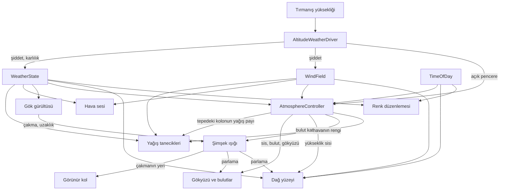

# Sistemler

## Bulutlar (`Assets/VolumetricClouds/`, `Assets/Scripts/Clouds/`)

Hacimsel bulutlar `UnityVolumetricCloudsURP` (MIT) üzerine kurulu; yoğunluk, şekil ve
aydınlatma zinciri Nubis/HZD makalesine göre düzeltildi. Fark listesi, ölçümler ve
gerekçeler `CLOUDS_REBUILD.md`'de — o dosya artık **teknik kayıt**, bağ listesi burada.

**Bulut ne okur**

| kaynak | ne | nereye |
|---|---|---|
| `AtmosphereController.Coverage` | küresel kapsamanın TEK eşlemesi | `cloudCoverage` |
| `AltitudeWeatherDriver.CloudMass` | yağışın geciken hâli | `densityMultiplier` |
| `WindField.FreeAirSpeed` + `PrevailingDirection` | serbest hava rüzgârı, **arazi maruziyeti uygulanmadan** | `globalSpeed` (km/h), `globalOrientation` |
| `TimeOfDay` | **dolaylı** — yönlü ışığın yönü/rengi/şiddeti | `GetMainLight()` |

Çeviriyi `CloudWeatherDriver` yapıyor; tek yön, bulut geri yazmıyor.

**Buluttan ne okunur** — hepsi `CloudLayerProbe` üzerinden, o da aynı Volume ayarlarını
ve aynı hava haritasını okuyor:

| tüketici | ne |
|---|---|
| `AltitudeWeatherDriver.CloudColumnTop` | sütunun tepesi; üstünde yağış yok |
| `ClimbHud` | katman kotları ve kapsama |
| `PrecipitationRenderer` | sütunun kapsaması — yağış bulutun altında yağar |
| `LightningFlash` | çakma kotu, çakma sütununun tepesinden |
| `_CloudBottom` / `_CloudTop` globalleri | `LightningBolt.shader` çakmayı bulut kabuğuyla kesiştiriyor |

Yer bulut gölgesi bunlardan geçmiyor: bulut sistemi gölgeyi **ana ışığın cookie dokusuna**
yazıyor, `MountainSurface.shader` `_LIGHT_COOKIES` ile okuyor. Gölge böylece gökyüzünü
çizen yoğunluk alanının ta kendisinden türüyor — ikinci bir yaklaşım yok.

**Bilinçli kurallar**
- Rüzgârda **maruziyet uygulanmaz**: oyuncu kayanın arkasına geçince iki kilometre
  yukarıdaki bulut yavaşlayamaz.
- Yoğunluk `WeatherState.Precipitation`'dan **sürülmez**: o değer tavanla kesilmiş, döngü
  kurardı (kapsama → tepe → tavan kesimi → yağış → kapsama).
- Kapsamanın eşlemesi **tek yerde**, `AtmosphereController`'da. İki eşleme olsaydı gökyüzü
  "kapalı" derken bulut "açık" diyebilirdi.
- Katman **mutlak kotta** (`localClouds` açık). Kapalıyken ışın başlangıcı `(0,0,0)` olup
  bulutlar oyuncuyla birlikte yükseliyordu.

**Açık:** bulut rengi ufuk altı gök renginden besleniyor ve sıcağa çalıyor; düzeltmesi
ertelenen atmosfer işinde (`DECISIONS.md`).

Atmosferin **şu an nasıl çalıştığı**: ne neyden beslenir, ne neyi etkiler.

`DECISIONS.md` ertelenmiş kararları ve tetikleyicilerini tutar; bu dosya mevcut durumu.

**Bu dosya sayı tutmaz.** Eşikler, katsayılar ve renkler kodda ve ayar asset'lerinde durur;
buraya yazılırsa ilk ayar değişikliğinde yalan söylemeye başlar. Burada yalnızca **ilişkiler**
var — onlar değiştiğinde bu dosya da değişir.

---

## 1. Kaynaklar

Her şey üç yerden doğar. Bunların dışında hiçbir sistem kendi zamanlayıcısını, kendi
rastgeleliğini veya kendi hava kavramını kurmaz.

| Kaynak | Ne üretir | Neye bakar |
|---|---|---|
| `AltitudeWeatherDriver` | Yağış şiddeti, karlılık, rüzgâr şiddeti | Tırmanışın ulaştığı yükseklik |
| `TerrainWindShelter` | Rüzgârın arazi maruziyeti | Oyuncunun altındaki arazinin biçimi |
| `TemperatureField` | Sıcaklık, hissedilen sıcaklık, donma seviyesi | Kot, saat, yağış, rüzgâr |
| `TimeOfDay` | Saat, güneş yönü, gündüz katsayısı, ışığın rengi | Kendi saati |
| `WindField` | Rüzgâr vektörü, sürekli şiddet, anlık esinti | Sürücünün verdiği şiddet + kendi gürültüsü |

`WeatherState` bir kaynak değil, taşıyıcı: sürücünün yazdığı iki değeri (şiddet, karlılık)
tutar ve değiştiğinde olay yayar.

### Rüzgâr neden iki sayı

Rüzgâr iki ayrı soruya cevap verir: "fırtına ne kadar sert" ve "şu an ne kadar esiyor".
Tek sayı ikisini birden taşıyamaz, çünkü esinti sürekli şiddetin **üstüne** biner ve
tavanı aşar. Aşınca normalize değer kırpılır, hız kırpılmaz — tanecikler hızlanmaya
devam ederken ses ve görüş tavana yapışık kalır.

Bu yüzden ikisi ayrı yayımlanır. Yavaş tepki vermesi gereken sistemler sürekli şiddeti,
esintiyi duyması veya görmesi gerekenler ikisinin toplamını okur. Hangisinin hangisi
olduğu §4'te.

### Yükseklik neden "ulaşılan seviye"

Sürücü anlık Y'ye değil, tırmanışın **ulaştığı** seviyeye bakar. Dağ sürekli yükselmez;
sırt aşılıp boyuna inilir, sonra tekrar çıkılır. Anlık yüksekliğe bakılsa hava her inişte
geri sarardı. Yukarı anında takip eder, aşağı bir ölü bant ve gecikmeyle iner.

---

## 2. Akış

Akış tek yönlü. Hiçbir tüketici kaynağa geri yazmaz; iki tüketici birbirini okumaz.
Bu yüzden çelişki ancak aynı kaynağı farklı yorumlamaktan doğabilir — nitekim öyle de
oldu (bkz. §6).

---

## 3. Kuşaklar

Yükseklik arttıkça hava sertleşir. Kuşak sınırları `AltitudeWeatherDriver`'da tanımlı;
başka hiçbir yerde tekrarlanmaz — yüzey de tanecikler de oradan okur.

Sınırlar mutlak metre değil, **dağın yüksekliğine oran** olarak tanımlıdır: tırmanışın alt
kısmı yağmurda, üst kısmı karda geçer ve dağ değişse de bu oran korunur. Oran yalnızca
**referansı** verir — yağmur/kar sınırının kendisi sabit değildir: donma seviyesi soğuk
cephede aşağı iner, öğle ısınmasında yukarı çıkar, `TimeOfDay` ve şiddet birlikte sürer.
Kar sınırının fırtınada inip sonra çekilmesi dağda gözle görülen tek birikme işaretiydi;
sabit sınırla hiçbir şey değişmiyordu. **Kalıcı kar çizgisi bu hareketli sınırı okumaz**,
referansı okur — buzul hava durumuyla gelgit yapmaz. Aradaki sulu kar
kuşağı dar tutulur — ikisi de "sadece" olmalı, geçiş bir bant değil bir sınır gibi
okunmalıdır.

| Kuşak | Hava | Ses | Yüzey |
|---|---|---|---|
| Açılış | Çok hafif yağmur, neredeyse rüzgârsız | Dingin yağmur ve rüzgâr | Çıplak kaya, ıslanır |
| Yağmur | Kademeli sertleşir, kar yok | Sağanak katmanı açılır, uzak gök gürültüsü | Islak kaya |
| Geçiş | Yağmur çekilir, kar yerleşir | Yağmur sesi hızla kısılır | Taze kar birikmeye başlar |
| Prosedürel | Bazen tipi, bazen sakin kar | Yalnızca rüzgâr | Kalıcı kar çizgisinin üstü |
| Zirve | Dalgalanma kapanır, sürekli fırtına | Tam güç rüzgâr | Sürekli örtü |

**Dinginlik nereden gelir:** Şiddet, yükseklikten gelen tabanın üstüne binen iki Perlin
katmanının çarpımıdır — biri havanın genel hâli (dakikalar), diğeri kısa esintiler.
Üçüncü ve çok yavaş bir gürültü nadiren **açık pencere** açar: hava kısa süre dinginleşir,
bulutlar aralanır, zirve görünür. Pencerenin **derinliği de değişkendir** — kendi ayrı ve
daha yavaş gürültüsü var: çoğu pencerede yağış tamamen kesilir, bazılarında çiselemeye
devam eder. Sabit kalıntıyla her açılma birbirinin aynısıydı. Zirve kuşağında genlik
daralır ama **sıfırlanmaz**; sıfırlanınca yukarıda şiddet tek bir sabit sağanağa çakılıyor,
saatlerce hiçbir şey değişmiyordu. Zirve yine de tahmin edilebilir şekilde acımasızdır —
aralık dar, yalnızca ölü değil.

**Bulut kütlesi yağışı gecikmeyle izler.** Kapsama ve bulut tabanı şiddetin kendisinden
değil, çok daha uzun bir zaman sabitiyle yumuşatılmış `CloudMass`'ten sürülür. Aynı değere
bağlıyken yağışın durduğu karede gökyüzü de açılıyordu; gerçekte bulut yağıştan sonra bir
süre durur. Sonuç kendiliğinden çıkar: **kısa** açık pencereler gökyüzünü açmadan geçer,
**uzun** olanlar açar — hangisi olacağı pencerenin süresine bağlı, ayrı bir kurala değil.

**Bulut tepesinin üstünde yağış yoktur, ve bu kesme bulut sisteminden itilir.** Sütunun
gerçek yüksekliğini yalnızca bulut sistemi bilir; `CloudLayerProbe` her karede
`CloudColumnTop` olarak yazar. Sürücü çekmez — iki sistem birbirine referansla
bağlanmasın diye. Önceden sürücü ayarın **nominal** tavanını (7000 m) kullanıyordu: sönme
5800 m'de başlıyor, zirve 5686 m — kural hiç işlemiyordu. Görüntüde yağış kesiliyor ama
`WeatherState` yağmaya devam ettiği için sis, ses ve zemin karı bulut denizinin üstünde de
fırtına okuyordu.

**Açık pencere dalgalanmanın parçası değildir**, ayrı hesaplanır ve zirvede de çalışır —
orada yalnızca eşiği yükselir, yani seyrekleşir ama açıldığında tam açılır. İçeriye
gömülüyken zirvede genlik sıfır olduğu için hiç açılmıyordu ve bulut denizinin üstünde
durma anı hiç oluşamıyordu. Şiddeti düşürdüğü için görüş de o anda açılır.

**Ani geçiş yoktur:** Şiddet **ve karlılık** hedeflerine aynı zaman sabitiyle kayar.
Sağanaktan dingin kara bir karede geçmek fiziksel olarak imkânsız olduğu için oyunda da
imkânsızdır. Karlılık dışarıda bırakılırsa, ulaşılan seviye yukarı doğru anında sıçradığı
için yağmurdan kara geçiş oyuncunun ne kadar hızlı yükseldiğine bağlı kalır.

---

## 4. Sistem sistem girdiler

### Yağış tanecikleri (`PrecipitationRenderer`, `Precipitation.shader`)

**Okur:** şiddet (yoğunluk ve damla boyutu dağılımı), **tepedeki bulut kolonunun yağış
payı** (`AtmosphereController.LocalRain` — şiddeti yerel olarak kısar), karlılık (damla/tane oranı),
rüzgâr vektörü (savrulma **ve girdap alanının sürüklenmesi** — türbülans ortalama akışla
taşınır, dünyaya çakılı durmaz), rüzgârın **esintili** şiddeti (girdap genliği, kar
tanesinin dönme hızı), **havanın rengi** (`_HeightFogColor`).

Yağış gökten tek parça düşmez: kaynağı tepedeki buluttur. `CloudLayerProbe` hava
haritasını oyuncunun konumunda CPU'dan okur — kapsama × kabarıklık (tip) yağış payını
verir, yayvan ince katman yağdırmaz. Kolonun tepesinin üstüne çıkıldığında pay sıfırlanır:
bulutları delip geçen tırmanışçının üstünde yağmur kalmaz. Pay ~2.5 s'lik sabitle
yumuşatılır; bulut kenarından geçerken yağmur bıçak gibi kesilmez.

Türbülans yamalıdır: genlik, rüzgârla akan alçak frekanslı bir zarfla yerel çarpılır —
enerji öbekler hâlinde geçer, düzgün yayılmaz. Damla da tane de aynı zarfı okur.
Kar tanesinin ayrıca taneye özel bir çırpıntısı vardır (yaprak süzülmesi, 1-3 Hz);
damla çırpmaz.

Kar tanesi kendi rengini seçmez: kendi ışığını üretmiyor, göğün ışığını saçıyor. Havanın
rengi çarpanla parlatılıyor, böylece şafakta turuncu, gece koyu, şimşek çaktığında parlak
oluyor — hiçbiri ayrıca ayarlanmıyor. Sabit bir beyaz, kapalı gökyüzünün önünde patlayıp
taneleri yıldız gibi gösteriyordu.

Tanenin **biçimi** kristal değil kümelenmedir. Havada süzülen şey yüzlerce kristalin
birbirine yapışmış hâli; kristalin kolları bir iki milimetre ve ancak göze değdiğinde
görünür. Altı kollu silüet mikroskop görüntüsünü gökyüzüne koymaktı.

Kar tanesi esintiyi anında yer (gevşeme süresi ~0.1 s, algı eşiğinin altında). Damla
gevşeme süresiyle uyar — terminal hız / g: ince serpinti hamleye çabuk döner, iri damla
geç. Süzülmesiz hız, her hamlede bütün yağmuru aynı karede tek parça yatırıyordu.
Dönme ve girdap sürekli şiddete bağlanınca aynı tane hızlanırken dönmesi sabit kalıyordu.

Damla ve tane ayrı popülasyondur; karlılık ikisinin oranını belirler. Sulu kar
gerçekte de damlanın taneye dönüşmesi değil, ikisinin bir arada bulunmasıdır.

Damla boyutu hem düşme hızını hem rüzgâra direncini belirler: ince serpinti yanlamasına
uçar, iri damla dik iner. Boyut dağılımı şiddetle kayar — çiseleme ince ve yavaş,
sağanak iri ve hızlı.

**Okumaz:** günün saati. Tanecikler kendi rengini ışıktan almıyor; gece ve gündüz aynı
görünüyorlar. Bilinen eksik.

### Hava sesi (`WeatherAudio`, `AudioBand`)

**Okur:** şiddet, karlılık, rüzgârın sürekli şiddeti **ve** esintisi.

Dört band: hafif yağmur, sağanak, dingin rüzgâr, fırtına rüzgârı. Her band eşit-güç
geçişiyle karışır; ayrık "hafif/şiddetli" durumu yoktur.

Hangi sesin çaldığını sürekli şiddet, o sesin ne kadar yükseldiğini esinti belirler.
Band geçişi de esintiye bağlansaydı dingin ve fırtına karışımı sekiz saniyede bir yer
değiştirir; rüzgârın sertleştiği değil, sesin oraya buraya kaydığı duyulurdu.

Rüzgâr sesi asimetrik yumuşatılır — esinti hızlı gelir, yavaş çekilir. Rüzgâr sertleştikçe
alçak geçiren filtre açılır ve perde yükselir: türbülans yüksek frekans üretir.

Her band varyasyonlar arasında çapraz geçiş yapar; band susmasını beklemek işe yaramıyordu,
çünkü dingin band ancak şiddet uca dayandığında susuyor ve pratikte tek klip dönüyordu.

Seviyesi eşiğin altına inen kaynak duraklatılır: sıfır sesle çalmak klibi çözmeye devam eder.

### Gök gürültüsü (`ThunderPlayer`)

**Okur:** şiddet (sıklık ve yakınlık), karlılık (kesilme).

Belirli bir şiddetin altında hiç çalmaz. Karlılık yükseldikçe seyrelir ama tamamen susmaz —
tipide şimşek nadirdir, yok değildir. Yakın gürültü yalnızca yağış sertleştiğinde devreye
girer; dağ eteğindeki dingin açılışta yalnızca uzak ve boğuk gürültüler duyulur.

Çakma anında `Struck` olayı yayılır ve **uzaklığı metre olarak** taşır. Mesafenin tek
sahibi burasıdır: hem sesin gecikmesi (`mesafe / 340`) hem çakmanın dünyadaki yeri ondan
türer. İkisi ayrı seçilseydi bir buçuk saniye sonra gürleyen bir gürültü, sekiz yüz metre
ötede çakmış bir ışığa ait olurdu.

**Ses o anda çalmaz.** Yakın çakmada saniyenin altı, uzakta yirmi saniyeye kadar bekler —
sekiz kilometre gerçekten yirmi dört saniye demek.

### Şimşek ışığı (`LightningFlash`)

**Okur:** `ThunderPlayer.Struck` ve taşıdığı uzaklık, `CloudLayerProbe`'dan bulut
katmanının tabanı ve tavanı, oyuncunun konumu.

**Okumaz:** yağış, rüzgâr, günün saati. Çakmanın koşulları tetikleyen tarafta zaten
değerlendirilmiş; burada ikinci kez okunsa iki sistem aynı soruya ayrı cevap verebilirdi.

Uzaklığı bir dünya noktasına çevirir: yön rastgele, yükseklik bulut katmanının alt
çeyreği — şimşek bulutun içinde boşalır, katmanın nerede olduğunu bilmeden yerleştirilemez.

Işık **yönlü** kalır ve şiddeti mesafenin karesiyle söner. Çakma iki kilometrenin üstünde
olduğu için arazi boyunca yayılan gradyan zaten küçük (beş yüz metre ötedeki bir çakma için
2.3 kat), buna karşılık menzili tüm sahneyi kaplayan bir nokta ışık Forward+ kümelemesini
işlevsiz bırakırdı. Baskın ipucu olan "yakın çakma kör eder, uzak olan soluk kalır"
tamamen ters kare sönümden geliyor.

Kendi rastgeleliği yalnızca çakmanın **yönü** ve **biçimi** (bir ile üç arası geri vuruş);
**anı** ve **uzaklığı** değil.

Gökyüzü ve bulut aynı `_LightningFlash` ve `_LightningPosition` değerlerini okur; rengi,
yeri ve yarıçapı ayrıca seçmezler — ayrı hesaplasalardı gökyüzü bir yerde, bulut başka bir
yerde parlardı. Bulutun parlaması bindirme geçişinde, tam çözünürlükte ve her kare
uygulanır — ışın yürüyüşünün içine konamaz, çünkü o on altı kareye yayılıyor ve parlama
blok blok titrerdi.

Yükseklik sisi de aynı değeri okur. Sisin rengi sabit tutulunca fırtınada — şimşeğin
çaktığı tek havada — görüş yedi yüz metreye düşüyor ve arazinin büyük kısmı o değişmeyen
rengin altında kalıyordu: yüzey aydınlansa bile üstü örtülü olduğu için görünmüyordu.
Gerçekte çakma anında sisin kendisi içeriden parlar.

Parlama çakmanın bulunduğu **yerde** toplanır, bir yönde değil: ışın bulut katmanıyla
kesiştirilip bulunan dünya noktasının çakmaya uzaklığına göre sönüyor. Yön yeterli değildi,
çünkü yön mesafe taşımıyor — yaklaştıkça büyümesi gereken leke sabit açıda kalıyordu.
Uzağa da küçük bir pay düşer; ışık kütlenin içinde saçılıyor.

Ortam ışığına dokunmaz: onu gökyüzü paketi ambient probe olarak pişiriyor, ikinci bir
yazan olsaydı çakışırlardı. Yönlü kalması zaten doğrusu — gerçek şimşek de sert gölge
bırakır.

### Görünür kol (`LightningBolt`)

**Okur:** `LightningFlash.Placed` ve taşıdığı çakma noktası, arazinin yüksekliği.

**Okumaz:** hava, uzaklık aralıkları, zamanlama. Nerede çakıldığına karar vermez — konumu
ikinci kez seçseydi ışık bir yerde, kol başka bir yerde olurdu.

Yalnızca yakın çakmalarda çizilir. Gerçekte de uzak şimşek kolunu göstermez: araya giren
bulut ve hava kanalı yutar, geriye denizin aydınlanması kalır. Kolun görünmesi mesafe
hakkında bilgi taşıyor, o yüzden mesafeden bağımsız çizilemez.

Kanalın nerede biteceğini yamacın kendisi belirler. Değme noktasındaki ışık **nokta**
ışıktır — yönlü olanın aksine orası gerçekten yakında, menzili birkaç yüz metrede kalıyor
ve kümelemeyi boğmuyor.

### Sis ve hava sinyalleri (`AtmosphereController`)

Bu bölüm sis, görüş mesafesi ve hava sinyallerini anlatır. **Gökyüzü, ortam ışığı ve
yansıma artık burada değil** — bkz. **Gökyüzü ve atmosfer**. Hacimsel bulutlar da ayrı bir
sistem — bkz. dosyanın başındaki **Bulutlar** bölümü. Buradaki `coverage` bulutların da
okuduğu tek eşlemedir.

**Okur:** şiddet, karlılık, rüzgârın **sürekli** şiddeti ve yönü, günün saati, ve
sürücüden yalnızca **açık pencere** sinyali. Sürücüden başka hiçbir değer okunmaz;
kuşak kotları, yükseklik, ilerleme — hiçbiri buraya girmez.

Esintiyi bilerek okumaz: görüş mesafesi ve bulut tabanı sekiz saniyelik bir esintiyle
açılıp kapanmaz. Bulut kayması da öyle — yön gibi hız da ağır yumuşatılır; ham hız
okununca rüzgârın saniyelik sarsıntısı kayan dokuyu seğirtiyor ve zamansal birikimin
altında bulut kenarlarını blok blok pikselleştiriyordu.

Görüş mesafesi tek bir değerden türer: yağış tipi (kar yağmurdan çok daha kapatıcı),
rüzgârın savurması (yalnızca yağış varken anlamlı), bulut kuşağının içinde olup olmama.

**Bulut gölgesi yere düşer.** Bulutlar tepede geziyordu ama yer bunu bilmiyordu ve ışık
sabit kaldığı sürece yamaç hep aynı okunuyordu. Gölge, bulutun **kendi yer izi
fonksiyonundan** okunuyor: `CloudFootprintAt` (`HeightFog.hlsl`) — gökyüzü ışın yürütücüsü
hangi fonksiyondan yoğunluk alıyorsa yer de ondan gölge alıyor. Fonksiyon eskiden
`CloudCommon.hlsl`'deydi ve yalnız gökyüzü görüyordu; gölge kendi yaklaşımını kuruyordu
(warp'sız, evrimsiz, fırtına dolgusuz) ve iki alan hiçbir zaman tutmadı — gökte bulut
olmayan yerde gölge, gölge olmayan yerde bulut. Fonksiyon ortak dosyaya taşındı, ikinci
alan silindi. Gölge, uzaklığa göre mip seçiyor: piksel ayak izi metrelerce genişleyince
LOD 0 çözülemeyen frekansı kaynatıyordu.
Güneşe doğru geri izleniyor: yüzeyden bulut tabanına kadar olan yükseklik, güneşin
eğimiyle yatay kaymaya çevriliyor; bu yapılmazsa gölge bulutun tam altında kalır ve alçak
güneşte manzarayla uyuşmaz. Arazi gölgesiyle **çarpılıyor** — ikisi ayrı olay (sırtın
arkasında kalmak / üstünden bulut geçmek) ama ikisi de yalnız doğrudan güneşi kesiyor,
gökten gelen dolaylı ışığa dokunmuyor.

Sis **üç katmanın toplamıdır**, hepsi kendi yarı yüksekliğiyle: sınır tabakası (yağışla
derinleşir, inversiyonda biter), vadi sis denizi (çok sığ, gece ürünü) ve serbest troposfer
(yayvan, havanın kendi molekülleri, yağıştan bağımsız). Katmanlar **toplanır, birbirine
çarpılmaz** — çarpım, bu dosyada üç ayrı belirtinin kaynağı oldu: derin profil bulut
denizini siliyor, sığ profil zirvede uzak sırtları karton bırakıyor, ikisini tek kanaldan
geçirmek de ikisini birden bozuyordu. Ayrık katman yapısı gereği bunu engeller.

**Dördüncü katman: sürüklenen kar.** Rüzgâr eşiği aşınca yerdeki gevşek kar havalanır ve
yüzeye yapışık, sığ bir perde oluşturur — uzaktan sırttan savrulan duman gibi okunur. İki
koşul birden aranır: rüzgâr eşiği (CPU'da uygulanır, tek dünya durumu) ve **yerde taze kar**
(shader kot profilinden okur; yıllanmış buzul sürüklenmez, taze toz sürüklenir). Öteki üç
katmandan farkı, yüksekliğin **yerden** ölçülmesi: deniz seviyesine göre sönen bir profil
sırtın üstünde hiç görünmez, vadide ise boğardı. Arazi yüksekliğini shader `SurfaceMapBaker`
pişirmesinden okuyor.

**Perde sürekli akmaz, ATAKLARLA gelir.** Kaldırma payı sürekli şiddetten değil
**hamleli** hızdan (`Strength × (1 + Gust)`) türer ve eşiğin üstünde **küple** ölçeklenir —
kar taşınımı sürtünme hızının küpüyle gider. Küp, hamlenin tepesini patlamaya dibini
sakinliğe çeviriyor: gerçek spindrift 10-20 saniye fışkırır, diner, tekrar gelir. Sürekli
şiddetle sürülünce perde hiç kesilmeyen düz bir akıntı oluyordu.

**Tüy rüzgâr altına bir KUYRUK bırakır.** Kretten kalkan kar orada asılı kalmıyor,
taşınıyor. Kuyruk, rüzgâr üstündeki noktanın kret olup olmadığından okunuyor — o noktanın
iki komşusu zaten elde olduğu için tek ek arazi örneğiyle çıkıyor. Etki kretin çevresinde
simetrik kaldığı sürece "savrulan duman" hiç oluşmuyordu.

**Dikey profil kuvvet yasası**, üstel değil: süspansiyon Rouse tipi dağılır — dipte yoğun,
yukarı doğru uzun kuyruk. Üstel sönüm kuyruğu erken bitiriyor ve tüyler kısa kalıyordu.

**KRETTEN fışkırır, yamacın tamamından değil.** Rüzgâr yönünde ileri ve geri iki arazi
örneği alınıyor; ikisi de bizden alçaksa sırtın üstündeyiz demektir. Kret üzerinde hem
kaldırma güçleniyor (rüzgâr tepeyi aşarken hızlanıp gevşek karı fırlatır) hem katman
**kalınlaşıyor** — tüy sırttan yukarı çıkıp rüzgâr altına dökülüyor. Tek örnekle kret
ayırt edilemiyordu ve perde yamaca eşit yayılıyordu.

**KAR SIFIRIN ALTINDA ERİMEZ.** Erime sıcaklıktan sürülüyor, karlılık oranından değil —
o bir sıcaklık vekiliydi ve sıfırın çok altındaki bandı bile "ılık" sayıp eritebiliyordu.
Faz değişimi enerji ister; enerji yoksa kar durur. Dağın karının kalıcı olmasının sebebi
budur. Sıfırın üstünde erime derece başına ivmelenir (kareyle), sıfırın altında tek kayıp
çok yavaş **süblimasyondur** — bir koşu boyunca gözle görülmez ama sonsuz birikmeyi de
engeller. Rüzgârın süpürmesi bundan ayrı ve ondan çok daha hızlı bir kayıptır.

**Sürüklenme kaynağını TÜKETİR.** Rüzgâr gevşek karı alıp götürüyor: yüzeyin kot bandı
örtüsü kaldırma payı kadar süpürülüyor ve yeni kar yağmadıkça sürüklenecek bir şey
kalmıyor. Bu bağ olmadan perde sonsuza kadar aynı şiddette akıyordu. Yalnız örtü
süpürülür, kalınlık deposu değil — rüzgâr gevşek üst tabakayı alır, altındaki sıkışmış
karı sıkıştırmaya devam eder. Süpürülen kar kot ekseninde yok olur; rüzgâr altına
yığılması yüzeyde birikim ağırlığıyla mekânsal olarak zaten var, ikinci kez modellenmez.

Kaldırma payı atmosferden **global olarak yayınlanır** (`_SpindriftLift`); yüzey eşiği
ikinci kez hesaplamaz. Yağış tanecikleri de aynı globali aynı sebeple okur.

Ayrı bir tanecik sistemi **değil**: sıfır ek çizim, ve güneş rengini sisin okuduğu yerden
alıyor — şafakta perde de kızıllaşır, ayrı bir renk kaynağı yok.

**Perdenin rengi ile parlaklığı ayrı kurulur.** Gök örneği (`_HeightFogSunColor`) HDR ve
**üst sınırsız** — üstelik en büyük olduğu yer güneş yönündeki ufuk, yani şafak ve
akşamüstü. Olduğu gibi renk olarak geçirilirse 1'i aşar, beyaza kırpılır ve dağ fosforlu
görünür; katsayı kısmak yalnızca eşiği öteler. Bu yüzden tondan parlaklık ayrılır
(ton 1'e normalize) ve seviyeye **fiziksel tavan** konur: perde kardır, en fazla tam
aydınlanmış kar kadar parlak olabilir. Seviyenin ölçüsü ufuk parıltısı değil **güneşin
yüksekliğidir** — şafakta yamaç hâlâ gölgedeyken perde ufkun parlaklığını alırsa dağ
aydınlatılmış görünür.

Akış alanı **bilerek kaba** (dalga boyu yüzlerce metre). Işın 8 adımda integre ediliyor;
daha ince desen undersampling üretiyor ve perdenin içinde yağmur yağıyormuş gibi bir
titreme bırakıyor. Sektörün çözümü temporal reprojection + blue noise + TAA, bizde TAA
yok (bkz. `DECISIONS.md`). İnce yapı ve görünür akış **yakın tanecik katmanının** işi. Yakın plandaki şerit şerit
akan kar ayrı bir iş; o gelince aynı rüzgâr ve aynı kar profilinden beslenecek.

Katmanın **derinliği yağıştan sürülür** ve tek başına bir ayar değil, ayrımın kendisidir.
Açık havada pus sığ bir sınır tabakasıdır: yatay ışın gözün kotunda kalıp katmanın içinde
kilometrelerce ilerler (uzak sırt solar), buluta giden ışın onu birkaç yüz metrede terk
eder (bulut denizi silinmez). Yağışta sütun dikey karışır, yağmur tepeden dibe doldurur ve
katman derinleşir. Tek yoğunluk hem yatay hem dikey yolu beslediği için görüşü tek başına
oynatmak ikisinden birini hep bozuyordu: görüşü açınca bulutlar geldi ama arazi pusu bitti,
kısınca sis geldi ama bulutlar silindi. Sabit derinlik de yağışla çelişiyordu — sığ bırakınca
1000 m kotta sağanakta 5 km görüş çıkıyordu. Görüş, inversiyon tavanı ve katman derinliği
üçü de yağış şiddetinden türer; çelişemezler.

Görüş göstergesinin **fiziksel tavanı** vardır. Katman yükseldikçe seyreldiği için
yoğunluğa bölmek zirvede sınırsıza gidiyor ve ekranda "3900 km görüş" yazıyordu. Hava
boşluk değildir: en temiz havada bile Rayleigh saçılması görüşü birkaç yüz kilometrede
kapatır. Vadi sisi gece
birikir, şafakta en kalın hâline ulaşır, güneş yükseldikçe dağılır — ve **akşam geri
gelmez**: vadi sisi gece ışınımsal soğumanın ürünüdür, batımın değil.

Şafak vadi sisinin **tek kaynağı deniz katmanıdır**. Bir zamanlar yerleşik havayı da
şafakta kalınlaştıran ayrı bir çarpan vardı; aynı olayın iki mekanizması, ve derin olanı
(yarı yükseklik 1400 m) 2.6 km yukarıdaki bulutlara kadar uzanıp onları siliyordu.

Şafak denizi **ayrı bir katmandır**, yerleşik havanın yoğunluğuna katlanan bir alt sınır
değil. Kendi yarı yüksekliği var ve yerleşik havanınkinden çok daha diktir — yüz metrede
biter. İkisi ayrı kanaldan gider (`_HeightFogDensity`/`_HeightFogFalloff` ve
`_FogSeaDensity`/`_FogSeaFalloff`), profillerini shader'da kendi katsayılarıyla uygularlar
ve `FogDensityAt` mutlak yoğunluğu toplayarak verir. Tek kanaldan geçirilince deniz,
yerleşik havanın profiliyle yayılıyor ve sığ olması gereken katman bulut tabanına kadar
tırmanıyordu: yol boyunca optik derinlik on kat fazla çıkıyor, şafakta yukarı bakan
oyuncuya bulutlar tamamen siliniyordu. Görüş göstergesi de tek noktadan değil, kameranın
kotunda iki katmanın toplamından okunur.

Sis **üniform değildir**: yoğunluk, rüzgârla sürüklenen alçak frekanslı bir bank
alanıyla yerel çarpılır. Aynı alan iki yerden okunur — GPU mekânsal deseni çizer
(`FogBankAt`), CPU kamera konumunda örnekleyip bulut kuşağı yamalarını ve görüş
nefesini sürer (`BankField`); formül değişirse ikisi birlikte değişmeli. Bankların
gücü havadan gelir: fırtına daha yamalı sarar, şafak denizi bank bank gezer. Görüş
ayrıca dakikalar ölçeğinde nefes alır; kuşağın içi tekdüze çorba değildir, bank
aralandığında yamaç bir görünür bir kaybolur.

Bulut tabanı sabit değil: sakin havada iner (bulut denizi), yağış ve rüzgâr onu yükseltir.
Kütle ağır olduğu için taban esintiyle inip kalkmaz, dakikalar ölçeğinde yer değiştirir.

**Bulut dağılımının tek kaynağı pişirilmiş 2B hava haritasıdır.** Üretim matematiği
`CloudWeatherMapGenerator`'da (çalışma anı, salt matematik) yaşar; iki tüketicisi var:
`CloudWeatherMapBaker` (editör, asset kaydeder) ve F1 teşhis panelinin canlı "Haritayı
yeniden pişir" düğmesi (Play içinde kalibrasyon, `AtmosphereController.SetWeatherMap`).

Pişmiş harita **türetilmiş veridir ve kendi kendini tazeler.** Geçerlilik imzası iki
girdiden kurulur: ayar alanları **ve** `CloudWeatherMapGenerator.Version`. Sürüm
üreticinin içinde durur çünkü onu artırmayı unutan, algoritmaya dokunan kişidir; imza
yalnız ayarlardan kurulduğu sürece kod değişikliği haritaya hiç yansımıyor, menüden
"yeniden pişir" bile eski sonucu üretiyordu. Tazeleme editör yüklenirken
(`[InitializeOnLoadMethod]`) yapılır, sahne kurulumunda değil — düzeltmeyi değerlendiren
kişi eski haritaya bakmasın diye. Pişirme asset'in **üstüne** yazar; silip yeniden
kurmak GUID'i düşürüp sahnedeki başvuruları koparıyordu ve her pişirmeden sonra sahneyi
yeniden kurmak gerekiyordu.
Dağılım vidaları ayar asset'inde: dev tavanı, istif, boşluk serpintisi, yama penceresi,
yoğunluk, tohum. `AtmosphereController` haritayı global yayınlar.
Kanallar: R kapsama, G tip, B taban kayması, A tavan. Harita gürültüden türetilmez,
fiziksel kurallarla kurulur: organizasyon alanı gökyüzünü boş/seyrek/yoğun bölgelere
ayırır; bulut çekirdekleri üstel yarıçap dağılımıyla serpilir (çok küçük, az büyük) ve
örtüşenler birleşip devasa kümeleri kurar — gerçek kümülüs alanlarının güç yasası bu
birleşmeden doğar. Çekirdekler eliptiktir (rastgele yön, 1-2.2 en-boy) — mükemmel daire
diye bulut yoktur, dairesel ayak izi bulutları silindir olarak okutuyordu. Tip ve taban
kayması çekirdek başına sabittir: her bulutun kendi karakteri ve kendi opaklığı vardır —
opaklığı TİP taşır, ince olan ışığı geçirir (Beer-Lambert kendiliğinden), kabarık opak
durur. Ayrı bir "kimlik" hash'i denendi ve söküldü: sürekli kanalların frac'ı tamsayı
geçişlerinde sıçrar, bulut içine fermuar kenarlı şerit perdeler çizer — süreksiz
fonksiyon sürekli alana uygulanamaz. Şekil gürültüsü haritanın kendi kanallarıyla
kolonsal bükülür (warp): kapsama kazancı bilerek doyumun altında tutulur ki gürültü
gövdeyi oyabilsin — ikisi de silindir okunuşuna karşı.

**Gezegen yarıçapı ayardan gelir ve gerçek değeriyle durur.** Denizin ufka değdiği mesafe
`sqrt(2·R·Δh)`; buradaki Δh gözün **deniz üstündeki payıdır**, tabanın kotu değil. Zirvede
bu pay topu topu birkaç yüz metre — yarıçap küçültülünce deniz zirvenin hemen dibinde
bitiyor (235 km'de 13 km) ve ufuktaki bulutlar yok oluyor. Gerçek yarıçapta denizin ucu
sönümün kapandığı mesafenin ötesinde kalır, yani hiç görünmez: kenarı **sönüm** saklar,
geometri değil. Sönüm mesafesi bu yüzden denizin ufkuna eşitlenemez — eşitlenirse ufuktaki
bulut tam karışıma girip kaybolur. Şimşek shader'ı aynı küreyi kestiği için aynı globali
okur; ayrı kopya tutulamaz, ayrışırsa şimşek bulutun önünde ya da arkasında kalır.

**Kare başına piksellerin 1/9'u hesaplanır.** Işın yürüyüşü 1/3 çözünürlükte koşar,
3×3 bloğun her karede bir hücresi güncellenir, tam çözünürlük geçmişten reprojeksiyonla
dolar. Geçiş **harmansız**: taze piksel yeni değeri alır, diğerleri komşuluk kelepçesiyle
sınırlanmış geçmişi — üstel karışım yok, harman kontur şeritleri basıyordu. Blok deseni
bu yüzden yalnız kompozit çadır filtresiyle örtülür ve filtre yarıçapı bulanıklıkla
birebir takas eder; basamak büyüdükçe takas pahalanır (bkz. `DECISIONS.md`, 1/16).

**Dikey uzanım ekranda kalibre edildi.** Silindirler, kapsama arttıkça kolonların ayak
izinden bağımsız şekilde yükselmesinden çıkıyordu. Sayılar F1 atölyesinde tek tek
tarandı ve kazananlar koda gömüldü: fırtına dolgusunun tavan bandı daraldı (katmanın
%15-54'ü — bir örtü, kule değil), dolgu kapsamayı düz bir tabandan değil **desenden**
kuruyor, cephe nefesi derinleşti, kümülonimbus profili neredeyse anında daralıyor
(yani tip artık kendiliğinden kule üretmiyor; kule ancak haritanın geometrik kapaklı
A kanalından gelir) ve taban düşümü kısaldı. Bu sayılar birlikte ayarlandı — birini
tek başına eski değerine döndürmek silindiri geri getirir.

**Tavanı yalnız kolon-sabit alanlar sürebilir.** `ceiling01` bulutun üst yüzeyini
doğrudan çiziyor; onu besleyen her şeyin kolon başına tek değer olması şart. Yüksekliğe
göre değişen bir alan tavanı sürerse üst yüzey o alanın izo-yüzeyi olur — 3B pürüzsüz
gürültünün izo-yüzeyi de yuvarlak kapaktır, yani kubbe. Fırtına dolgusunun dalgası bu
kurala aykırıydı (`sec4.r`, örneğin y'sini taşıyordu) ve yüksek kapsamada tepeleri
kubbeleştiriyordu; kolon-sabit kanala taşındı. Kolon-sabit okumalar y'lerini sabitler:
`colWarp` (y = 87.3 + evrim), `colBump` (y = 310.7).

**Fırtına tekdüze doldurur, kolon seçmez.** Kolon seçmesi denendi ve dev kubbe ürettiği
için geri alındı; sebep ve tetikleyici `DECISIONS.md`'de. Özet kural: **bulutun üst
yüzeyini `ceiling01` çiziyor**, dolayısıyla pürüzsüz ve geniş ölçekli hiçbir alan tavanı
sürmemeli — sürerse üst yüzey de pürüzsüz ve geniş olur, yani kubbe. Tavanın meşru
kaynağı pişmiş A kanalıdır; orada çekirdek başına ve çapa bağlı üretiliyor.

**Kapsama, eşiği belirler; yoğunluğu ayrıca çarpmaz.** Eşik remap'i
(`Remap(shape, 1−kapsama, 1, 0, 1)`) hayatta kalan dilimi 0-1'e normalize eder. Nubis
bunun ardından kapsamayla bir daha çarpar; biz çarpmıyoruz — kenar sönümünü sert kapsama
kapısı (`smoothstep(0.08, 0.26)`) ve uzun kuyruklu kuvvet eğrisi yapıyor. İkisi ekranda
karşılaştırıldı, bizimki seçildi (bkz. `DECISIONS.md`).

**Sanat yönü haritayı ezebilir, ama pişirmede.** `artDirectionMap` verilip payı
açıldığında elle boyanmış harita üretilenin üstüne harmanlanır; kanal anlamları aynı
kalır (R kapsama, G tip, B taban, A tavan) — boyayan da üretici de aynı dili konuşur.
Harman **pişirme adımında** yapılır, shader'da değil: kaba sıçrama haritası bu sonuçtan
türüyor ve çalışma zamanında harmanlansaydı sıçrama boyanmış bulutun üstünden atlardı.
Çalışma zamanı maliyeti bu yüzden sıfır. Pişmiş harita adı boyanan dosyanın **içerik**
hash'ini taşır — aynı dosya yeniden boyandığında ad değişmiyor ve harita bayat kalıyordu.

**Işık sondası 5 koni örneği + 1 uzak örnek alır (PDF'in sayısı).** Kazanç sayıda değil
dağılımda: adımlar üstel büyür, ilk adım `menzil/(2ⁿ−1)`. Dörtte 80 m, beşte 38.7 m —
gölgenin belirleyicisi ilk birkaç yüz metre olduğu için yakın gölge iki kat ince çözülür.
Koni çekirdeği sürgü aralığının tamamını (2-8) ayrı yönle karşılar; eksik kalsaydı üstteki
örnekler aynı yönü okuyup maliyeti bedava sanılan bir tekrara harcardı.

**Işık sondası bulutun ön yüzünde tam örnekler.** Birincil ışının alfası 0.3'e varana
kadar sonda erozyonu (detay + curl) da okur, ondan sonra ucuza düşer — HZD'nin kuralı.
Sebep: kabarık kenarların kendi gölgesi onları üç boyutlu okutan şey; erozyonsuz gölge
kenarı düz bir zar gibi aydınlatıyor. Derinde ışık zaten sönmüş, detayın gölgeye katkısı
ölçülemiyor. Sonda ayrıca örneğin **kameraya uzaklığını** taşır: kendi mesafesini
uydurursa (eskiden sabit "çok uzak") detay sönümü ve kenar eğrisi birincil ışınla
ayrışıyor, gövde bir alandan gölge başka alandan okunuyordu — beyazlaşmanın eski kökü bu
sınıftandı. Koninin uzak örneği bilinçle ucuz ve mesafesiz kalır: o komşu kütlelerin kaba
kapatmasıdır, detayı yoktur.

**Yağış karartması ikinci bir çarpan değil, karartmanın derinliği.** Gövde zaten yerel
yoğunlukla koyulaşıyor; yağışı ayrı bir çarpan olarak üstüne binmek aynı işi iki kez
yapmak demek ve kalın gövdede ambient dörtte bire iniyor — bulutlar siyahımsı griye
kaçıyordu. Tek çarpan var, yağış onun ne kadar derine indiğini belirliyor.

**Yağmur soğurması yereldir.** Fırtınada bütün gök kararmaz: yağan kolon kurşuni olur,
komşusu aydınlık kalır. Ölçü kolonun kendi kalınlığıdır (ışık yürüyüşünde biriken optik
derinlik, birincil örnekte yerel yoğunluk) — ek doku okuması yok. Yağış şiddeti yalnız
çarpanı büyütür, kimin yağdığını bulut belirler.

**Hava kolonsaldır.** 2B harita bunu yapısal garanti eder: kapsama, tip, tavan ve taban
kayması kolon boyunca tek değerdir; dikey yapıyı yalnız zarf ve şekil gürültüsü kurar.
Hava 3B'den örneklenen dönemde gövdeye bağsız yüzen parçalar (kubbe/adacık) doğuyordu.

**İğne/bıçak biçimli bulut matematiksel olarak üretilemez.** İki garanti pişirmededir:
(1) tavan alanı tip×gelişim BİLEŞİMİ olarak kurulup bütün hâlinde bulanıklaştırılır —
tavanın dünya eğimi ~45°'yi aşamaz (bileşen bileşen bulanıklaştırmak yetmiyordu, bileşim
keskin kalıyordu); (2) kubbe geometrisi — yükseklik kenara uzaklıkla büyür (mesafe
dönüşümü): dar kapsama sırtı yüksek tavan alamaz, küçük kümülüs basık kalır (humilis),
kule ancak geniş kütlede yaşar. Kanıt sim'de (`weather_bake_sim.py`): kesitlerde iğne
sayısı sıfır, en-boy medyanı ~0.7.

**Bulut alanı rijit ötelenmez.** Hava haritası rüzgârın %72'siyle akar, şekil alanı tam
hızla: şekiller kapsama zarfının içinden geçer, bulut ön kenarında oluşur arka kenarında
dağılır. Evrim üç eksende kayar (tek eksende kaydırma alanı dikey sürüklüyordu), aşındırma
kendi zamanında (~3×) kaynar. Bunlar olmadan gökyüzü tek parça kayan levha gibi
duruyordu; kolonsal tutarlılık korunur (harita yine yükseklikten bağımsız).

Kenar halkası/beneklenme ailesinin kökleri ölçümle (F1 izolasyon anahtarları) bulundu:
**boş bölge sıçraması** serbest uzunlukta yapıldığında ışının örnekleme kafesini
kaydırıyor — komşu piksellerden biri sıçrayıp öbürü sıçramayınca buluta sabit metrelik
kuantalarla giriliyor; sıçrama artık TAM ADIM KATLARI hâlinde, faz korunuyor. **Mercek
sapması** şekil alanına toplamsal binerken geçişi dikleştirip kuyruğu inceltiyordu;
artık kapsamayı ÇARPIYOR — biçim aynı, alanın gradyanı gürültünün kendi gradyanı.
Integrasyon yamuk kuralıyla (hata O(h²)), kuyrukta adım yakın alanda yarıya iner.
Kompozit çadır filtresi yarım çözünürlüğün blok merdivenini ortalar (mesafe kapısı yok;
pay uzakta artar). Işık kapısı dar tutulur: geniş bant doğrudan güneşi kısıp bulutları
ambient'e bırakıyor, renk siliniyordu.

Biçim/görünüm son durumu: yoğunluk eğrisi uzun kuyruklu kuvvet (t^~3 — tam yoğunluk
ancak t→1'de: kenarlar merkezden dışa 400-600 m tül, iç yapı tekdüze değil; smoothstep
erken doyup blok yapıyordu). Mercek profili şekil alanına TOPLAMSAL sapma olarak biner
(orta +, taban/doruk −; kapsamaya çarpım üç kez ölü vida çıktı — kapı/erken-çıkış
mıhları); sapma katsayısı bilerek gürültü genliğinin altında: aşarsa sınırı pürüzsüz
harita konturu çizer, kenar duvarlaşır. Saçak kapısı geniş bantlı (0.10-0.42) — dar
bant dış sınırı keskin duvara çeviriyordu. Işık yürüyüşü jitter'ı YEREL koordinat +
sin'siz hash: gezegen-merkezli sin hash'i fp32'de dejenereydi, ışık kabukları çıplak
soğan halkaları basıyordu — halka sagasının gerçek köküydü. Dilim değişmezi yürüyüşte:
yoğunluk ≤ 0.30/adım (densityScale artık dilim korkusu olmadan kalibre edilir). Peçe
RENGİ süzer, alfayı değil (alfa kırpımı dağı bulutun içinden gösteriyordu). Kapalı
örtünün taban çeyreği kolon-sabit benekli (kalın koyu, ince aydınlık — tekdüze gri
tavan "bulut yok" okunuyordu); mercek örtüde düz döşeğe söner.

**Zarf şekil alanını çarpmaz, kapsamayı kısar.** Yükseklik zarfı şekil gürültüsünü
çarpanla inceltince eşiği tepede yalnız gürültü zirveleri geçer ve hayatta kalanlar
sivrilerek iğneye döner — bulut üstlerindeki koni ormanının kaynağı buydu. Zarf eşiği
yükseltince yumrular kendi doğal omuzlarından kapanır: gerçek kümülüs tepesi gibi
yuvarlak biter. Saçak kapısı zayıf kapsama kuyruğunu keser, saçak ezmesi zayıf
kapsamada tavanı basıklaştırır (fractus alçaktır — parçaya tam zarf vermek tek Worley
sırtını dikey perdeye çeviriyordu). Kapsama-gök bağı alt-doğrusaldır (üs 0.65):
doğrusal bağ "%35 bulut" derken göğü %22 örtüyor, min %30 kuralını deliyordu.

Fırtına dolgusu 0.42'den itibaren haritanın boşluklarını doldurur — tabanı sabit değil
tavan kanalından varyanslıdır (sabit taban eşiği her yerde doyurup örtüyü tek parça
halıya çeviriyordu) ve fırtınada tavan ikincil oktavın km ölçekli dalgalarıyla dolar;
küme türetleri örtüyü içinden deler. Kapalı örtüde döşeme tekrarına karşı iki önlem:
boş bölgelerin tip/taban/tavan kanalları pişirmede 48 km periyotlu alanlarla boyanır
(düz 0.5 bırakılınca tek doku değişkeni 2.86 km'de döşenen şekil gürültüsü kalıyor,
örtü zirveden kafes gibi okunuyordu) ve şekil alanına 37° döndürülmüş ×1.26 ölçekli
ikinci bir taban örneklemi katılır. İkisi de **yetmiyor**: ikinci örneklemin kendi
periyodu da menzilin altında, zirveden bakınca kafes yine okunuyor (ölçüldü, ekran
görüntüsüyle). Asıl kırıcı 48 km periyotlu kaydırma — bkz. aşağıdaki "Döşeme kırıcı".

Bulut ve sis rengi aynı kaynaktan gelir; ayrı sabitler tutmak gökyüzü kızarırken sisin
soluk kalmasına yol açıyordu.

Batış kızıllığı buluta **ışık olarak eklenir**, sonucu çarpan bir ton değildir: batışta
bulut zaten karanlıktır, sıfıra yakını kızılla çarpmak siyah bırakır — kızıllık bu
yüzden hiç görünmüyordu. Işık güneş yönünde yoğunlaşır (dar çekirdek + geniş ılık bant,
karşı yarıya sıfır), tabana ağırlıklıdır (dipler yanar, tepeler gölgede) ve o saatte
ambient kısılır — kızıl, kontrastla patlar. Renk `TimeOfDay`'in süzülmüş güneşi, pencere
`HorizonFactor`. Güneş ve ay kadranları yıldızlarla aynı sepette sislenmez: sınırlı yol
sönümü alırlar — berrak havada ufukta loş kızıl disk görünür, çorbada kaybolur.

**Şafağın rengi üç gök örneğinden, altın ucu sabitten.** `AtmosphereController` ufkun
2° üstünden üç yön örnekler — güneşe doğru, karşı ufuk, zenit — ve `AirColor` bandı
bunların arasında harmanlar; bandın azimut boyunca sönümü tek yerde, `towardSun`'da.
Yalnız güneşin TAM azimutundaki altın uç açık yazılı bir sabittir (`AirColor`'da `gold`,
bulut aydınlatmasında `golden`).

Sabit bilinçli bir abartmadır. Altın saatte (+5°) fizik zaten sabite eşit (0.569 / 0.571);
fark yalnız doğuş anında ve orada fizik haklı — gerçek doğuş, yirmi dakika sonrasından
sönüktür. Sabit o ilerlemeyi düzleyip doğuşu 3.7 kat parlatıyor. Aerosol, adım sayısı ve
örnek yüksekliği hipotezlerinin üçü de ölçülüp çürütüldü; gerekçe ve sayılar
`DECISIONS.md`'de.

**Test kilitleri bileşeni kapatmaz.** `AltitudeWeatherDriver` hem `WeatherState`'i yazar
hem `StormIntensity`/`ClearWindow` yayınlar; atmosfer bulut kapsamasını, kalınlığını,
yağmur soğurmasını ve yüksek katmanı ikincilerden okur. Bileşen kapatılınca o değerler
donuyor ama okunmaya devam ediyordu: F1 sürgüsü yağışı, görüşü, sisi ve rengi sürerken
bulutlar kilitlenme anındaki hâlde kalıyor, tek hava durumu iki kanala ayrılıyordu.
Kilit artık sürücünün kendi hedefini dışarıdan verir.

**Kazanç tektir.** `Atmosphere.SceneGain` ham radyansı sahne birimlerine taşır; hem
gökyüzü rengi hem pozlama seviyesi onu okur. İki ayrı sabit vardı, aynı adı taşıyorlardı
ve farklı işler yapıyorlardı: biri değişince öteki yerinde kalıyor, gökyüzü ile ondan
türeyen değer ayrışıyordu.

**Güneş ufukta bir anda kesilmez.** Kırılma ışığı ~0.57° yukarı büker ve disk 0.53°
geniştir: batış bir an değil, yarım dereceden geniş bir geçiştir. Ölçü geometrik ufka
göredir, gözlemci yükseldikçe ufuk çöker (bulut kotunda 1.64°) ve güneş oradan daha erken
görünür — bulut tabanlarının yerden önce yanmasının sebebi bu. Işın yere çarptığı hâlde
disk kısmen görünüyorsa yol teğetten ölçülür; batışın kızılı o en uzun kesitten gelir.

**Gökyüzünün rengi tek ve çok saçılmanın toplamıdır.** `Atmosphere.SkyRadiance` her
örnek noktasında iki katkı toplar: güneşe giden yolun geçirgenliğiyle sönen TEK saçılma
(faz fonksiyonlu) ve `MultipleScattering` tablosundan okunan izotropik ÇOK saçılma
(Hillaire 2020, geometrik seri). İkincisi olmadan batış ufkunun mavi kanalı tükeniyor,
doygunluk 0.98'e çıkıyor ve renk turuncu değil saf kırmızı oluyordu; ayrıca göğün
tamamı karardığı için kazanç şişiyor ve en parlak yer ton eşlemede kırpılıyordu.
Işının güneşi görmediği noktalar da katkı verir — gölgedeki hava komşusundan saçılan
ışıkla parlar, alacakaranlığın rengi oradan gelir. Kazançlar (`AtmosphereController`
gökyüzü rengi için, `TimeOfDay` ortam ışığı için) zenit radyansına göre eşitlenir:
tabloya dokunulduğunda ikisi birlikte ayarlanır, yoksa gök ile ondan gelen ışık ayrışır.

**Hava ve gökyüzü tek fonksiyondur.** `HeightFog.hlsl → AirColor(yön)` havanın rengini
üretir (güneş tarafı sıcak, karşı ufuk Dünya'nın gölgesinde soğuk ve karanlık, yükseldikçe
tepe rengine kararır, güneş yönünde ileri saçılım parlaması); gökyüzü gradyanı bu
fonksiyonun kendisidir, sis de aynı fonksiyona sislenir. İki ayrı formül tutulduğu sürece
her hava/saat köşesinde ayrışıp dağı "parlayan karton" olarak gökten koparıyorlardı —
eşitlik artık yapısal, elle eşitleme yok. Gökyüzü kendini `SkyFogAmount` ile sisler
(sonsuz yol, kapalı biçim integral): yıldız, kadranlar ve şimşek lekesi havanın
arkasındaki cisimlerdir, yoğun siste boğulurlar — çorbanın içinde yukarı bakan oyuncu
süt görür, yıldız değil. Bulut bindirmesi de kameranın önündeki sisin ardındadır:
geçirgenliği arazi sisiyle aynı integralden alır ama bank çarpanını yalnız kameranın
yerelinden okur — bank alanı katmana yansıtılınca sinüs deseni gökyüzüne şerit şerit
basılıyordu.

Yüksek katman (sirrus/altostratus) da aynı fonksiyona karışır. Ayrı düz bir taban renge
karışıyordu: şafakta hacimsel katman güneşe doğru altına gömülürken yüksek katman her
yönde aynı griye gidiyor, iki katman arasında hem renk hem kenar farkı duruyordu.
Katmanın ufuk sınırı da kesme değil sönmedir — sert eşikte alfa sıfır olmadığı için
gökte jilet gibi yatay bir çizgi bırakıyordu.

Sönüm bütçesi Koschmieder'dir (3.9): "görüş X" dendiğinde X metredeki cisim gerçekten
kaybolur. Önceki 1.6, sisi olduğundan iki kat seyrek gösteriyordu.

Arazide sönüm kanal başınadır: berrak havada Rayleigh maviyi kırmızıdan önce süpürür —
uzak koyu kaya maviye kayar, uzak kar hafif ılıklaşır (ressamın hava perspektifi).
Görüş kapandıkça su damlası baskınlaşır (Mie) ve sönüm nötrleşir; geçişi görüşten
CPU türetir.

### Işığın rengi (`TimeOfDay`)

Alpenglow'u tanınabilir yapan şey **gölge çizgisinin yamaçta yukarı yürümesidir**:
güneş battıkça vadi söner, ışık zirveye çekilir. Aydınlanmanın alt sınırı sabit bir
irtifa bandı değil, Dünya'nın gölgesinin o andaki yüksekliğidir — `h ≈ R·θ²/2`, θ
güneşin ufuk altı açısı (0.5° → 240 m, 1° → 975 m, 1.5° → 2190 m). Sabit bant dağın
tamamını birlikte pembeleştirip birlikte söndürüyordu; yapay duran şey buydu.

Güneş battıktan sonra aydınlatan kaynak **noktasal değil**: kızıla boyanmış bütün
gökyüzü. Bu yüzden yönlü sönüm (`alpenglowFacing`) ve güneş yönlü arazi gölgesi yalnız
doğrudan fazda çalışır; artçı fazda yerlerini maruziyete (o noktanın gökyüzünü ne kadar
gördüğü) bırakır. Renk sırası turuncu → pembe → mor ilerler ve moru veren Rayleigh değil
ozonun Chappuis soğurmasıdır — renk ilerlemesi henüz yapılmadı.

Şafak kızıllığı **seçilmez, hesaplanır**. Işık alçak açıdan geldiğinde atmosferde uzun
yol kat eder; mavi saçılıp tükenir, kızıl geçer. Sönüm üstel olduğu için iki renk arasında
doğrusal geçiş bunu üretemiyordu. En parlak kanal bire oturtulur — ölçekleyip birin üstüne
çıkarmak ton eşlemenin doygunluk düşürdüğü bölgeye taşıyor ve rengi beyaza çeviriyordu.

Hava kütlesi ufukta ~22'ye tırmanır ve ancak ufuk altında sabitlenir. Eski taban onu
güneş ufka varmadan kesiyordu: renk turuncuda kilitleniyor, batımın kızıl fazı hiç
üretilmiyordu — zincirin hiçbir tüketicisi kızıl gösteremezdi, kaynakta yoktu.

**Alacakaranlık üç parçanın toplamıdır ve üçü de aynı kaynaktan beslenir:** (1) gök
paleti — `AirColor`'da güneş çevresi altın, açıldıkça turuncu-kızıl, karşı yarı soğuk;
altın ucu açık yazılır çünkü süzülmüş güneşten çarpımla sarı üretilemez (yeşili
tükenmiş). (2) bulut alt ışığı — aşağıda. (3) **altın saat kademesi** — renk
düzenlemesinde alacakaranlığın kendi profili (`LookSettings.goldenHour`,
`HorizonFactor` sürer): gece↔gündüz karışımı bu saati soğuk ve soluk basıyordu, palet
ne kadar kızıl olursa olsun ekrana pastel geliyordu. Fırtınada devreye girmez.
Palet sayıları simülasyonla doğrulanır (`dusk_palette_sim.py` — zincirin tamamını
ekransız çizer); göz, test aracı değildir.

Bu renk dört yeri birden besler: dağ yüzeyi, bulutlar, sis ve gökyüzü kadranı.

### Rota ve arazi şekli (`MountainRoute`, `RoutePainter`, `RouteTerrainShaper`)

**Okur:** elle çizilmiş rota verisi (otobüs yolu, doğuş, dört hat, kamplar, market) ve
üretilmiş yükseklik haritası. **Yazar:** yükseklik haritasını — arazi üretildikten HEMEN
SONRA, yüzey haritaları pişmeden önce.

Konumlar normalize XZ (0-1) olarak saklanıyor, yükseklik saklanmıyor: arazi yeniden
üretilince işaretler yeni zemine kendiliğinden oturuyor.

Tesviye iki iş yapıyor. Boyuna eğim sınırı yolu tavana çekiyor (otobüs %10, bisiklet
%12); sonuç ortalama değil TAVAN, uygun parçalara dokunulmuyor. Kazı ve dolgu ise taban
çizgisinden uzaklaştıkça arazinin sapmasına izin veriyor — kazı 1:1, dolgu 1:1.5, sabit
bir geçiş genişliği yok, pay kot farkından türüyor.

Rota İMZAYA giriyor: hat değişince arazi baştan üretilip yeniden şekilleniyor. Tesviye
şekillenmiş arazinin üstüne ikinci kez uygulanamaz.

Yolun GÖRÜNÜRLÜĞÜ buradan gelmiyor — bkz. `DECISIONS.md`, doku işi.

### Dağ yüzeyi (`TerrainSurface`, `MountainSurface.hlsl`)

**Okur:** karlılık ve şiddet (taze kar, ıslaklık), **hâkim** rüzgâr yönü ve anlık
şiddeti (birikinti ekseni ve yüzeyin taranması), öğle güneşi (liken), kar kuşağı
kotları (hava sürücüsünden).

Yön HÂKİM olandan geliyor, anlık hızdan değil: birikinti alanı `dot(worldXZ, windAxis)`
üzerinden kuruluyor ve dağın ortasında |worldXZ| yedi bin metre — bir hamlenin 0.14
radyanlık sapması bütün deseni 980 metre sürüklüyordu (gövde 45 m).

Örtünün **kapsaması** ile **kalınlığı** ayrı iki sorudur ve farklı yerlerde zirve
yaparlar: kapsama "kar var mı", kalınlık "ne kadar". Rüzgâr sırttan alıp oyuğa bıraktığı
için kalınlık düzlükte ve çukurda birikir, dik yamaçta ince kalır. Kayanın kabartısını
gömen şey kapsama değil kalınlıktır — bir parmak kar altındaki taşı gösterir, yarım
metre göstermez.

İkisi zamanda da ayrışır: `TerrainSurface` iki depo biriktirir. Örtü yağışla hızlı
kapanır, kalınlık deposu arkadan gelir — yağış başlayınca önce serpinti, sonra beyazlık,
dolgunluk en son. Erirken ters sıra: depo örtüden hızlı boşalır, kar önce incelir, sonra
delinir, en son çıplak kalır. Kalıcı çizginin üstünde kalınlık havadan bağımsız tamdır.

Gömülen taş dokusunun yerine karın kendi dokusu gelir: kalınlık arttıkça rüzgârın
taradığı gradyan ayrı bir genlikle yüzeye biner — kalın kar dokusuz plastik kalmaz.
Üstüne desimetre ölçeğinde **pütür** biner (çökme höyükleri; taş kabartısının dalga
boyu bunun için fazla iri): ince oktav yalnız karlı piksellerde örneklenir.

Rüzgâr yüzeyi kendi yönünde tarar (sastrugi): eldeki kabartının rüzgâr yönündeki
bileşeni kısılıp yanal bileşeni güçlendirilerek desen o yöne uzatılır. Tarama gücü
karın kenar serpintisiyle paylaşılan gürültüyle yamalanır — tekdüze tarak izi değil,
sırt yamaları — ve maruziyetle kapılanır: rüzgârın oyduğu yüzey maruz yüzeydir, açık
sırtlar taranır, korunaklı oyuklar pudra gibi düz kalır. Maruziyet BİRİKİM AĞIRLIĞINDAN
geliyor, gökyüzü açıklığından değil: gökyüzü kanalı yönsüz ve bir çukurun tabanı göğü
görmez ama rüzgâr da almaz, oysa göğü gören bir rüzgâraltı terası taranmaz.
Yeni gürültü örneği alınmaz; arazi fragmanında her ek örneğin kare hızında ölçülebilir
bir payı var.

**Birikinti alanı** (`SnowDrift.hlsl`) kar derinliğinin YATAY şeklini veriyor. Kot bandı,
eğim ve rüzgâr maruziyeti arazi ızgarasında (4.28 m) değiştiği için derinlik dört
metrenin altında dümdüzdü; alan rüzgâr eksenine hizalı yığınlar üretiyor — rüzgâr
boyunca uzayan, ona dik daralan gövdeler.

Alan **konkavlık okumaz.** Yüzey haritasının konkavlık kanalı akış birikiminden türüyor
ve ızgaraya hizalı gürültü taşıyor; birikintiye girdiğinde yamaçta tarama çizgileri
bırakıyordu (ölçüldü, F1 izolasyon anahtarıyla).

**ARAZİ AĞIRLIĞI TEK KAYNAK.** Rüzgâra bakan yüzün süpürülmesi ve oyuğun dolması ayrı
iki terim değil: arazi rüzgârın HIZINI değiştiriyor, hız da birikimi. Rüzgârüstü ve
dışbükey yüzeyde rüzgâr hızlanır, kar kazınır; rüzgâraltı ve içbükey yüzeyde yavaşlar,
kar yığılır. Liston & Sturm'ün SnowTran-3D bağıntısı:

    W = clamp(1 + 0.5·Ωs + 0.5·Ωc, 0.5, 1.5),   birikim ∝ 1/W  ∈ [0.67, 2.0]

`Ωs` hâkim rüzgâr yönündeki eğim, `Ωc` eğrilik. Uçlar arası 3.0 kat; saha ölçümü
rüzgâraltı yamaçta iki kat, taze karda dörde kadar.

`W`'nin kendisi bir RÜZGÂR HIZI çarpanı, yalnız karın işi değil: `TerrainWindShelter`
oyuncunun hissettiği rüzgârı da bu haritadan okuyor. Eskiden kendi kabartma hesabını
yapıyordu ve iki cevap ayrışıyordu — karın derin rüzgâraltı yığını saydığı yerde oyuncu
tam rüzgâr hissedebiliyordu.

Ağırlık **pişiyor** (`SurfaceMapBaker.BakeDriftWeight` → `MountainSnowDrift`), çünkü
hâkim rüzgâr yönü sabit bir ayar. Gölgelendirme (`cover`, `pile`), geometri
(`SnowMacroDepth`) ve çarpışma (`SnowSurface`) **üçü de bu tek dokuyu** okuyor. Eskiden
gölgelendirme `lee`'yi anlık normalden, `hollow`'u konkavlık kanalından ayrı ayrı
türetiyordu; geometri eklenince üçüncü bir kopya çıkacaktı.

Eğrilik çekirdeği **dairesel** (Gauss ağırlıklı disk, σ = yarıçap/2). Kare kutu
ortalamasıydı ve kare çekirdeğin frekans cevabı eksenlere hizalı: kanal ızgaraya hizalı
bir desen taşıyordu ve büyütüldüğü her yerde yüzeyde tarama çizgisine dönüşüyordu.

**İki ayrı kalınlık.** `depth` kabartıyı besliyor (sastrugi, pütür, mikro doku) ve
birikinti onu şekillendiriyor. `burial` "altındaki taş görünüyor mu" sorusunun cevabı ve
birikinti ona KARIŞMIYOR: altmış santim kar da doksan santim kar da taşı tamamen gizler,
gömülme doyar. Tek kanalken birikinti çukurunda kayanın rengi karın içinden geri geliyor
ve rüzgâr ekseninde uzamış gri şeritler bırakıyordu.

Örtü maskesine birikintinin **ısırığı** eşikten ÖNCE giriyor: kar bol olduğu yerde
birikinti örtüyü delmez, yalnız inceltir; delinme örtünün zaten cılız olduğu kenarda olur.

**Geometri ve çarpışma.** Alan yalnız gölgelendirmede kalmıyor: `SnowDisplacement.hlsl`
onu makro derinliğe (0.2-3 m) çevirip yüzeyi fiilen kaldırıyor, `SnowTessellation.hlsl`
yakın ve karlı yamaları bölüyor. Dört geçiş de (ForwardLit, ShadowCaster, DepthOnly,
DepthNormals) aynı yer değiştirmeyi uyguluyor — biri atlanırsa gölge yüzeyin altında
kalır. Yer değiştirme yalnız DÜNYA KONUMUNUN fonksiyonu ve sönümü bölünmenin İÇİNDE
bitiyor; ikisi de LOD çatlağını engelleyen kurallar.

Çarpışma yüzeyi aynı hesabın CPU ikizinden geliyor (`SnowSurface`, `SnowDriftField`) ve
oyuncunun ayağı o kota oturuyor (`FirstPersonController.SettleOnSnow`). CPU ikizi
mesafe sönümü UYGULAMIYOR — sönüm kameraya bağlı, çarpışma kamerayı bilmez (co-op borcu,
bkz. `COOP.md`). İki kopyanın ayrışması `DECISIONS.md`'de kayıtlı, ölçümü F1'de.

Katmanların **nerede** olduğu gürültüyle değil dağın kendi biçimiyle belirlenir; veriler
`SurfaceMapBaker` tarafından heightmap'ten çıkarılır:

| Katman | Kaynak |
|---|---|
| Çakıl | Akış birikimi — dik yüzler malzeme verir, oluklar toplar |
| Liken | Konkavlık + gökyüzü maruziyeti + öğle güneşi + rakım sınırı |
| Oksit | Jeolojik bant maskesi — demir damarları katmanları izler |
| Kar | Eğim + birikim ağırlığı (rüzgâraltı/içbükey) + hava + rakım |
| Islaklık | Yağış; hızlı ıslanır, yavaş kurur |

Liken **öğle** güneşine bakar, anlık güneşe değil: anlık konuma bağlanırsa gün içinde
yanıp söner.

Kar iki parçadır: **kalıcı kar çizgisi** yüzeyin kendi rakımından okunur ama kotu
sürücünün kar kuşağından **türetilir** — `SnowFloor + permanentSnowRise`. Ayrı bir sabit
tutulmaz: tutulduğunda çizgi kar kuşağının altına düşüyor, zemin beyazken tepeden yağmur
yağıyordu. Kalıcı kar denge çizgisidir, donma seviyesinin üstünde kalır. Yükseltme payı
çizginin **yumuşatma bandından büyük** tutulur; küçük kalırsa çizginin alt ucu kar kuşağının
içine sarkar ve aynı çelişki dar bir şeritte geri gelir. **Taze kar** hava durumundan gelir ve
**kot ekseninde** tutulur: dağ 128 banda bölünür, her bant kendi kotundaki yağışla dolar
ve kendi sıcaklığıyla erir. Erime donma seviyesinin altında dakikalar, üstünde saatler
sürer — kar sınırının fırtınada inip sonra çekilmesi buradan çıkar. Tek bir global sayıyla
dağın tamamı aynı anda beyazlıyor ve öyle kalıyordu; üstelik birikme hızını *oyuncunun
bulunduğu kotun* havası sürüyordu. Profil yüzeye 128×1 doku olarak verilir.

**Hava kaynaklı değerler GLOBAL yazılır, materyale değil.** `_SnowfallFloor`,
`_SnowfallCeiling`, `_PermanentSnowLine`, `_SnowProfile` ve aralığı — hepsi hava
sürücüsünden geliyor ve sahnedeki her yüzey aynısını okumalı. Bunlar `UnityPerMaterial`
tamponunun içindeyken `material.SetFloat` ile yazılan değer shader'a **ulaşmıyordu**:
tampon eski değerinde kalıyor, kar maskesi her kotta kapalı okunuyordu. Kural: bir değer
çalışma anında paylaşılan bir kaynaktan geliyorsa materyalin ayarı değildir, globaldir —
sisin `_HeightFog*` değerleri gibi. Materyal tamponu yalnızca asset'te yazan, elle
ayarlanan değerler içindir.

**Tazelik ayrı bir sinyaldir.** Kalıcı kar çizgisinin üstünde örtü zaten dolu; yeni yağan
karın kapsamaya ekleyeceği bir şey yok, o yüzden fırtına sonrası yüzey hiç değişmiyordu.
Fark kapsamada değil yüzeyde: taze toz mat, pütürsüz, parıltılı ve sastrugiyi örter;
yıllanmış névé camsı ve rüzgârla oyulmuş. Taze pay bu yüzden yerleşmişliği geri çeker,
tarağı söndürür, yuvarlanmayı artırır. Erime bu ölçekte bir dağda çok yavaştır.

Kar parlaması: buz kristali yüzcükleri güneşi ancak tam hizada yansıtan minik aynalardır —
dünyada sabit noktalar, oyuncu hareket edince hizaya girip çıkarlar. Yalnız doğrudan
güneşte olur (arazi gölgesi kapılar — gölgede kar parıldamaz), yalnız yakın mesafede
seçilir ve **tazeliğe** bağlıdır: taze tozun yüzcükleri sağlamdır, sıkışmış yaşlı kabuk
az parıldar (taze örtü integratörü okunur). Rengi anlık güneşin süzülmüş rengi. Uzak
"pırıltı şeridi" denendi ve söküldü: hücre gürültüsüyle taklit, çizik dokusu basıyor.
Kar **gece matlaşır**: yönlü ışık aya çevrildiğinde gündüz pürüzsüzlüğü dar speküler
lobla çakıyor ve dalgalı kar normali yüzünden kamera oynadıkça yanıp sönüyordu — gece
boyunca süren sahte pırıltı. Şiddet düşünce diffuse zemine gömülüyor ama dar lob
tonemap'ten sağ çıkıyor: oran değil görünürlük değişiyor. Gerçekte ay ışığında kar
cila verir, çakım vermez. Kaynak güneşin yüksekliği (`_SurfaceDawnDir.y`) — ayrı bir
zamanlayıcı yok, kristal pırıltısının kapısıyla aynı sinyal.

Alpenglow ayrı bir ışık değil, kızıllaşmış güneşin kendisidir: vadi Dünya'nın gölgesine
girmişken yüksek yüzeyler hâlâ doğrudan ışık alır. Pay bu yüzden **arazi gölgesine
tabidir** (aynı ufuk haritası) — gölgedeki yamaç parlamaz; gölgesiz emisyon şafakta
sahneyi düz bir vuruşla yakıyordu. Batımdan sonra kalan pay, atmosferde saçılmış ışığın
artçı parıltısıdır: gölgesiz ama cılız. Rengi `TimeOfDay`'in süzülmüş güneşi, penceresi
`HorizonFactor`.

### Gökyüzü ve atmosfer (`PhysicallyBasedSkyURP` paketi, `SkyWeatherDriver`)

**Okur:** ana ışığın yönü ve rengi (`TimeOfDay` sürüyor), yağış şiddeti (`WeatherState`).
**Okumaz:** `AtmosphereController`'ın renk zincirini. Gökyüzü kendi fiziğinden çiziliyor.

`Packages/com.jiaozi158.unity-physically-based-sky-urp` — HDRP'nin Physically Based
Sky'ının URP portu (MIT). Rayleigh, Mie ve ozon soğurmasını LUT'lardan hesaplıyor;
aynı LUT'lar üç yeri birden besliyor: gökyüzü, hava perspektifi ve ambient probe.

Üç override tek profilde (bulutlarla aynı profil, çünkü bulut portu gezegeni oradan okuyor):

- `VisualEnvironment` — gökyüzü tipi Fiziksel, uzay DÜNYA, ambient DİNAMİK
- `PhysicallyBasedSky` — model EarthAdvanced, atmosferik saçılım AÇIK
- `Fog` — KAPALI (gerekçe `DECISIONS.md` → Paketin sisi kapalı başlıyor)

**Bulut bağı.** `URP_PBSKY` tanımlıyken (`SkyPackageDefine` kuruyor) bulut portu üç şeyi
gökyüzünden alıyor: gezegen merkezi ve yarıçapı, ambient probe, hava perspektifi. Sonuncusu
brief'in şartı — uzak dağ, silüet ve bulut aynı atmosferik perdeden geçiyor. Gök yansıması
da bulut materyalini alıyor, yani yansımada gök varsa bulut da var.

**SOĞURMANIN TEK SAHİBİ PAKET.** Yönlü ışığa HAM güneş yazılıyor — `TimeOfDay`'in kendi
süzmesi (`Tint`, `BeamLevel`, `LowSunFade`) ışığa uygulanmıyor. Paket ışığı okuyup üstüne
kendi transmittance'ını koyuyor; bizimki de uygulansaydı aynı atmosfer iki kez soğururdu.
Ölçülmüştü: öğlen ışığa `şiddet 2.55 · renk 1.00 0.88 0.70` yazılıyordu, mavi kanal
kaynakta 0.70'e iniyordu ve gökyüzü lacivert kalıyordu.

Işıktaki tek kısıcı geometrik. Güneşin bandı **+3°'den −12°'ye** iniyor, ayınki **±3°**;
asimetri bilinçli. Paket gökyüzünü ışığın yönünden ve şiddetinden hesapladığı için güneş
ufkun altında sıfırlanırsa ALACAKARANLIK DA SÖNÜYOR — 18:10 gece yarısından karanlık
çıkıyordu. Arazi bundan yanlış aydınlanmıyor: ışık neredeyse yatay geldiği için düz zeminde
`N·L` negatif, yalnız güneşe bakan dik yamaçlar ışık alıyor (alpenglow).

`Atmosphere` modeli SİLİNMEDİ — ışığa değil, başka tüketicilere bakıyor: sis rengi, bulut
tonu, arazi şafak rengi (`TerrainSurface`) ve pozlama uyumu (`LookController`). Kendi
yükseklik sisimiz durduğu sürece o zincir de duruyor.

**GÜNEŞ VE AY AYRI IŞIK, AY İKİNCİ GÖK CİSMİ.** Tek yönlü ışığa iki cisim sığmıyordu:
ay güneşin tam karşısında (`MoonDirection = −SunDirection`), yön bir tanedir ve devir
anında disk 180° atlıyordu. Ölçmeye gerek yok, yapısal.

- `TimeOfDay` iki ışığı ayrı sürüyor. Güneşin bandı **+3° → −18°** (astronomik
  alacakaranlık sonu) çünkü gökyüzünü o sürüyor; ayınki **±3°**, ikincil kaynak.
- **Ay gölge düşürmüyor.** Paketin `GetMainLight`'ı gölgesiz cismi ana ışık saymayıp
  `RenderSettings.sun`'a düşüyor, yani gökyüzü gece bile güneşten sürülüyor.
- Paket ayı **ikinci gök cismi** olarak çiziyor (`PhysicallyBasedSkyURP.MoonLight`).
  Disk ana ışıktan bağımsız: evre ve dünya parıltısı paketin kendi hesabından
  (`ComputeMoonPhase`, `ComputeEarthshine`).

**AY GÖKYÜZÜNÜ DE AYDINLATIYOR.** Sky-view, çoklu saçılım ve hava perspektifi LUT'ları
artık `_CelestialBodyCount` üzerinden iki cismi de topluyor; zemin aydınlatması da öyle.
Tek cisimken sıçrama kaçınılmazdı ve ÖLÇÜLMÜŞTÜ: 19:12'de probe `0.00000`, 19:22'de
`0.00228` — atlama tam da güneşin şiddetinin sıfırlandığı anda, çünkü gökyüzü o ana kadar
güneşten sürülüyor, sonra aya geçiyordu. İki katkı toplanınca ayınki güneşinki sönerken
devralıyor.

**Bulutlar ayı YALNIZ ortam ışığından alıyor.** Bulut geçişinin tek yönlü ışığı var
(`_SunColor`); gece ay bulutları doğrudan değil, gökyüzünden pişen ortam probe'u üzerinden
aydınlatıyor. Yani ayda gümüş kenar yok.

**Ortam probe'u GERÇEK gökyüzünden pişiyor** (`SkyAmbientBaker`, `DynamicGI`). Paketin
analitik probe'u devre dışı: o yol çoklu saçılım taşımıyor ve alacakaranlıkta sıfır
veriyordu. Pişirme kısık — güneş 0.25° kayınca ve en fazla yarım saniyede bir.

**YILDIZLAR PROSEDÜREL** (`Assets/Shaders/StarField.hlsl`, paketin uzay dalından
çağrılıyor). Küp harita yolu ölçülüp elendi: 512'lik yüzde teksel 0.176°, ekranda piksel
0.047° — yıldız zorunlu olarak dört piksel ve bilineer süzmeyle leke oluyordu; bir piksel
için 2048'lik yüz, yani 201 MB gerekirdi. Durağan doku ayrıca titreyemez.

Yön küp yüzü ızgarasına bölünüyor (yüz başına 128, hücre 0.70°), hücre hash'inden konum,
kadir ve renk üretiliyor. ~6000 yıldız, kadir 0–6, sayım küp kökle dağıtılıyor (kadir
başına ~2.5 kat, gerçek sayıma yakın), renk sıcaklıktan (mavi-beyaz ↔ turuncu). Gürültü
tamsayı karıştırıcıdan. Yarıçap ekran-uzayı türevinden, yani çözünürlükten bağımsız ~1
piksel.

**Ortam probe'u SIÇRAMADA İKİ KEZ pişiriliyor** (`SkyAmbientBaker`). `DynamicGI` gökyüzü
materyalini okuyor ama materyali render geçişi yazıyor, yani pişirme bir kare geriden
görüyor. Zaman akarken görünmez; saat sıçrayıp durunca tek pişirme eski göğü yakalıyor ve
probe donuyordu. `LookController` pozlamayı o probe'dan okuduğu için gece sahnesi gündüz
pozlamasıyla çiziliyor, her şey siyah çıkıyordu.

**Sintilasyon hava kütlesinden.** Ufka yakın yıldız kalın hava katmanından geçtiği için
çok titriyor, zenitte neredeyse sabit. Kendi zamanlayıcısı yok — `_Time` ve hash fazı.

**Gündüz solması güneş yüksekliğinden, kadire göre ayrı ayrı:** parlak yıldız güneş
−3°'nin altına inince görünüyor, en sönüğü −18°'yi bekliyor. `SkyWeatherDriver` bu değeri
`TimeOfDay`in güneş yönünden sürüyor, ikinci bir zaman kaynağı yok.

**`(1 − skyOpacity)` GÜNDÜZÜ KAPATMIYOR** — bir dönem öyle varsayıldı, ölçüm çürüttü:
zenitte gündüz opaklık ~0.2, yıldızların %80'i geçiyordu ve sabah 8'de gökyüzü
yıldızlıydı. Bulut örtüsünü hacimsel bulutlar kesmeye devam ediyor.

**Yıldızlar gök kutbu etrafında dönüyor**, günde bir tur, ekseni güneşin yayıyla AYNI
(`TimeOfDay.CelestialPole`). Ayrı bir eksen verilseydi güneşle yıldızlar farklı yönlerde
dönerdi.

**Ay şiddeti 0.0199, albedosu 0.586 0.653 0.818.** Doğan ay uzun atmosfer yolundan geçip sarıya kayıyor;
taban soğutuldu ki soğurma sonrası sonuç nötre yaklaşsın. Doygunluğu bir kez düşürüldü ve
ton lineer uzayda ESKİ IŞIMAYA ölçeklendi (Y = 0.3844): renk değişirken parlaklık
değişmemeli, yoksa `SurfaceLightLevel` üzerinden pozlama da kayıyor. Hesap `TimeOfDay.moonColor`
yorumunda: 10°'de eski renk `1.00 0.80 0.43`, yeni renk `1.00 0.87 0.56`.

**Hava bağı.** `SkyWeatherDriver` yalnız bir şey çeviriyor: yağış şiddeti → `aerosolDensity`
(aerosol sütununun zenit opaklığı, 0.006 temiz ↔ 0.069 fırtına). Güneşin yönü ve rengi
BURADAN GEÇMİYOR — `TimeOfDay` ana ışığı sürüyor, paket aynı ışığı okuyor. İkinci bir yol
"gökyüzü kızardı ama gölgeler öğle yönünde" çelişkisini üretirdi.

**Ortam kipi `Skybox` olmak zorunda.** Sahne `Flat` kalırsa paketin dinamik probe'u hiç
devreye girmez ve ortam ışığı donmuş bir renkte kalır — bulutlar da gece gündüz aynı
aydınlanır. Ölçülmüştü: probe öğle ve gece birebir `0.223 0.293 0.420`, tepe ile taban da
aynı. Kipi sahne kurulumu yazıyor.

**Ortam ışığı ve yansıma da burada.** `AtmosphereController` artık `RenderSettings.skybox`,
`ambientLight`, `ambientMode` ve `reflectionIntensity` yazmıyor; paket ambient probe'u ve
yansıma küpünü kendi gökyüzünden pişiriyor. İki yazar olduğunda sonuç kare içindeki yazma
sırasına kalıyordu.

### Bisiklet (`BikeController`, `BikeSurface`)

**Okur:** hiçbir şey. Yaklaşma aracı; hava, rüzgâr, sıcaklık ve kar sistemleriyle
**bağı yok** ve bu bilinçli — bisiklet başka bir projeye taşınabilsin diye tek bağımlılığı
kendi ayar asset'i.

Hız fizikten çıkıyor, tablodan değil: `P = v·(Crr·m·g + m·g·sin θ + ½·ρ·CdA·v²)`. Zemin
eğimi ışının döndürdüğü yüzey normalinden okunuyor, arazi sistemine sorulmuyor.

Görsel üç ayrı bileşende ve hiçbiri fiziği bilmiyor: `BikeWheels` yol hızından dönüş
(`ω = v/r`), `BikeSteeringVisual` yatma açısından gidon sapması, gölgelendirici yüzey.
Model olmadan da fizik çalışıyor.

**Yüzey desenin kaynağı nesne uzayı**, dünya değil: bisiklet hareket ediyor ve dünya
uzayında örneklenseydi boya yüzeyin üstünde kayardı. Aşınma yine de dünya yukarısını
okuyor — toz üstte birikir, kir altta toplanır, sebebi yerçekimi.

Malzeme üç yerden geliyor: parça→yüzey tablosu (kaba atama), mesh bölgeleri (tek mesh'te
gelen tutamak/kablo/pedal), köşe rengi maskesi (elle boyanan sınırlar). Sonuncusu
diğerlerinin üstüne yazıyor.

### Renk düzenlemesi (`LookController`)

**Okur:** şiddet ve karlılık (fırtına ağırlığı), gündüz katsayısı, `TimeOfDay`in
`SurfaceLightLevel`i ve ortam probe'unun zenit parlaklığı.

Post-process profilini sürer. Ayrı bir hava kavramı kurmaz.

**Pozlama uyumu gökyüzünü OKUR, sürmez.** `adaptShare` × sahnenin ışık seviyesi kadar
açılır, `exposureCap`te kırpılır. Gece kırpma etkin, yani ışık tarafında yapılan her
kısıntı ekrana birebir iniyor — gece parlaklığı `MoonIntensity`den ayarlanır, buradan
telafi aranmaz.

**Pozlama karanlık ucu kaldırmak için kullanılmaz.** Bir kez denendi: gece göğü ton
eğrisinin dibinde kalıp keskin sınırlı siyah bir bölge ürettiğinde `adaptShare`
yükseltildi, belirti kapandı ama parlak uç da yükselip gece sahnesini aydınlattı.
Karanlık ucun aleti gece profilinin `contrast` değeridir. Gerekçe ve ölçüm
`DECISIONS.md` → "Gecedeki fasulye kapandı".

---

## 5. Bilinçli kurallar

Bunlar hata değil, karar. Yanlışlıkla "düzeltilmemeli".

**"Gündüz"ün iki ayrı ölçüsü var ve bilerek farklılar.** `DayFactor` (−0.22 → 0.45)
"ortalık ne kadar gündüz" sorusunun cevabı; gökyüzü rengi, sis rengi ve renk düzenlemesi
onu okur. `sunOverMoon` (−0.12 → 0.04) ise "ışığın kaynağı güneş mi ay mı" anahtarı ve
yalnızca `TimeOfDay` içinde kalır. Kuşaklar farklı olmak zorunda: birincisi geniş olmazsa
sabah 8 ile öğle 12 aynı parlaklıkta görünür, ikincisi dar olmazsa güneşle ay ufukta yarım
saat boyunca aynı anda yanar. Biri diğerine uydurulmamalı.

**Aşağı inmek havayı geri sarmaz.** Ulaşılan seviyenin belli bir mesafe altına inene kadar
hiçbir şey değişmez; ötesinde de yavaş geriler. Boyun geçişleri fırtınayı kapatmamalı.

**Bulut kütlesinin üstünde yağış olmaz.** Tepende bulut yoksa kar düşmez. Tırmanışın son
bölümü bu yüzden bulut denizinin üstüne çıkıştır: yağış diner, gökyüzü açılır, altında
deniz kalır. Rüzgâr sönmez — zirve yağışsızdır ama acımasızdır.

Ölçü katmanın **nominal tavanı değil, kütlesinin bittiği kot**. Yoğunluk profili tavana
varmadan sıfırlanıyor: en kabarık bulut bile kendi tepesinin yarısından itibaren sönmeye
başlıyor, yayvan olanlar katmanın alt üçte birinde bitiyor. Tavana yaslanmış bir sönüm
geç kalıyor ve oyuncu denizin üstünde dururken üstüne kar düşmeye devam ediyordu.

**Arazinin güneş gölgesi gölge haritasından gelmez.** Yüzey, gölgesini pişirilmiş ufuk
haritasından okur: on altı pusula yönü için her noktanın ufku kapatan açısı pişirilir,
güneş o yöndeki ufuk açısının altındaysa nokta gölgededir. Gölge haritası arazi için hiç
okunmaz — üçgen silüetlerin gölgesi sırtlarda testere dişiydi; araya giren ışın yürüyüşü
de kenarda ya jilet ya nokta bırakıp iki kez geri alındı. Ufuk alanı pürüzsüz: ne üçgen
var ne rastgelelik. Gölge menzili sınırsız, kenar güneşin ufka açısal yakınlığıyla
yumuşuyor. İleride araziden gölge alması gereken nesneler geldiğinde onlar da ya ufuk
haritasını okumalı ya gölge haritası yalnızca nesneler için açılmalı.

**Bulut ve arazi aynı havayı paylaşır.** Bulutların atmosfere karışma mesafesi de yükseklik
sisinin rakım profilini kullanır. Yer seviyesinin görüşü olduğu gibi yükseklere taşınınca,
dağın kilometrelerce net göründüğü havada bulutlar birkaç yüz metrede yok oluyordu.

**Taze karı biriktiren yağışın şiddetidir, varlığı değil.** Örtünün hızı şiddetle
orantılıdır; çisenti de sonunda örter ama sağanaktan çok daha uzun sürede. Eşikle
sürülürse şiddet örtüyü hiç etkilemez, yalnızca açıp kapatır.

**Kar erimez denecek kadar yavaş erir.** Bu ölçekte bir dağda hızlı sıcaklık geçişleri
olmaz. Kalıcı çizginin üstünde erime kavramı yoktur.

**Bulut kapsamasının alt sınırını yalnızca açık pencere delebilir.** Sınırın altında
gökyüzü boş ve bulutlar cılız görünüyor, o yüzden normal yolların hepsi ona tabidir —
test kilidi dahil. Tek istisna penceredir ve bilinçlidir: iki kural aksi halde çelişiyordu,
sürücü "bulutlar aralanır, zirve görünür" diye söz verirken taban o anın hiç gelmemesini
sağlıyordu.

**Kapsama şiddetten daha hızlı yükselir**, ama bu zamanda bir önceleme değil, eğrinin
dikleşmesidir: gökyüzü yağış tam sertleşmeden kapanır. Adı "lead" olduğu sürece kod
yapmadığı bir şeyi vaat ediyordu.

**Hava perspektifi bulutun uzaklığından ölçülür, ışının nerede durduğundan değil.**
Bulut ışını görüş mesafesine bağlı olarak kesiliyor — maliyetin ana kaynağı bu, ve beyaz
körlükte gökyüzü zaten düz olmalı. Ama ışının durduğu nokta üzerindeki bulut içeriğine
göre basamak basamak oynuyor; katmana giriş açısı yalnızca yüksekliğe bağlı olduğu için
o basamaklar gökyüzüne eksen etrafında simetrik, iç içe halkalar olarak biniyordu.

**Görüş sınırında bulut şeklini de kaybeder, yalnızca rengini değil.** Şekil alfada
taşınıyor; perspektif kapandığında kapsama da doldurulmazsa düz gri görülmesi gereken
yerde silik siluet kalır.

**Bulut örnekleme kafesi ekranda tektir.** Adım boyu piksele göre değişen hiçbir şeyden
türetilmez. Yürüyüş mesafesi sahne derinliğiyle kesiliyor; adım boyu ona bağlanınca komşu
pikseller farklı kafeste örneklenir ve **arazinin silüeti buluta desen olarak basılır**.
Derinlik yürüyüşün nerede duracağını belirler, nasıl örnekleneceğini değil.

**Bulutun BOYU tipinden gelir, metre cinsinden.** Kaynak HZD (Schneider 2015, s.34-35):
hava haritasının boyla ilgili tek kanalı **tiptir**, boy tipin seçtiği yükseklik
gradyanından çıkar. Bizde ayrıca bir **tavan kanalı** vardı — çekirdek başına kubbe, MAX
ile birleşen, bulanıklaştırılan, sonra shader'da beş çarpandan geçen ikinci bir yükseklik
kaynağı. Ürettikleri ekranda tek tek görüldü: dar kolonun komşusundan tavan miras alması
(**parmaklar**), çarpanların üst üste binip tavanı sıfıra indirmesi (**dümdüz çökmüş
örtü**), tavanın yatayda hızlı değişmesi (**sivri uçlar**). Kanal ve zinciri silindi.

Boy **metre**, katman oranı değil: HZD'nin hacimsel katmanı 2.5 km, bizimki 5.3 km
(kümülonimbusa yer açmak için). Oran kullanılsaydı katmanı kalınlaştırmak bütün bulutları
birlikte uzatırdı — tavan kanalı zaten bunu telafi etmek için icat edilmişti. Katman
kalınlığı artık yalnızca kümülonimbusun tavanı.

**Zarf şekil alanını ÇARPAR** (HZD s.35: `SetRange(gürültü × yükseklikSinyali) × kapsama`).
Bir dönem eşiği yükseltiyordu, çünkü çarpınca tepeler iğneye dönüyordu; o gözlem doğruydu
ama sebep zarf değil sönüm bandının GENİŞLİĞİYDİ — tavan kanalı yüzünden ~1.2 km'ye
yayılıyor ve gürültünün özellik boyuyla (~1 km) yarışıyordu. Metre boyla bant her tipte
180-456 m, özellik boyunun altında: daralma pürüzsüz, tepe kubbe. Dalga boyu kuralı.

**Kolon-sabit bir alan yüksekliği süremez.** Sürerse desenini dikey sütun olarak basar —
kolon-sabitin tanımı zaten "dikeyde değişmeyen". Genişliği ve yoğunluğu sürebilir.

**Yoğunluk alanı ve gölge sondası, görüş ışınının ne kadar kapandığına bakamaz.** Ne
`CloudDensity` ne `CloudLightTransmittance` `transmittance` üzerinden dallanır. Böyle bir
dal, geçirgenliğin eşiği geçtiği YÜZEYİ uzayda çiziyor: bulutun ortasında makasla
kesilmiş düz beyaz ada (yoğunluk dalı), kenarda koyu zar (sonda dalı), ikinci bir halka
ailesi (sonda aralığı dalı). Üçü de yaşandı ve söküldü — ucuzlatma yalnız **ışından
bağımsız** ölçütlerle olur: mesafe (`_DetailDistance`), LOD, iki kademeli yürüyüşün
kendi kademesi (`cheap`, ve orada `cheap ≥ full` garantisi şart).

**Döşeme kırıcı görüş menzilinden uzun periyotlu olmak zorunda.** Taban gürültüsü dünyada
2.86 km'de aynen tekrar ediyor; yakından bir-iki tekrar görünür ve göz seçemez, zirveden
yüzlercesi aynı anda görünür ve desen okunur. 37°'lik ikinci örneklem, 7.7 km'lik 3B
büküm ve 5.7 km'lik kolon warp'ı **kendileri de kafestir** — tekrarı gizlemezler, süslerler.
Şekil alanına 48 km periyotlu analitik bir kaydırma biner (genlik 1400 m = döşemenin
yarısı; gradyan 0.23, uzay katlanmaz) ve ikinci örnekleme de aynısı uygulanır — yalnız
birincisi bükülseydi ikincisi kendi tekrarını olduğu gibi taşırdı. Hava haritasının kendi
periyodu (48 km) ayrı bir sınır: görüş menzili onu aşarsa bulutların **yerleşimi** tekrar
eder ve bunu büküm çözmez, harita büyür.

**Esintiyi herkes okumaz.** Yeni bir sistem rüzgâra bağlanırken hangisini okuduğu
seçilir: anında tepki veriyorsa sürekli şiddet + esinti, ağır ve yavaşsa yalnızca
sürekli şiddet. Varsayılan yoktur, karar verilir.

**Tanecik yoğunluğu şiddetin doğrusal karşılığı değildir.** Görsel yoğunluk bükülmüş bir
eğriden geçer, yoksa hafif yağışta ekran tanecikle doluyor.

**Kar sesi yoktur.** Kar sessiz yağar; karlı havada duyulan şey rüzgârdır. Karın kendi
sesi (tanelerin giysiye çarpması) henüz yok — bilinen eksik.

---

## 6. Çelişki kontrolü

Yeni bir özellik eklerken ya da bir değeri değiştirirken bakılacak liste. Her maddesi
gerçekten yaşandı.

- [ ] Rüzgâr uğularken yağış aynı yöne savruluyor mu? *(Kar sola süzülürken yağmur dik iniyordu.)*
- [ ] Ekranda kar varken kulakta yağmur var mı? *(Ses doğrusal, tanecikler dördüncü kuvvetle kısılıyordu.)*
- [ ] Fırtınada gökyüzü ve sis birlikte kapanıyor mu? *(Bulut perspektifi sabitti, dağ sise gömülürken bulutlar berrak kalıyordu.)*
- [ ] Şafak rengi dağa, buluta, sise ve gökyüzüne aynı anda ulaşıyor mu? *(Her biri kendi sabit rengini kullanıyordu.)*
- [ ] Yeni özellik kendi zamanlayıcısını mı kuruyor? *(Kurmamalı; mevcut duruma bağlanmalı.)*
- [ ] Aynı rüzgârı iki sistem farklı şiddette mi görüyor? *(Esinti tavanı aşınca normalize değer kırpılıyor, hız kırpılmıyordu.)*
- [ ] Görsel bir ölçü, hesaplanan bir sınırdan mı geliyor yoksa bir döngünün nerede durduğundan mı? *(İkincisi içeriğe göre basamaklanır ve ekrana desen olarak çıkar.)*
- [ ] İki bilinçli kural birbirini yutuyor mu? *(Sürücü "bulutlar aralanır" diyordu, atmosferin kapsama tabanı o anın hiç gelmemesini sağlıyordu.)*
- [ ] Kodda okuduğun varsayılan, sahnede geçerli olan değer mi? *(Serileştirilmiş alanın sahnedeki kopyası kazanır; kuşak sınırları ve kapsama eşikleri iki kez bu yüzden yanlış teşhis edildi.)*
- [ ] Bir yükseklik eşiği ikinci bir yerde tekrar tanımlanıyor mu? *(Kar kuşağı yalnızca hava sürücüsünde durmalı.)*
- [ ] Oyuncunun konumundan gelen bir değer bütün dünyaya uygulanıyor mu? *(Karlılık oyuncunun kotundan geliyordu; zirvedeyken etek de karlı görünüyordu.)*
- [ ] Gece ve gündüz aynı görünüyor mu? *(Tanecikler hâlâ öyle.)*

---

## Bakım

İki sistem arasında yeni bir bağ kurulduğunda, bir bağ koptuğunda veya bilinçli bir kural
eklendiğinde bu dosya aynı adımda güncellenir. Sayı değişiklikleri buraya yazılmaz.
